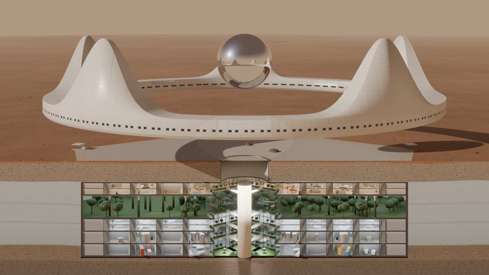
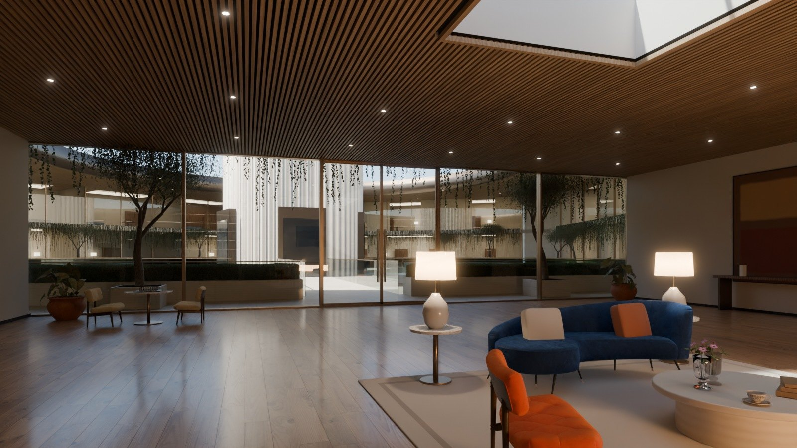
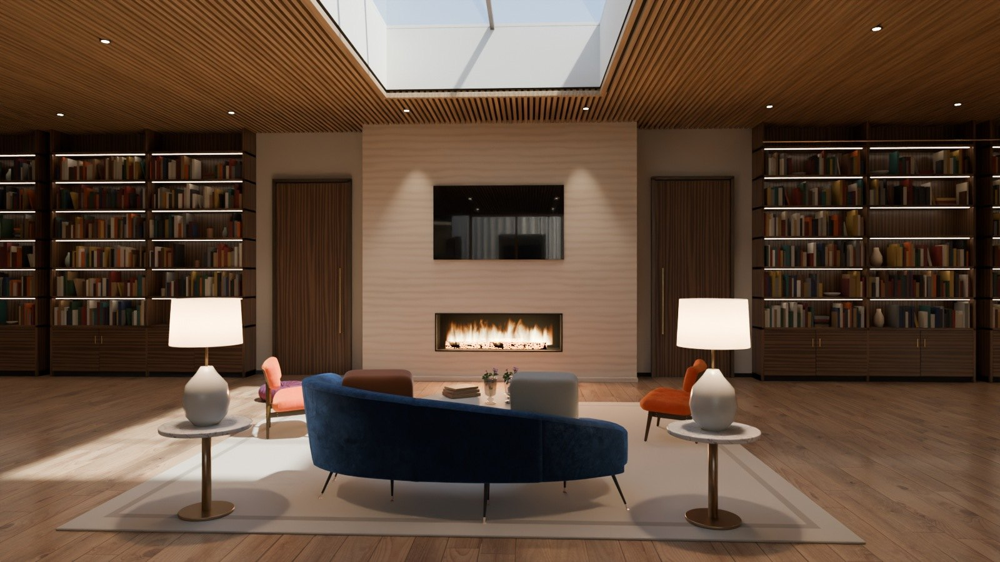
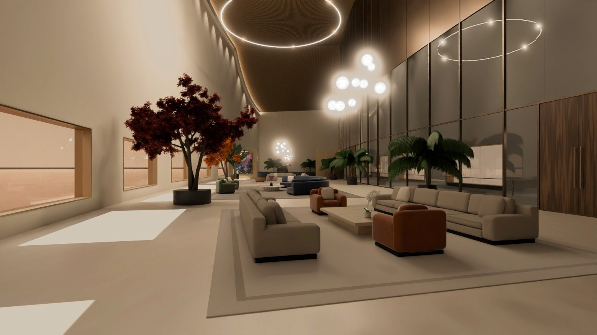
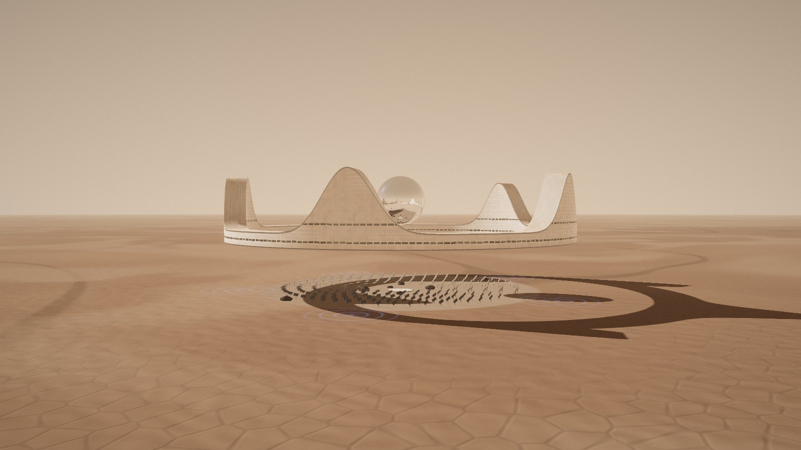
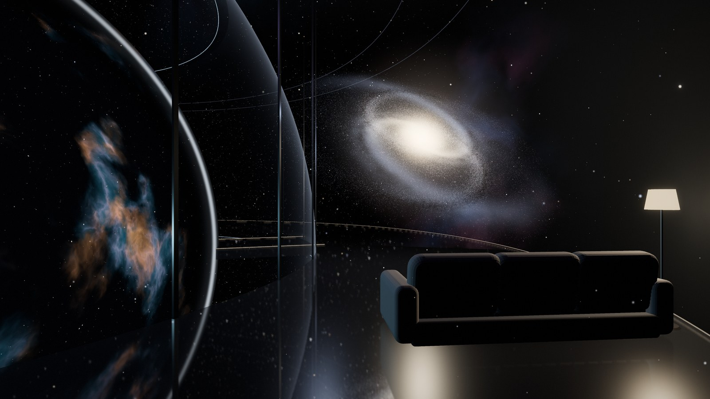
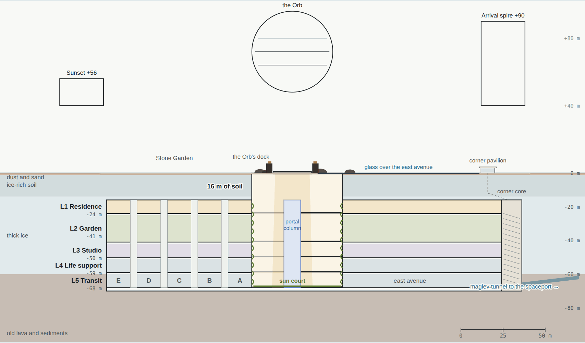

# Demo 2 · Arcadia, Jim's home on Mars

**The Crown and the Pentagon**, in Arcadia Planitia · owner: Jim (TTMath) · last updated 3 Oct 2026

**Demo 2 home · [Requirements](REQUIREMENTS.md) · [Decisions](docs/decisions.md) · [Design](docs/design/README.md) · [Rooms](docs/rooms.md) · [Floor plans](docs/plans/README.md) · [Pictures](docs/gallery.md)**



*Arcadia, path-traced and cut through the middle: on the [design plan](https://ttmathcs.github.io/mars-campus/palace/design/) you can turn it and click any part.*

**Arcadia** is Jim's private home on Mars, for one person, on the icy plains of Arcadia Planitia. **Above ground, the Crown**: a white
ring 276 m across floats 40 m over a stone garden on anti-gravity, with five spires and a mirror Orb 48 m across, where
the universe fills the rooms in 3D round the **Wormhole Gate**. **Below ground, the Pentagon**: five levels, 24 to 68 m down, eleven times the
Crown's floor area. **Arcadia Spaceport** stands 30 km east. The Wormhole Gate does the travelling, so the pod and the
rockets are for seeing the views: the pod's scenic flight through a dust storm into the sunset, and voyages to orbit
and the moons. A city will grow around it.

## The rooms, in pictures

| | | |
| --- | --- | --- |
| [](docs/rooms.md#the-family-room)<br>**The family room**, L1 | [](docs/rooms.md#the-family-room)<br>**By the fire**, L1 | [](docs/rooms.md#the-great-salon)<br>**The great salon**, the Crown |

Path-traced like an architect's photographs, from the same model as the 3D demo, with furniture scanned from real
things. **[Every room, picture first →](docs/rooms.md)** Walk round them in the
**[photo tour](https://ttmathcs.github.io/mars-campus/palace/tour/)**. More rooms are rendering and go in as they finish.

## Start here

| | What it is | In this repo | On the live site |
| --- | --- | --- | --- |
| 🏠 | **The design plan**: opens on the whole house in section, path-traced, which you turn and click: each part opens its floor plan, each room its pictures, 360° views and facts; then Arcadia area by area and room by room; this is what the homepage opens | [design/](design/) · [design/explorer.js](design/explorer.js) · [tools/render/overall.py](tools/render/overall.py) · [tools/gen_plan.py](tools/gen_plan.py) | [Design plan](https://ttmathcs.github.io/mars-campus/palace/design/) |
| 🔭 | **The science** (now its own part of the site, one subject a page): Mars facts (surface, inside, weather, space, resources, hazards, numbers, exploration) and Building on Mars (every factor, getting there, construction, water, air, food, energy, shielding, health, fuel, talking to Earth, protecting Mars), with sources | [science/README.md](../science/README.md) | [Mars facts](https://ttmathcs.github.io/mars-campus/science/mars-facts/) · [Building on Mars](https://ttmathcs.github.io/mars-campus/science/building-on-mars/) |
| 🛋️ | **The rooms, in pictures**: every room path-traced, picture first, with what it is made of | [docs/rooms.md](docs/rooms.md) | |
| 📸 | **The photo tour**: Arcadia's rooms in path-traced 360° photographs, on L1 and in the Crown; drag to look round, click to walk | [tour/](tour/) | [The tour](https://ttmathcs.github.io/mars-campus/palace/tour/) |
| 🗄️ | **The real-time 3D pages** (the flight home, the Crown, the Orb, the Pentagon), hidden since 2 Oct 2026 and archived: Jim found them far from satisfying | [archive/3d-demo/](archive/3d-demo/README.md) | |
| 📋 | **Requirements**: everything Jim asked for, with status | [REQUIREMENTS.md](REQUIREMENTS.md) | |
| ✅ | **Decisions**: every question to Jim, his answers, and what they changed | [docs/decisions.md](docs/decisions.md) | |
| 📐 | **The design, chapter by chapter**: what each part looks like and how it works, with every diagram | [docs/design/](docs/design/README.md) | [Design plan](https://ttmathcs.github.io/mars-campus/palace/design/) |
| 🗺️ | **Floor plans Rev G**, approved by Jim on 3 Oct 2026: every room designed, with a code | [docs/plans/](docs/plans/README.md) | [Floor plans](https://ttmathcs.github.io/mars-campus/palace/plans/) |
| 🌍 | **Mars Atlas**: zoom from the solar system to Arcadia, Google Earth style | [Atlas views](docs/design/01-site-and-city.md#the-mars-atlas) | [Mars Atlas](https://ttmathcs.github.io/mars-campus/palace/design/atlas/) |
| 🖼️ | **Pictures**: every picture rendered from the 3D build | [docs/gallery.md](docs/gallery.md) | |
| 🗄️ | **The first palace** (rounds 1 and 2) and **floor plans Rev B**, archived | [docs/archive/old-palace.md](docs/archive/old-palace.md) | [Old palace](https://ttmathcs.github.io/mars-campus/palace/archive/old-palace/) |
| 🛠️ | **How to build and test**, for whoever continues the work | [HANDOFF.md](../HANDOFF.md) | |

## Status

| Part | State | Next |
| --- | --- | --- |
| Requirements | Updated 3 Oct 2026: the name Arcadia, Rev G approved, the Orb at 48 m. No open questions | — |
| Floor plans | **Rev G approved** by Jim on 3 Oct 2026: 179 rooms and areas, each with a code, a purpose, a second use, a place and a size; the Orb at 48 m | The pictures of every room, one at a time, following the plans |
| Design plan | Chapters 01–07 written, with the Orb at 48 m and every room as Rev G | Write 08 Life support, 09 Communications and space, 10 Building it |
| Pictures | Path-traced, one render at a time: Arcadia in section (24 frames to turn), L1's residence, library, baths and cinema, and the Crown's salon, bedroom, library, map room and pool | The Crown's pool again (stone edges at both ends), the dining hall, the Arrival hall and the sunset lounge; the master suite down; the atrium; then 72 frames so Arcadia turns smoothly |
| Mars Atlas | Live, over a real colour map of Mars | — |
| Real-time 3D pages | Hidden on 2 Oct 2026 (Jim found them far from satisfying) and archived on 3 Oct | — |
| First palace | Archived | — |

## The design at a glance

| | | |
| --- | --- | --- |
| <a href="docs/design/02-crown.md"></a><br>**The Crown**, above ground: 276 m across, floating 40 m up | <a href="docs/design/02-crown.md#the-orb-the-universe-in-vr-and-the-wormhole-gate"></a><br>**The Orb**: the universe in VR in the rooms, and the Wormhole Gate | <a href="docs/design/03-pentagon.md"></a><br>**The Pentagon**, below ground: five levels |
| <a href="docs/design/01-site-and-city.md"></a><br>**Site**: 39.8° N on Arcadia Planitia | <a href="docs/design/06-transport.md"></a><br>**The scenic flight**: 4 min 40 s | <a href="docs/design/07-spaceport.md"></a><br>**Arcadia Spaceport**, 30 km east |

| Number | |
| --- | --- |
| 39.80° N, 201.44° E | Arcadia, 3.9 km below Mars' average height, on ground rich in ice |
| 276 m | The Crown across; it floats 40 m up and its spires reach 90 m |
| 19,500 m² | The Crown's floor area with the Orb, 5.7 times the TTMath campus |
| 209,700 m² | The Pentagon's floor area, 11 times the Crown |
| 48 m | The Orb across, three floors of rooms round the Wormhole Gate, a ball 18 m across: press send and it shoots you like light to any place and time |
| 30 km | To Arcadia Spaceport, due east |
| 20 MWe | Four reactors, two at Arcadia and two at the port; no panels or mirrors on the ground |
| 4 min 40 s | The pod's scenic flight, 37 km; the Gate does the travelling |
| 0 | Lifts: portals link every part of Arcadia |

## What is in this folder

```
palace/
├── README.md            this page
├── REQUIREMENTS.md      what Jim wants: the source of truth
├── docs/                the docs in this repo
│   ├── decisions.md     questions to Jim, his answers, what they changed
│   ├── design/          the design book chapter by chapter, with its diagrams
│   ├── plans/           the floor plans Rev G, one short file per sheet
│   ├── gallery.md       every rendered picture
│   ├── img/             diagrams, plan sheets and Atlas views exported for these docs
│   └── archive/         the first palace's requirements
├── design/              the design book and the Mars Atlas (live pages)
│   └── img/             the pictures (path-traced), the thumbnails and the maps
├── plans/               the floor plans Rev G, a page per sheet (written by tools/draw_plans.py)
├── tour/                the photo tour: the viewer, stops.js, the 360s and the stills
├── tools/               the room program, the plans and design-plan generators, docs export, the render scenes
├── archive/             the real-time 3D demo (3d-demo/), floor plans Rev B (plans-rev-b/), the first palace (old-palace/)
└── index.html           opens the design plan
```

The diagrams in `docs/img/` are exported from the live pages by `python3 palace/tools/docs_export.py`. Run it again
after changing a drawing so the docs stay in step.
