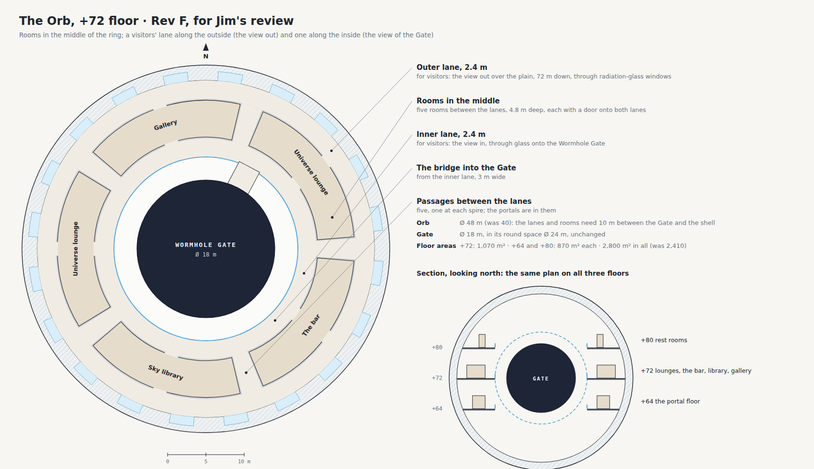

# Decisions with Jim

[Demo 2 home](../README.md) · [Requirements](../REQUIREMENTS.md) · **Decisions** · [Design](design/README.md) · [Rooms](rooms.md) · [Floor plans](plans/README.md) · [Pictures](gallery.md)

Every question put to Jim, his answer in his own words, and what it changed. Newest first. Requirement IDs refer to
[REQUIREMENTS.md](../REQUIREMENTS.md).

## 7 Oct 2026: nothing on the windows

- **Asked** (Jim): "painting should not be on the windows".
- **Changed:** a rule for every room (in CLAUDE.md): paintings, prints, shelves, lockers and screens hang on solid wall,
  between the windows or on the cross walls, never over a window. `audit_windows.py` builds each Crown room and lists
  what is fixed over its outer windows; it found Jim's paintings on the gallery's outer wall, the suit room's lockers,
  the craft room's pot shelves, the telescope room's screens and the guests' lounge's desks, all moved onto the wall
  between the windows, and the pod hangar's great door, behind which the wall now keeps no windows. Low things under
  a sill (the dining hall's sideboards, the map chests, the kitchen's banquette, the tub) stay. → LV-12.

## 6 Oct 2026: the plan reviewed

- **Asked** (Jim): "Can you review the plan?"
- **Brought into line, no decision needed.** The Crown's numbers to revision H in every chapter, the README, the
  requirements, the Atlas and the drawings: the ring 26 m wide and 224 m across inside, the Glide 3.5 m wide and
  734 m long, the roof +56 m between the spires, rooms 12.5 m tall and 20 m under the spires, 28,700 m² with the Orb
  (8.4 times the TTMath campus), about 210,000 t of which 120,000 t is ice, 156 MN on each drive; the Stone Garden
  204 m across; the air 2.4 million m³, 2,300 t. The day-and-night rule's leftovers: the Crown chapter's modes, the
  Interiors chapter, the Pentagon's summary, the study, the studio and the breakfast room. "No glass wall anywhere"
  became "no glass wall to the outside". The city's 60–70 MW in phase 3 is no longer "in L4-02" (now the heat pumps);
  GN-12 no longer says reactors. The requirements now hold Jim's asks of 4 and 6 Oct (GN-19, GN-20, CR-5 to CR-9,
  LV-8 to LV-11, DM-14), with a round 6 in their history.
- **Decided with our best judgment.** The spires' upper floors (C-05, C-12, C-19, C-26, C-32) were at +51 m, which
  is now inside the 20 m halls: they move up to **+62 m**, under the spire roofs, about 1,090 m² each, with the drive in
  the tip above them. **Power, water and air reach the floating Crown through the portals in its spires** (future
  technology, like the portals themselves); batteries in each spire keep the drives running for a day, and seated on
  its pads the Crown plugs into the Pentagon's power, water and air.
- **Asked of Jim** ([REQUIREMENTS, section 10](../REQUIREMENTS.md#10-open-questions)): Q1, whether the city should
  also own the spaceport, the fuel plant and ice mine, the relays, the maglev and tunnels, the city control room and the
  foundry's work for the city; Q2, the true reason for "by day below, by night up" (the dose comes from the hours up,
  not from which hours); Q3, the Pentagon now 7 times the Crown, not about 10 (PG-1).
- **Still to do:** render again the outside pictures that show the Rev G ring (the Crown by day, from the garden and
  at sunset, and the site from the air); the spaceport's was rendered again without its reactor domes the same day.

## 6 Oct 2026: no reactor; the city provides the power

- **Asked** (Jim, reviewing the plan): "no nuclear reactor is needed since it is provided by city".
- **Changed:** Arcadia and its spaceport have no reactors and no radiator field. The power comes from the city's grid on
  two buried DC cables by different routes (30 km by the rover road from the spaceport, where the city's grid reaches;
  and through the city's first tunnel, L5-16), 15 MW each. Arcadia keeps its own batteries (L4-03) and fuel cells on
  the ships' methane and oxygen (L4-20) for an outage, and heat pumps (L4-02) make the warmth the reactors' spare heat
  used to give (about 2 MW for 0.7 MW of power). In the room program L4-01 Fission reactors became the City feed and
  L4-02 the Fusion-ready bay the Heat pumps. Chapter 05 rewritten; chapters 01, 02, 03, 07, 08, 10, the idea page, the
  atlas, the science pages' boxes on Arcadia, README and REQUIREMENTS (SY-1, SY-4) brought into line.
- **Done the same day:** the spaceport's aerial picture rendered again without the two reactor domes (the archived 3D model
  lost them, `palace/archive/3d-demo/src/50_port.js`).

## 6 Oct 2026: every Crown room glazed onto the Glide, as the master suite

- **Asked:** Jim, "all rooms in the crown should have same window as master bedroom". Shown the two (A: the suite's
  wall of bronze and glass onto the Glide, floor to ceiling; B: the windows to the outside at eye level, already the
  same in every room), he chose **A**.
- **Changed:** every room of the Crown now has that wall on its Glide side (`crown.glass_wall`, bronze fins every
  2.6 m, a transom at 4 m, switchable glass below it, clear above): clear where the room is seen in passing, frosted
  where it wants privacy (the study, the guests' lounge, the suit room and the hangar, and as before the suite, the
  spa, the gym and the kitchen); pivot doors where the way in is clear (`palace/tools/furnishing.py`, `doors`). The
  windows to the outside stay at eye level.

## 6 Oct 2026: no Gaussian splats; path-traced photos and 360s

- **Tried, then set aside.** Jim asked "try to use gaussian splatting if possible. I heard it is pretty good for real
  experience?" and "maybe show me something gaussian splatting can do first". A splat of the master suite up was fitted
  on the CPU to 234 path-traced views of it (a quick fit, 31 dB against the views; the page `palace/splat/`). Jim, after
  seeing it: "since I don't have real photo, so gausssian splatting doesn't help too much but consumes too much token
  and slow. in this case go back to the best way to create the real life expeiences and continue". A splat is only as
  good as the pictures it is fitted to, and ours are renders, so it adds little to them for hours of fitting.
- **What we do instead:** path-traced photographs of every room, and a 360 at each room's stop on the tour, so a
  visitor can stand in the room and look all round; then the walk. The splat tools, the dataset and the page stay in
  the repo (`palace/blender/splats/`, `palace/tools/render/splat_*.py`), unlinked.

## 6 Oct 2026: by day in the ground, by night in the sky

- **The rule turned round.** Jim, on the idea page's "By day in the sky, by night in the ground": "it should be
  opposite. day has too much rediation so day should be in the ground while night in the sky". Now: **by day down in
  the Pentagon**, away from the Sun's ultraviolet and the particles of its storms; **by night up in the Crown**, for
  about 6 hours from sunset (dinners, music, the stars); everyone sleeps below. The dose budget stays 19 mSv a year
  (6 hours up per sol). Changed: the idea page, the Crown, Pentagon, Interiors and Life support chapters, the room
  program's uses (the great salon is Jim's living room in the evening, the family room on L1 his living room by day;
  the sky pool, library, study, studio and breakfast room are for the evening; C-20 is now the guests' lounge), the
  pairs page and these docs.
- **Gaussian splatting.** Jim: "try to use gaussian splatting if possible. I heard it is pretty good for real
  experience?" See HANDOFF for the trial and its result.

## Decided with our best judgment, 1 Oct 2026

Jim asked us to decide these; he can change any of them.

| Question | Decision | Why |
| --- | --- | --- |
| Where the Gate opens in the demo (OR-7) | Zoom out to the whole universe, back in to the TTMath campus in Gale crater, press send and arrive in demo 1 | It links the two demos, and the campus is real NASA ground |
| Guest rooms, now that visitors are rare (LV-7) | Keep them as designed | Visitors from Earth come only once every 26 months and stay until the next launch window, so the few who come need real apartments. They take one of L1's five sectors and two suites in one dip of the Crown |
| Extras in the demo (DM-13) | All four, as nice-to-haves: the pool in low gravity, Earth as the evening star from the Observatory, a message home with the delay shown, the forest on L2 | Each is one small scene in phase 2 or 3 |
| How far the garden level seems to go (PG-3, DM-9) | The sky of lamps carries on down L2's outer walls to a far horizon of low hills in the haze, with a clipped hedge along the foot of the walls | Under a sky that stops at a bare wall the garden feels like a room; with a horizon it feels like the country, which is what the sky of lamps is for |
| The columns on the garden level | 55 slender columns about 30 m apart, each with a flared head, planted from foot to head like a vertical garden (as Singapore's Supertrees) | In Mars gravity the level above weighs little, and the soil on the roof balances the air inside, so few columns are needed; planted, they read as part of the garden |
| The residence rooms on the atrium (L1) | The guest lounge and the family room are two storeys of 4 m within L1's 8 m, with the guest suites and Jim's study above them; the cinema, the thermal pools and the great library are full height. Each room's sky ceiling is a panel in a plaster ceiling | Rooms 8 m tall would feel like halls; the plan's rooms keep their places |
| The sun court (L5) | A paved walk round the lawn, and causeways over the pool to the portal column | So you can reach the portals on L5 as on the other levels |
| The front of Jim's residence on L1 (for the photo tour) | Walls 8 m either side of the middle make three rooms behind the glass: a music room with the grand piano, the family room with the fire, and a dining room with the table for eight | One room 49 m long under a 3.8 m ceiling looks like a hotel lobby in a photograph; chapter 04 already lists a kitchen and dining room on L1 |

## 3 Oct 2026: Arcadia, a city rising on Mars, Rev G approved and the Orb at 48 m

- **The name: Arcadia.** Jim: "don't like retirement house. what do you suggest?" Offered: *Arcadia House, Jim's home
  on Mars* (recommended), *Jim's home on Mars* or *The Crown*. Jim: "Arcadia House it is acurally not house".
  Offered: *Arcadia* (recommended), *Arcadia Palace* or *Arcadia Estate*. Jim: "just Arcadia (by the way what does
  this word mean?)". **Done:** demo 2 is *Arcadia*, with "Jim's home on Mars" under it, on the homepage, the design
  plan, the tour, the Atlas, the science pages and the docs. *The word:* Arcadia is a mountain region of Greece, a
  land of shepherds; since the Roman poet Virgil it has meant an ideal place of peace and a simple, happy life close
  to nature. The plain, Arcadia Planitia, is named after it. → GN-1.
- **The homepage: a city rising on Mars.** Jim: "on homepage don't use demo, use some phrase to show the city is
  building in progress on mars". **Done:** the section is *Under construction · A city rising on Mars* ("Place by
  place: walk into what is built, and follow what is still being designed as it takes shape"); the cards are tagged
  *Built · Gale Crater* and *In design · Arcadia Planitia*, with *Walk in* and *Explore Arcadia*. → GN-17.
- **No notes for visitors.** Jim, on the homepage's *How to move* and *What's real*: "I hate all this kinds of notes,
  just garbage shows on the page since there are already duplicates in the 3d. You can keep those for your memory to
  save somewhere else you know, but not on the pages for users/visitors". **Done:** both are off the homepage and kept
  in the repo's [README](../../README.md#controls); the same kind of note is gone from the design plan (its cover and
  footer) and the science pages (their footer and the hub); the map credits stay. A global rule in `CLAUDE.md`. → GN-18.
- **Show the work as it goes.** Jim: "don't wait for last to merge, merge in the middle as well so I can view the
  changes and steer the direction". **Done:** each step is pushed to `main`, and so goes live, as soon as it is checked.
- **The Orb (Rev E) and the built ground stand.** Both were shown for review on 1 Oct ("if it looks right, nothing is
  needed"); Jim asked for no changes, so they stand as drawn, with the Orb now 48 m across. → OR-1 to OR-9, GN-13.
- **The site's name.** Jim: "the title should not be 'Mars – No Way Home', should be 'Mars - your new home'".
  **Done:** the site is *Mars – your new home* on the homepage, in every page's header and in the browser tab;
  the repository keeps its name.
- **Floor plans Rev G.** Jim: "approve". The plans are now at [palace/plans/](https://ttmathcs.github.io/mars-campus/palace/plans/)
  ([summary](plans/README.md)); Rev B is archived. Room pictures carry on, one at a time, following the plan. → GN-16.
- **The Orb's size (Rev F).** Jim: "do per your best judgements". **Decided:** the Orb grows from 40 m to **48 m**
  and the Wormhole Gate stays 18 m in its round space 24 m across. On each floor five rooms sit between an outer
  lane along the windows and an inner lane along the glass onto the Gate, with a passage under each spire. The
  rooms are Rev G's: the portals at +64, the five universe lounges at +72, the rest rooms at +80. The Orb has
  2,800 m² and the Crown 19,500 m². *Why:* the Gate is the heart of the Orb, so it keeps its size; the bigger ball
  costs nothing in the middle of a ring 244 m across. → OR-1 to OR-8.
- **Clean pages, old files archived.** Jim: "after new design, archive or remove all old files to avoid messy
  confusions", and on the design plan's home page "remove FOR JIM Decisions ... For review ... remove all those
  notes/archived things. keep the page clean and clear". **Done for the home page and the plans;** the rest is
  listed in the handoff.

## 2 Oct 2026: the whole house to explore, plans in full, travel by the Gate

- **Design every room before drawing it.** Jim: "your photo images don't follow the floor plan? I think the floor
  plan is not designed properly. there are duplicates like theaters and other rooms. I like you to design it and
  plan it well before draw the images", then "I mean for certain facilities you can have mltiiples. it is OK to have
  duplicates but just need to design well as long as they could be used for multiple purpose". **Done, for his
  review:** floor plans Rev G. Every room and area has a purpose, a second use where it can, a place and a size;
  each pair has two different jobs (most: by day down in the Pentagon, by night up in the Crown); the duplicates
  with no second job are gone: the planetarium (the Orb shows the universe better), two of the four music rooms, the
  club's bar, the two private spas, the Crown's workshop, the second tea house, the reading rooms, and the guest
  suites in the Crown (guests sleep below ground, like Jim). The room program is `palace/tools/room_program.py`, drawn by `palace/tools/draw_plans.py`.
  Room pictures wait for his approval. → GN-16.
- **A code for every room.** Jim: "each room / area give it some code which can be easily referenced, like
  L1-A1/etc.", "not ncessary L1-A1 but just like this. you can rename it with best naming conventions", "L1-01?".
  **Done:** level and number, as he suggested: L1-01 is the Pentagon's level 1, room 01, numbered sector by sector
  from the atrium outwards; C-10 is the Crown's room 10, clockwise from the Arrival part; O-07 the Orb; G-01 the
  ground; shared areas have letters (L1-AT the atrium terrace, CC1 to CC5 the corner cores, C-GL the Glide).
  Named Rev G because one set of letters runs through the whole design (Rev C to E are the design book, Rev F the
  Orb's question).
- **The pool steps.** Jim: "the bath pool, the stairs are upside down I think?". **Fixed:** the steps are solid
  blocks standing on the pool floor, the top step the shortest, in the thermal baths and in the Crown's pool; the
  thermal baths' 360 is published again.
- **Turning the house.** Jim: "drag to turn the house. the turnning is not smooth at all". **Better now:** the
  pictures are drawn on a canvas and blended between frames as you drag, and the house glides to rest when you let
  go. A smoother turn needs more frames (72 instead of 24); they are rendered after Rev G is approved, in the one
  render queue.
- **Separate pages, as a global rule.** Jim: "I don't like the way you build things. You always build everything on
  the same page, but i would like to separate things into different pages/files … for exaample, mars facts you put
  eerything on the same page, while I like a separate page for those, and probably divide that subpage into nested
  subpages as well, like surface/core/weather/space/resources/etc. please keep this as global rule". **Done:** the
  science is its own part of the site, `science/`, one subject a page: *Mars facts* (surface, inside Mars, weather,
  Mars in space, resources, hazards, the numbers, exploration) and *Building on Mars* (every factor, getting there,
  construction, water, air, food, energy, shielding, health, rocket fuel, talking to Earth, protecting Mars). The
  homepage keeps a short science section with a card for each; the design plan's two science chapters redirect to
  the new pages. The rule is written into `CLAUDE.md`, `AGENTS.md` and the handoff for every session. → GN-15.
- **Renders one at a time.** Jim: "also build other images or 3d images for other rooms one after another. don't run
  in parrelllel since if hit limit and restarted, all processes could be gone and token wasted". **Done:** one render
  queue; the second lane was stopped and its jobs added to the first.

- **The science on the homepage.** Jim: "those Mars science should be put on directly on the homepage ... in
  parrellel with 2 demos. create spearate section like 'mars facts'/etc. to show these are sience facts of mars and
  research on how to build on mars. consider weather/etc... all factors". **Done:** the homepage now has three
  sections, *Demos* (still one card per demo), *Mars facts* (the numbers next to Earth's, the weather measured by the
  Viking landers, dust storms, dust devils, wind, cold, clouds and snow, seasons; the geography, ice, soil, sky and
  moons; the hazards: thin air, radiation, ultraviolet, toxic dust, marsquakes, meteorites) and *Building on Mars*
  (a table of 17 factors, each with the answer, then twelve topics from getting there to talking to Earth), with
  sources. The design plan's two science chapters gained the weather, the hazards, the table of factors, health and
  planetary protection. → GN-14.

- **The overall construction.** Jim: "in the design homepage, it should show overall construction (real or better
  3d). when click on each components like crown, petagon/etc. it shows the building plan. by clicking on each
  room/area, it pop up window to show real image or 3d", "I need you really put focus on the overall constrution
  image (real and 3d)", and on the homepage "demo 2 should show the image of overall constuction image mentioned above
  (or embedded 3d ?), not some image from specific room". **Doing:** the whole house path-traced in section, as an
  architect draws it: the Crown and the Orb over the Stone Garden, and under 16 m of soil the Pentagon's five levels
  round the atrium. On the design plan's home page you turn it in 24 frames; its labels open the Crown's and L1's
  floor plans, where each room opens in a window with its pictures, 360° views and facts. The same picture goes on
  the homepage's demo 2 card. Made by `palace/tools/render/overall.py`.
- **Floor plans in full.** Jim: "the L1 floor plan doesn't show full. now only show partial". **Done:** every room's
  plan is now the whole sheet with the room shaded, and a click enlarges it.
- **Travel by the Gate.** Jim: "so if I have wormhole to do the transportation, then the pod / rockets will be the
  tool for travel and see the views, not used for actual transportation". **Done:** the Wormhole Gate does the
  travelling, to Earth, the spaceport or anywhere. The pod is for sightseeing: its scenic flight over the Dune Sea, a
  crater and the Ice Cliffs, through a dust storm into the blue sunset. The spaceport's ships fly voyages to see
  space: orbit, Phobos and Deimos, and further. *Real fallback,* if the Gate stays a dream: the ships and the pod carry
  people and cargo as designed. Chapters 06 and 07, the README, TR-1, TR-2, SY-2 and a new TR-7. → TR-7.
- **Mars, the science.** Jim: "I am thinking creating another subpage to introduce Mars with facts of geography. also
  separate topics on the engineering on how to build / move materials to mars to build, how to get water and food /
  energy/etc. this subpage should be based on science". **Done:** two new pages in the design plan,
  *Mars, the planet* (00·1: the numbers next to Earth's, a labelled map, the air and weather, water
  and ice, radiation, the moons, the site) and *Living on Mars* (00·2: getting there and what to
  bring, building, water, air, food, energy, radiation, rocket fuel, talking to Earth, each with how the house does
  it). The numbers come from spacecraft and published studies, listed at the end of each page; our own estimates
  say so. → SY-7.

## 2 Oct 2026: one demo 2, a new name, the design plan

- **The homepage.** Jim: "why I have 2 demo 2? you kept making such mistake. multiple demo 2". The photo tour had
  been given a card of its own. **Done:** it is a link inside the one demo 2 card. → GN-2.
- **The site's name.** Jim: "Mars Campus this title is not good. I like sth 'die on mars' but that is bit more
  extreme I think?" Offered: *Grow Old on Mars* (recommended: it means the same, staying for the rest of your life,
  and suits a retirement house), *Mars, for Good*, *One Way to Mars*, or *Die on Mars* itself. Jim: "oh I thought of
  the homepage title 'Mars - No Way Home'". **Done:** the site is *Mars – No Way Home* on the homepage and in every
  page's header; the repository keeps its name.
- **The docs.** Jim: "the new images created looks great. I am thinking you can organize the docs with the images
  to illustrate first, which could be great resources along with final 3D". **Done:** a new page,
  [The rooms, in pictures](rooms.md), shows every rendered room picture first, with what it is made of and a link to
  its 360° view; it is in every page's menu, on the demo 2 home page, and the renders now open chapter 04 and the
  design book's Interiors chapter. Each new render goes in as it finishes.
- **The design plan.** Jim: "hide fly home so far since it is far from satisfying and hide the link so far. merge
  'photo tour' with design book as new name 'Jim retirement house design plan' or sth like this, organize the design
  plan into different sections, different sub pages, each pages will have floor plan and real images (static or
  better to be 360 degree)", and "each area/room/space should have details intro, image and floor plan/etc. like the
  purpose/etc." **Done:** the homepage's demo 2 card opens the design plan (no "Fly home", no separate tour link); the
  design book is now *Jim's Retirement House · Design Plan*, with area pages (the Crown room by room, L1 Jim's
  residence, L1 round the atrium) where every room has its purpose, its facts, where it is on the floor plan, and its
  pictures and 360° views, which play inside the page. They are generated by `palace/tools/gen_plan.py`, so each
  render shows up as soon as it is in the tour. The real-time 3D pages stay online but unlinked.
- **Every room path-traced** (from 1 Oct): rendering the music room and the dining room (their far ends furnished:
  a wall of records with a turntable and speakers; a bar), the great library, the thermal baths and the cinema on
  L1, the master suite down redone, and the Crown's rooms.

## 1 Oct 2026: the Orb's rooms, and a flash while walking

Jim, in the Orb:

> "in the orb, I don't like it be all open area. there should be seprate rooms in the middle of the circle, while
> leaving outer and inner circle to be visitor lanes so they can see the view outer or inner."

**Drawn for his review, Rev F** ([the plan](archive/img/orb-rev-f.png)): on each of the three floors, five rooms in the
middle of the ring (on +72 two universe lounges, the bar, a sky library and a gallery; on +80 the rest rooms; on +64
the portals), a lane 2.4 m wide along the windows and one along the glass onto the Gate, and five passages between the
lanes. It needs a bigger Orb or a smaller Gate (the question above). → OR-1 to OR-8

Jim, walking the house:

> "when I walk in the building it flashes every few seconds. not sure why"

**Fixed.** The Crown and the Pentagon light each room partly from a probe: a picture of the room round you, taken
again every 5 to 14 m as you walk. The new picture replaced the old one at once, and the whole room jumped in
brightness, by up to a seventh in one frame. Now the old picture fades into the new over 1.5 s, and stepping in or
out of Jim's residence changes the light over a second. Measured on a walk across the family room: the biggest jump
at a new probe went from 17 levels (of 255) to 1.5.

## 1 Oct 2026: it must look real, so a photo tour

Jim, opening the Pentagon in 3D:

> "WTH IS THIS? CATOON? nothing is real or feel real at all"
>
> "Try again"

**What changed.** The real-time 3D pages draw with a game engine in the browser, and they look like a game. The house
is now shown the way an architect or an estate agent shows one: **path-traced photographs** of the 3D model (Blender
Cycles: real bounced light, real glass, furniture scanned from real things), and a **360° tour** you can walk through
by clicking from place to place. Live at [palace/tour/](https://ttmathcs.github.io/mars-campus/palace/tour/), with its
[README](../tour/README.md), starting with **the family room on L1**, by the fire and at the glass, and two stills in
the tour's **Photos**. → DM-9, DM-10

Jim, seeing the first two stills:

> "the new images of indoor are so great and almost perfect. i need all rooms to be like this."

**So every room is being rendered the same way**, and added to the tour as it finishes: next Jim's music room and
dining room, the terrace, the bridge and the sun court; then the street and the master suite down (the moss garden,
the bedroom, the bath); then the Crown's rooms, starting with the great salon; then the Orb, once its plan is settled.
The real-time pages stay up for walking about.

## 1 Oct 2026: the Pentagon in 3D

Phase 3 of the demo has started, under Jim's pre-approval ("please go ahead to build, you have my pre approve"). Live
at [palace/pentagon/](https://ttmathcs.github.io/mars-campus/palace/pentagon/):

- **The atrium**, 35 m across and 68 m deep, with its terraces of hanging plants, five bridges on every level and the
  portal column, which takes you to any level in one step. → DM-5, DM-9
- **The rooms of ring A behind the atrium's glass**, on every level, as on the plans: on L1 the guest lounge, the family
  room, the cinema, the thermal pools and the great library; the studio's rooms on L3, the machine rooms on L4 and the
  transit halls on L5. You see into them as you walk the terraces; walking into them comes next.
- **The garden level (L2)**: the orchard, the market garden, the vertical farm and a wheat field, the lake with a pier,
  the forest with ferns and the stream, and the meadow with wild flowers and the tea house. → DM-13 (the forest)
- **The sun court (L5)**: the lawn, fruit trees and the pool round the foot of the column.
- **Jim's residence (L1, sector 1)**, to walk into: the family room in ring A behind a glass door from the atrium, the
  street, and the master suite down in ring B (the bedroom, the bath and the dressing room). In the family room you can
  play the piano, watch Earth on the screen over the fire, and read a book. → DM-9, DM-10

Four choices made while building are in the table above, for Jim's review.

## 1 Oct 2026: a built ground, and a dock for the Orb

Jim, looking at the ground under the Crown:

> "also there should be some interface when orb can land on the ground. the ground is raw and need some
> construction/design as well. and at least some hints that there is big part underground, instead of raw
> ground/soil"

**Done, Rev E, for his review:**

- **The Orb's dock.** A ring of dark basalt round the Sun Well, 30.8 m across and 5.5 m high, with a bronze band and
  five bronze pads on top. The Orb comes down onto the pads, about 50 m, for service or if its drive ever stops.
  Seated there it clears the ring by 20 cm and the lens by 1.4 m. A hatch in its base opens onto the dock, and a stair
  and a lift inside the ring go down into the atrium. → OR-9
- **A paved pentagon over the Pentagon.** Sintered-regolith slabs, 166 m on a side, 4 m wider all round than the
  Pentagon below, so the ground shows from the air where the house lies. A dark basalt kerb edges it, with a line of
  light that glows warm at dusk. → GN-13
- **The Stone Garden** stays, raked gravel and seven stones, as the circle inscribed in the paving.
- **Hints of what is below.** Five strips of dark glass, lit warm from below at dusk, trace the five avenues from the
  dock to the corners. Where each avenue ends, a low glass pavilion under a thin white roof holds the corner core's
  stair and airlock. Under each spire lies a basalt pad 14 m across with a bronze rim, where the Crown would settle
  (chapter 02 said 24 m; the pads now fit inside the paving's corners).
- Still nothing spread over the ground: no panels and no mirrors (GN-12).
- The 3D build, four pictures, the site plan, the Crown's elevation and the Pentagon's section were redone; the
  picture under the ring is now taken from the terrace by a corner pavilion. →
  [Ch 01](design/01-site-and-city.md#the-site-plan), [Ch 02](design/02-crown.md), [Pictures](gallery.md).

## 1 Oct 2026: the universe in VR, the ball is the Gate

Looking at the Rev D drawing of the Orb, Jim wrote:

> "not projector. it is future tech VR 3d. not inside a ball, the universe can be VR inside the orb, not in the ball"
>
> "projected directly in the 3d space"
>
> "the ball looks pretty cool and I am not sure where to put it for maybe different purpose? but not for the VR 3d
> universe"

We proposed making the ball the Wormhole Gate: physicists expect the mouth of a wormhole to look like a ball showing
the place at its other end, as in the film *Interstellar*, drawn from Kip Thorne's equations. Jim:

> "I like the idea. it is wormhole gate, it can send people/object to specified time (also time machine) and
> specified area of universe instantly. but how object can go into the ball?"
>
> "when time/space configured and press send, the ball will shoot the object like a light directly to the VR 3d
> space and this is how wormhole works"

**What changed: Rev E.**

- **The universe** is future-tech VR. Switched on, it appears in 3D directly in the space of the room, all round: no
  projector, no screen, no glasses. It works in every room, or in the whole Orb at once. Earth and Mars float in the
  corner of his view with their weather. → OR-2 to OR-5.
- **The ball** is the **Wormhole Gate**, 18 m across, floating in the middle of the Orb. It sends people and things to
  any place in the universe and any time, instantly; it is a time machine too. → OR-1, OR-8.
- **How it works:** choose the place and time in the universe; walk across a short bridge from the lounge floor into
  the ball (things ride in on a cart, or a robot carries them); press send, and the ball shoots you like a beam of light
  straight to the target in the universe around the room, and you are there. The far end is a ball too, for the way
  back.
- The floor areas stay as in Rev D: three rings of 804 m², the Crown 19,100 m².

→ [Ch 02, the Orb](design/02-crown.md#the-orb-the-universe-in-vr-and-the-wormhole-gate). *Shown for Jim's review
(above).*

## 1 Oct 2026: nothing on the ground

**The panels.** Jim, looking at the pictures of the spaceport and the garden:

> "are those solar panels on the ground? so ugly. if you need to put solar panels at least they should be much good
> looking and looks future proof"

and then:

> "it is bit scary to have so many panels on the ground. vvvvery messy. better to remove them all if no good design."

**Decided:** remove them all. A tidier design was tried first, panels raised on stalks like flowers, but it still
filled the ground, so it was not used. **What changed:**

- The 224 mirrors in the Stone Garden are gone. The garden is raked gravel and seven dark basalt stones, nothing else.
- The Sun Well stays as a **sky lens**: lamps behind the glass show the atrium the sky that is outside and keep it
  bright through a dust storm. Jim has the real sun in the Crown's rooms and the Orb's rest rooms.
- The 94,000 m² solar field at the spaceport is gone. A fourth reactor takes its place: **four 5 MWe reactors**, two
  on the Pentagon's L4 and two in a buried vault at the port, 20 MWe for an average demand of 8 MW. A dust storm
  changes nothing.
- The 3D build, all ten pictures and the power chapter were redone. → GN-12, SY-1,
  [Ch 05 Power](design/05-power.md).

**The garden picture.** Jim: "this image looks so strange, far away from real. even for diagram I don't know what it
means." **Done:** it is now a view from the plain at sunset, the Crown floating over the Stone Garden. The cockpit
picture still looked like a game after two tries, so it was taken out. → GN-4, GN-10, [Pictures](gallery.md).

**The questions.** Jim: "Decisions still open all items I think i have answered. why you still put all those
questions there?" **Done:** the questions are gone from the cover and every page; his answers are in this log. Only
the Orb's new design is shown for review, because it is drawn from his answer and not yet seen.

## 1 Oct 2026: Jim's answers

The design book asked five questions. Jim answered all five, then asked to organise the documents and pictures.

**1. The universe ball.** In his first answer, Jim asked for a 3D projection of the whole universe that he can zoom,
to choose where the Wormhole Gate goes. The first proposal put an 8 m ball of light at the centre of the Orb. Jim:

> "I don't need the universe to be displayed in the ball, but I need to sit in some rooms in the Orb, so I can see
> the spaces in the big circle ... If it is blocked, how can I sit in some rooms and across the window see the
> inside of the ball? ... I need you to help redesign this ... inside it I should have some switch to turn it on and
> off. When I turn it on I can do 3D projection of the universe so I can zoom in and zoom out, because it's like a
> 3D dashboard. At the corner somewhere, there's always our home planet Earth, and our current immigration planet
> Mars ... small icons showing dynamic weather ... I can turn it off. I can turn it back on if I need to."

**What changed:** Rev D. The Orb's centre opens into the Universe Hall, and three rings of rooms with glass fronts
surround it. Each room has the switch and a corner dashboard showing Earth and Mars with live weather. →
OR-2 to OR-5. *Replaced the same day by Rev E (above): the universe became VR in the rooms, and the ball became the
Wormhole Gate.*

**2. The site.** Asked whether to move to the real landing zone AP-1, Jim: "do your best judgment." **Decided:** AP-1,
the safest of the Arcadia Planitia sites studied for SpaceX Starship, with ice just under the ground. The house is at
39.80° N, 201.44° E and the spaceport 30 km east at 202.10° E. → ST-2.

**3. Air pressure inside.** Jim: "do your best judgment." **Decided:** 70 kPa with 27% oxygen, which breathes like
Calgary. It halves the load on the walls and the gas needed, and suit trips need no long wait. NASA's exploration
atmosphere is 56.5 kPa with 34%. → SY-3; chapter 08 will explain it.

**4. Sleeping below ground.** Jim: true, "but I should have some rooms to rest in the Orb ... through the windows,
there should be high tech. They should block the radiation." **Decided:** Jim sleeps in the master suite down most
nights. **New:** five rest rooms on the Orb's top ring, with radiation glass (future technology; the real fallback is
deep acrylic and water windows). → LV-3, OR-6.

**5. The year Jim moves in.** Jim: "probably in 2027, the next year." **Decided:** year 0 is 2027. Jim launches in the
Earth–Mars window of November–December 2026 and lands at Arcadia Spaceport in mid-2027. In the story, the robots
that build the house landed two windows earlier. → SY-6; chapter 10 will date the timeline.

**What the demo lets you do.** Jim, on the old list (walk inside, watch TV, read books): "I think that's it", and "I
don't expect a lot of visitors because it's for my retirement." **Decided:** the demo is played as Jim, and the old
activities carry over. → section 9 of the requirements, LV-7.

**The documents.** Jim: the documentation is "pretty messy"; "I need a structured way to ... show me the requirements
and demonstrate the plan in an organized way ... so I can navigate between the plans and the maps easily"; the
pictures "are really good but there is no way I can see from the repo". **Done:** the requirements rewritten by area,
a [Demo 2 home](../README.md), this log, the design chapter by chapter with every diagram exported as an image,
the floor plans sheet by sheet, and a [picture gallery](gallery.md). → GN-9.

**Diagrams and pictures.** Jim: "I really like those diagrams and graphs to show how it works ... I want to use this
as much as possible to illustrate ... if not real please make it real, at least look real." → GN-10. **Done:** 39
diagrams exported as images, all ten renders redone so they look real, and the maps use a real colour map of Mars.

**The homepage.** Jim: "there are 3 demo 2s on the page ... very confusing. delete old ones or ... archive old ones,
only keep one demo 2 on the homepage." **Done:** one demo 2 card, which opens the design book. The first palace moved
to the [archive](archive/old-palace.md). → GN-2. On 2 Oct 2026 the photo tour had been given a card of its own, and
Jim had to say it again: "why I have 2 demo 2? you kept making such mistake. multiple demo 2". **Done:** the tour is
a link inside the one demo 2 card; the rule is in the handoff notes.

## 30 Sep 2026: design first

After approving Rev B, Jim paused the 3D build:

> "before the detailed html implementation, I really like to put efforts on the design and figure out all the plans
> ... architecture, interior, power station design, transportation design/etc with details on its outlook/how it
> works ... we need to finish this before we move the implementation."

> "in the design doc, I need full map of mars, terrain and space maps. also mark where are the city/my house/spaceport
> are located ... better like google earth design so that we can zoom in/out."

**What changed:** the design book (Rev C) and the Mars Atlas. → GN-7, ST-4.

## 30 Sep 2026: Rev B approved

Jim on the floor plans Rev B: **"Approve. Go."** → the build began with phase 1 (the landscape, the spaceport and the
flight), until the pause above.

## 30 Sep 2026: answers to Rev A

| Question | Jim's answer | What changed in Rev B |
| --- | --- | --- |
| The Crown's design | "even wilder" | Sharper spires to 90 m, a lighter 16 m ring, the mirror Orb |
| Master suites | "one up and one down" | Master suite up in the Crown, master suite down on L1 |
| Anything to add? | a "wormhole transformation device which can transfer me to anytime any space" | The Wormhole Gate in the Orb |
| The flight | "Arrival land on sunset, but animation can go through Mars storm etc." | A dust storm after the Ice Cliffs, then the blue sunset |
| How the Crown stays up | "use anti gravity. No elevator. From crown to underground is by use warm hole or any transmission device." | Anti-gravity drives in the spires, no legs; portals instead of lifts |
| Where the work lives | "keep all the progress in the repo, so I can switch account or ai to continue there" | HANDOFF.md, everything in this repo |

## 29 Sep 2026: start again

Jim on the first palace: "far from satisfactory". His direction for round 3:

> "Future-proof, the bravest designs." "Before you jump into details, show me the plans." "I like the pentagon shape
> solid design underground, and above the ground I like most future proof design, not necessary glasses due to strong
> sun lights." "Above the ground design doesn't need to be pentagon shape … like what you can imagine in the dream",
> "only exist in dreams design". The spaceport is "30 km east of your house", and "when the flying pod carry me to my
> house I need impressive video to show the flight on the way".

**What changed:** floor plans Rev A: the Crown, the Pentagon, the spaceport and the flight. → GN-2, GN-3, GN-6, CR-1,
PG-2, ST-1, TR-2.

## Before 29 Sep 2026: rounds 1 and 2

The first palace on a mesa above Arcadia Planitia, with the Deep below it. Its requirements are in the
[archive](archive/old-palace.md).
