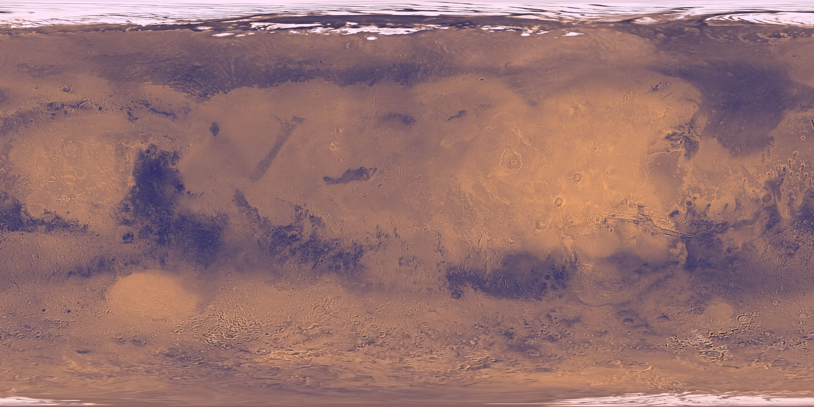

# 00·1 · Mars, the planet

[Design](README.md) · **00·1 Mars, the planet** · [00·2 Living on Mars →](00b-living.md)

**[Open the full page on the live site ↗](https://ttmathcs.github.io/mars-campus/palace/design/mars.html)**

The planet the house stands on, from spacecraft measurements. Mars is half as wide as Earth, with a bit over a third
of its gravity, a day 40 minutes longer, air less than a hundredth as thick, and cold and radiation no one could live
in unprotected. It also has ice, sunlight, carbon dioxide and soil: everything needed to make water, air, fuel and
buildings. Sources are listed on the live page.

*Earth and Mars, to scale: Mars is 6,779 km across, a little over half of Earth's 12,742 km, yet its land area is
about the same as all of Earth's dry land.*

| Mars | | Earth |
| --- | --- | --- |
| 0.38 g (3.71 m/s²) | Gravity | 1 g |
| 24 h 39 min 35 s | Day | 24 h |
| 687 Earth days, 668.6 sols | Year | 365.25 days |
| 586 W/m², 43% of Earth's | Sunlight above the air | 1,361 W/m² |
| 636 Pa on average (870 Pa at the house) | Air pressure | 101,325 Pa |
| 95% CO₂, 2.6% N₂, 1.9% Ar, 0.16% O₂ | Air | 78% N₂, 21% O₂ |
| −63 °C on average, about +20 to below −120 °C | Temperature | 15 °C on average |
| about 0.64 mSv a day on the ground | Radiation | about 2.4 mSv a year |
| Phobos (22 km) and Deimos (12 km) | Moons | the Moon (3,475 km) |
| 3 to 22 minutes each way | Radio delay to Earth | |

## Geography

- **Two halves:** old cratered highlands in the south; a smooth plain a few kilometres lower in the north, covering
  about a third of the planet.
- **Tharsis and Olympus Mons:** three giant volcanoes in a row and Olympus Mons, about 22 km high and 600 km wide,
  the tallest volcano known in the solar system.
- **Valles Marineris:** canyons more than 4,000 km long and 7 km deep, as long as the United States is wide.
- **Hellas:** an impact basin 2,300 km across and about 7 km deep, the lowest place on Mars.
- **The poles:** water ice up to about 3 km thick, about 3 million km³ in all, enough to cover Mars about 20 m deep.
- **Water:** none liquid on the surface (the air is too thin), but ice under much of the middle latitudes. Radar and
  craters show clean ice tens of metres thick across Arcadia Planitia, where the house is.
- **Radiation:** no global magnetic field and thin air; Curiosity measured 0.64 mSv a day on the ground. A few metres
  of soil stop most of it.
