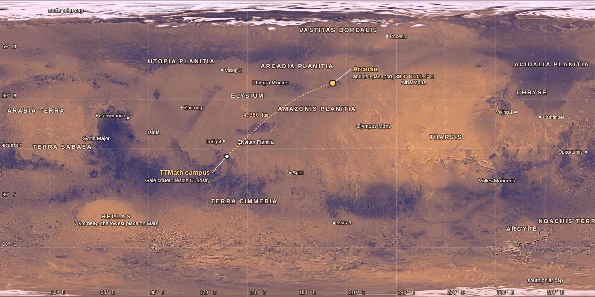
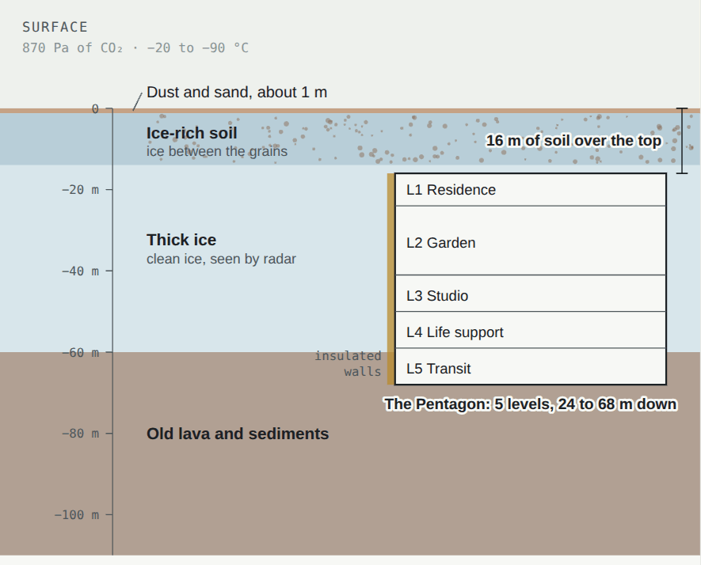
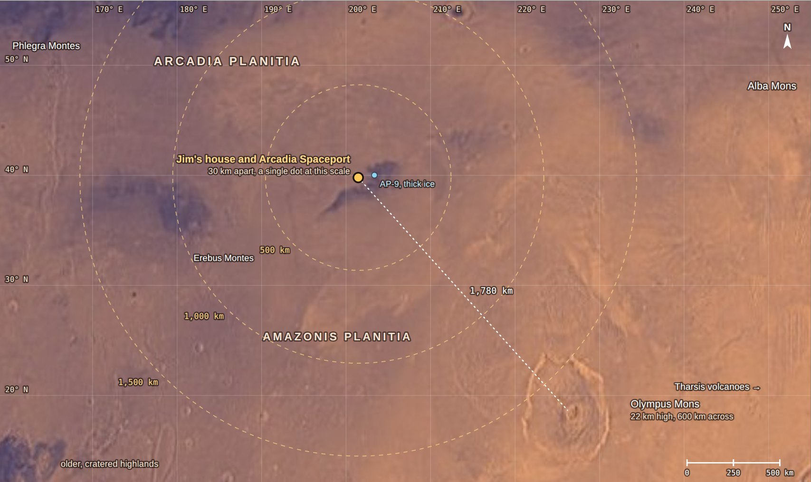
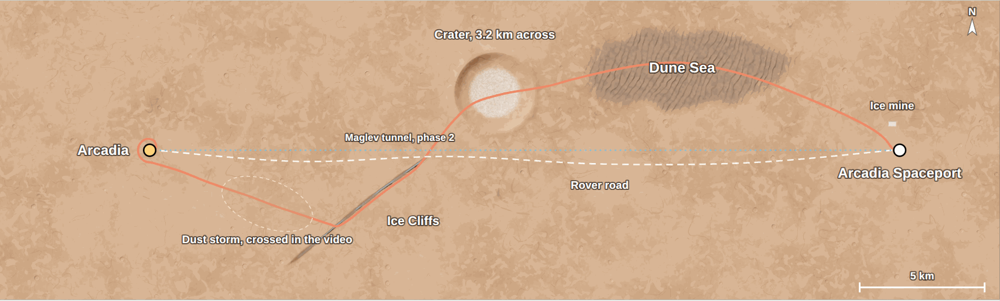
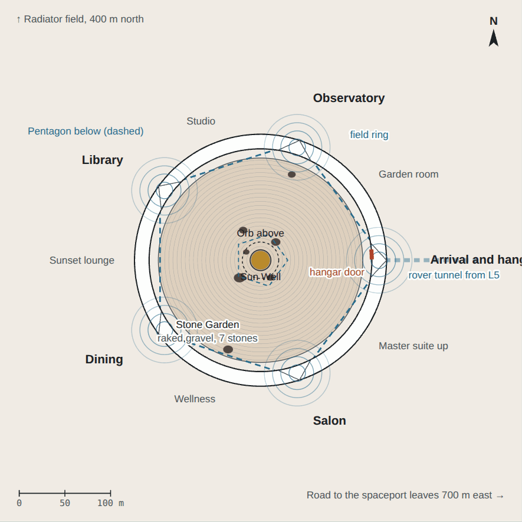
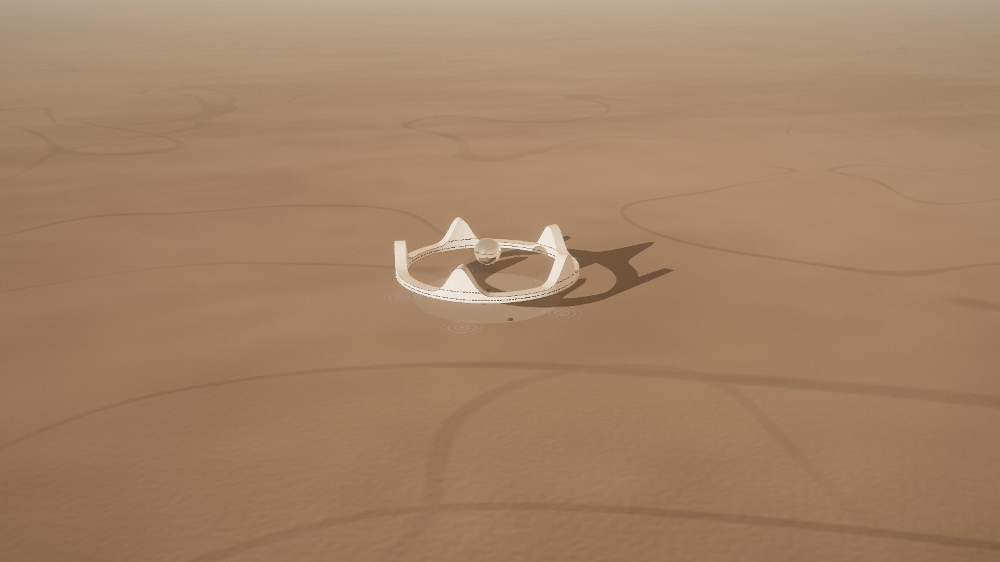
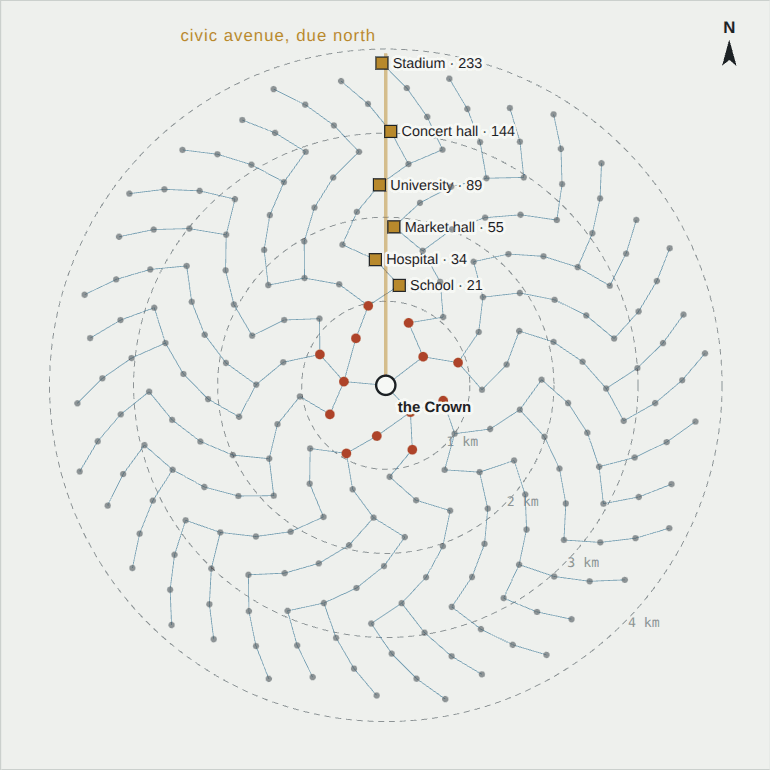
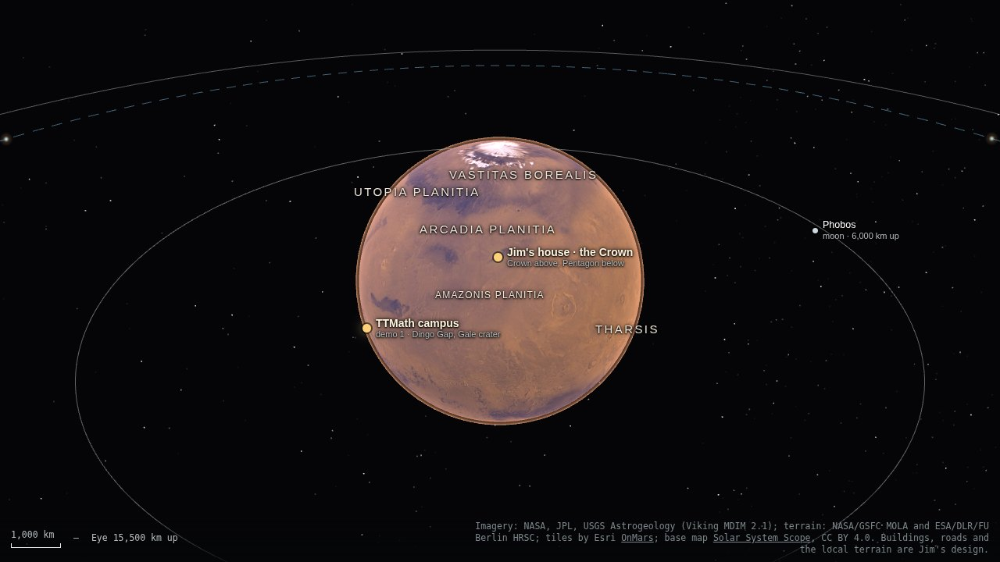
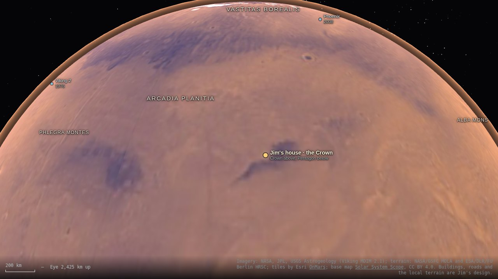

# 01 · Site and city

[Design](README.md) · **01 Site and city** · [02 The Crown →](02-crown.md)

**[Open the full chapter on the live site ↗](https://ttmathcs.github.io/mars-campus/palace/design/site.html)**

Arcadia stands on the smooth, icy plains of Arcadia Planitia in Mars' northern hemisphere, 30 km west of a
spaceport built on one of the best-studied landing sites on the planet. **Requirements:** ST-1 to ST-4.

*The whole of Mars, 0° to 360° east, north up. Arcadia (gold) is on the northern plains of Arcadia, 1,780 km from
Olympus Mons; the TTMath campus of demo 1 is 4,360 km away in Gale crater, beside Curiosity. White dots are landers
and rovers. Base map: Solar System Scope (CC BY 4.0, from NASA imagery); the live page loads the NASA Viking mosaic.*

| | |
| --- | --- |
| **39.80° N, 201.44° E** | The Crown; the spaceport is at 202.10° E on the same latitude, on landing zone AP-1 |
| **−3.9 km** | Below Mars' average height, so the air is 40% thicker than average: 870 Pa |
| **< 1 m** | Down to water ice across much of Arcadia; tens of metres thick in places |
| **24 h 40 min** | One sol, a Mars day. A Mars year is 668 sols |
| **−20 to −90 °C** | A summer day and night; winter nights fall below −120 °C |

## Why here

1. **Ice.** Radar shows thick water ice just below the dust for hundreds of kilometres: water to drink, oxygen to
   breathe and, with the air's carbon dioxide, methane fuel. Digging the Pentagon alone yields about 1.5 million
   tonnes of ice.
2. **Low ground.** At 3.9 km below the average there is more air above you, which helps ships brake and adds a little
   shielding.
3. **Flat and smooth.** Few boulders and gentle slopes make landings safe. Studies of Starship landing sites rated
   AP-1 the safest in Arcadia (Golombek and others, 2021). **Decided 1 Oct 2026:** the design uses AP-1.
4. **Mid-latitude.** At 40° N there is good daylight for the Crown's rooms most of the year, and it is still cold
   enough for the ice to last.

*The ground at the site: a thin layer of dust and sand over ice-rich soil. The Pentagon's walls are insulated so the
frozen ground round it stays frozen.*

## The region

*The region, about 4,300 km across, between the Phlegra Montes, Amazonis Planitia and the volcanoes of Tharsis.
Olympus Mons stands 1,780 km away, so far that even its summit is below the horizon. AP-9, 58 km further east, has the
thickest ice and is kept for a later ice mine.*

## The corridor

*The corridor from above, 40 × 12 km, north up. Orange: the pod's scenic flight. White dashes: the rover road. Blue
dots: the maglev tunnel, phase 2. The dust storm drifts across the plain; the flight video meets it just after the
Ice Cliffs. The dunes, the crater and the cliffs are the landscape designed for the demo; the real ground at AP-1 is
flatter and plainer.*

Everything that links Arcadia and the spaceport runs along this strip: the pod route (37 km, 4 min 40 s), the
30 km rover road, a buried cable carrying power and data, and later the maglev tunnel 68 m down. From the top of a
spire, 90 m up, the horizon is 25 km away, so on a clear evening Jim can see the ships at the spaceport.

## The site plan

*North up. The white ring is the Crown overhead with its rooms named round it; blue dashed lines are below ground.
The red mark is the pod hangar door, facing the garden. The pale pentagon is the paving over the Pentagon, with a
pavilion at each corner and glass over the five avenues.*

The ground over the Pentagon is built, not left raw (Jim, 1 Oct 2026: "the ground is raw and need some
construction/design as well. and at least some hints that there is big part underground"):

- **A paved pentagon** of sintered-regolith slabs, 166 m on a side, 4 m wider all round than the Pentagon below, so the
  ground shows from the air where Arcadia lies. A dark basalt kerb edges it, with a line of light that glows warm at
  dusk.
- **The Stone Garden**, the circle inscribed in it: raked gravel 224 m across and **seven basalt stones**, no mirrors
  and no panels.
- **The Orb's dock** at the centre: a ring of dark basalt 30.8 m across and 5.5 m high with a bronze band and five
  bronze pads, round the **Sun Well**, the glass sky lens 20 m across over the Pentagon's atrium, 68 m below. The Orb
  comes down onto it for service or if its drive stops; a stair and a lift inside the ring go down into the atrium.
- **Hints of what is below:** five strips of dark glass, lit warm from below at dusk, trace the five avenues from the
  dock to the corners, and where each avenue ends a low **corner pavilion** of glass under a thin white roof holds the
  corner core's stair and airlock.
- **Pads under the spires:** basalt discs 14 m across with bronze rims, where the Crown would settle if its drives
  stopped; rings of pale light pulse on them while the drives run.

The other ways in are the Sun Well and the rover tunnel from L5, which comes out 700 m east.

| Ground | Size |
| --- | --- |
| Paved pentagon | 166 m sides, 141 m from the centre to each corner |
| Stone Garden | Ø 224 m, seven stones of 2 to 4 m |
| The Orb's dock | Ø 30.8 m, 5.5 m high, pads 6.9 m up |
| Pads under the spires | 5, Ø 14 m, 130 m from the centre |
| Corner pavilions | 5, 116 m from the centre; glass 6.2 × 8.2 m, roof 8.6 × 11 m, 3.4 m high |
| Glass over the avenues | 5 strips, 15 to 111 m from the centre, in paved bands 2.6 m wide |

## The city

*233 seeds. Bright: phase 2. Gold: civic buildings on the Fibonacci seeds. Thin lines: the tunnels that join each
home to its nearest older neighbour.*

Every new home takes the next seed of a sunflower spiral, turned 137.5° (the golden angle) from the one before, about
450 m apart, so the city never needs replanning. Civic buildings take the Fibonacci seeds: 21 school, 34 hospital, 55
market hall, 89 university, 144 concert hall, 233 stadium. Those seeds line up due north from the Crown. Each home is
a small crown over a small pentagon, joined by tunnels; people move between homes by portal.

| Phase | What | Size |
| --- | --- | --- |
| 1 | The spaceport, Arcadia, the corridor | 1 home |
| 2 | First neighbours, the maglev | 13 homes, 1.0 km |
| 3 | Arcadia City and its civic avenue | 233 homes, 3.8 km, about 2,000 people |
| 4 | Links to other cities by rail, tunnel and portal | — |

## Living with Mars

| Mars | At the site | The design's answer |
| --- | --- | --- |
| Thin air | 870 Pa, under 1% of Earth's, mostly CO₂ | Every room pressurised; suits outside; the pod flies on rocket thrust |
| Cold | −20 °C on a summer afternoon, −90 °C at night | Thick insulated shells; heat pumps warm the rooms |
| Radiation | About 230 mSv a year on the open surface | 16 m of soil over the Pentagon; the Crown's shell cuts it to a third; sleep below ground |
| Dust and storms | Dust devils in summer; a planet-wide storm every 5½ Earth years | Storm shutters, sealed suit ports, the city's power on buried cables; no panels to bury |
| Low gravity | 38% of Earth's | A 50 m pool, a gym and walking everywhere |
| Toxic soil | Perchlorate salts in the dust | Suits stay outside; farm soil is washed; the air is filtered |

## The Mars Atlas

The Atlas zooms from the solar system to Mars, Arcadia Planitia and Arcadia itself, Google Earth style, over NASA imagery, with
landers, the moons and the relay satellites. **[Open the Mars Atlas ↗](https://ttmathcs.github.io/mars-campus/palace/design/atlas/)**
Links can open a place directly, for example
[Arcadia](https://ttmathcs.github.io/mars-campus/palace/design/atlas/#place=house),
[the spaceport](https://ttmathcs.github.io/mars-campus/palace/design/atlas/#place=port),
[the TTMath campus](https://ttmathcs.github.io/mars-campus/palace/design/atlas/#place=ttmath) or
[the Orb](https://ttmathcs.github.io/mars-campus/palace/design/atlas/#place=orb).

| Whole Mars | Arcadia Planitia |
| --- | --- |
|  |  |

*Saved without the NASA tiles, so they show the coarser base map.*
