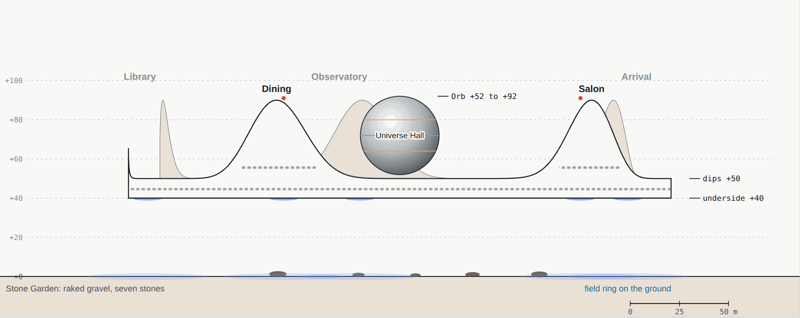
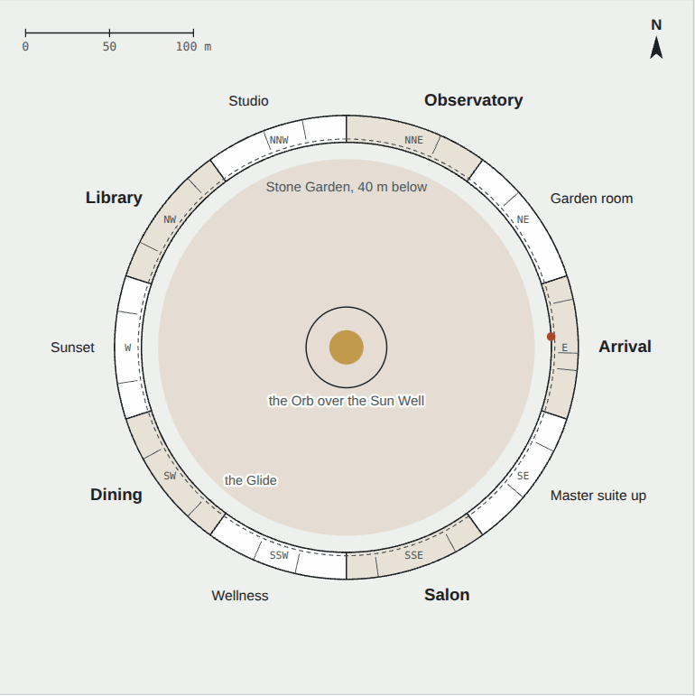
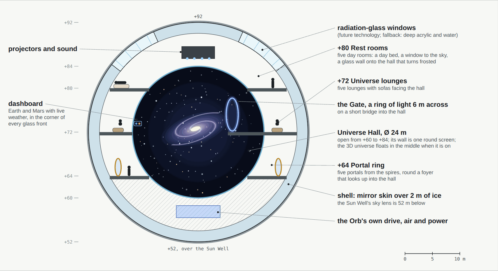
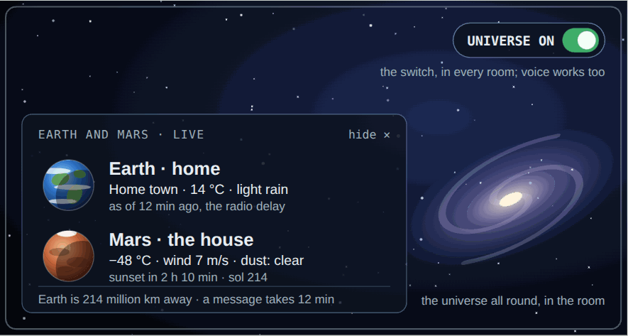
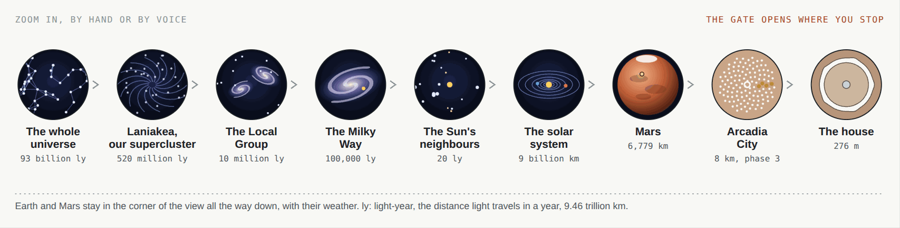
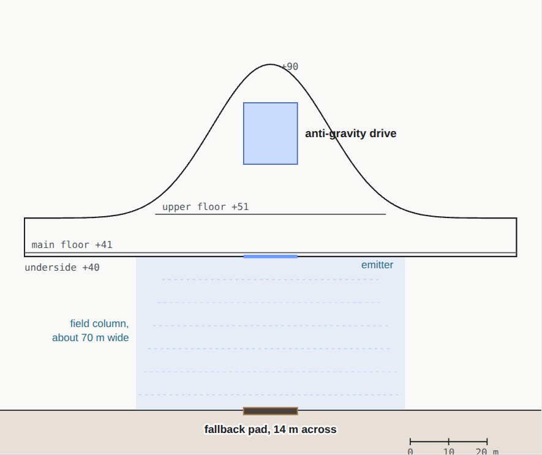
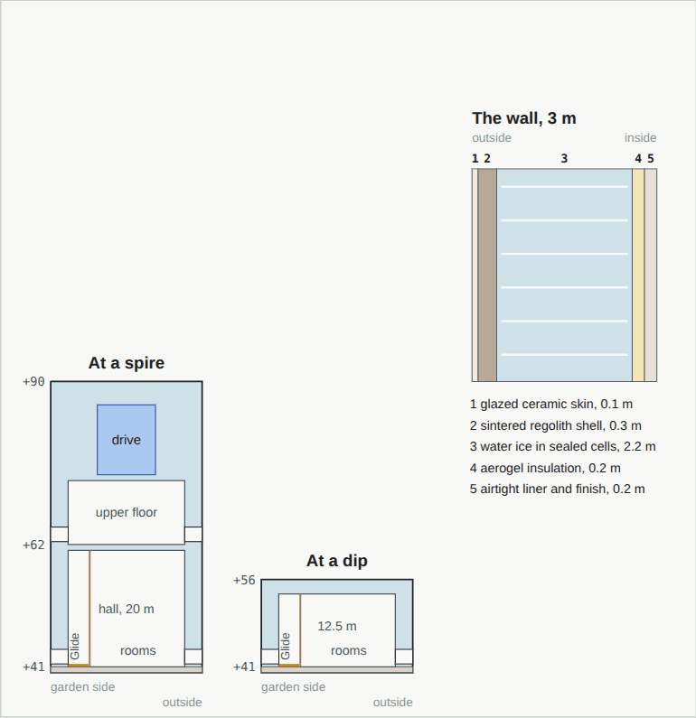

# 02 · The Crown

[← 01 Site and city](01-site-and-city.md) · [Design](README.md) · **02 The Crown** · [03 The Pentagon →](03-pentagon.md)

**[Open the full chapter on the live site ↗](https://ttmathcs.github.io/mars-campus/palace/design/crown.html)**

The house above ground. A white ring 276 m across floats 40 m over the Stone Garden, with five spires, a mirror Orb at
its centre and no big windows. It is the day house, for light, views, music and guests. Nothing holds it up, and
nothing links it to the ground but portals and the pods. **Requirements:** CR-1 to CR-4, OR-1 to OR-7, GN-3.

| | |
| --- | --- |
| **276 m** | Across the outside of the ring; 244 m across the inside |
| **+40 m** | The underside, over the Stone Garden; the main floor is at +41 m |
| **+90 m** | The tips of the five spires; between them the roof dips to +50 m |
| **19,100 m²** | Floor area with the Rev D Orb, 5.6 times the TTMath campus (Rev B: 20,100 m²) |
| **3 m** | Walls and roof, mostly water ice, to keep out cosmic rays |
| **0** | Legs, lifts or big windows |

## What it looks like

*Elevation from the south-south-west, to scale, heights in metres above the plain. The two nearest spires are Dining
(left) and Salon (right). Dashed lines are the window slots.*

- **The shape:** one continuous ring, 16 m wide, whose roof rises five times into sharp spires and falls between them.
  The roof line is one smooth curve, 50 + 40·c⁶ m, so the spires look drawn rather than built.
- **The skin:** glazed white ceramic fired from Mars soil, with a titanium band. No glass walls, because Mars sunlight
  carries harsh ultraviolet. Window slots 1.2 m tall are cut through the 3 m wall, so the sun shines straight in only
  at sunrise and sunset.
- **At night** the slots glow warm, a red beacon burns on each spire, and pale blue rings of light pulse on the ground
  under the anti-gravity drives.

## The main floor

*Main floor at +41 m, north up. Spires are shaded; the dashed circle is the Glide.*

Ten parts of 36°: five under the spires, each with an upper floor, and five in the dips. A moving walkway, the
**Glide**, runs 779 m round the inner side past every room.

| Part | Rooms on the main floor | Upper floor |
| --- | --- | --- |
| Arrival (E, spire) | Suit room, pod hangar, the Door, Arrival hall | Dock control |
| Master suite up (SE) | Dressing room, bedroom, bath, private spa | — |
| Salon (SSE, spire) | Hearth room, great salon, piano room | Sky lounge |
| Wellness (SSW) | Spa and sauna, 25 m pool, gym | — |
| Dining (SW, spire) | Wine room, dining hall, chef's kitchen | Sky bar |
| Sunset lounge (W) | Guest suite, Sunset lounge, guest suite | — |
| Library (NW, spire) | Study, library on two floors, map room | Reading gallery |
| Studio (NNW) | Music room, art studio, workshop | — |
| Observatory (NNE, spire) | Star lounge, planetarium | Telescope dome |
| Garden room (NE) | Tea house, breakfast room, sky garden | — |

## The Orb and the Universe Hall

**Rev D, 1 Oct 2026, drawn from Jim's answer, for his review.** The Orb is a mirror ball 40 m across floating over the
Sun Well. Inside it is hollow. Its heart is the **Universe Hall**, a round space 24 m across, and the rooms sit around
it on three rings, like the boxes of an opera house. Every room has a glass front onto the hall.

*Inside the Orb, section looking north, to scale. The Universe Hall (dark) is open from +60 to +84 m. Around it: the
portal ring at +64, the lounges and the Gate at +72, and the rest rooms at +80 under the windows. Each glass front
(blue) has the dashboard in its corner.*

- **Switch it on** and the universe appears in the middle of the hall, a 3D image Jim zooms with his hands or his
  voice: from the web of galaxies to the Milky Way, the solar system, Mars and the house, or Earth and his home town.
  It zooms in time too. The hall's curved wall is one seamless screen showing the sky as seen from wherever he has
  zoomed to. **Switch it off** and the wall shows the real sky above the Orb. Every room has the switch.
- **The dashboard:** in the corner of every glass front, Earth (home) and Mars (where Jim lives now) as small globes
  with their weather, live. One touch hides it and another brings it back.
- **The rest rooms:** five quiet rooms on the top ring for resting by day, with a day bed, a window to the sky behind
  radiation glass, and a glass wall onto the hall that turns frosted. Jim still sleeps below ground at night.
- **The Gate:** a ring of light 6 m across on a short bridge into the hall. Pick a place and a time in the universe,
  and the Gate opens onto it.

| Floor | Rooms | Area |
| --- | --- | --- |
| +80 m | Rest rooms: five day rooms with windows to the sky and glass onto the hall | 804 m² |
| +72 m | Universe lounges: five lounges facing the hall, and the Gate on its bridge | 804 m² |
| +64 m | Portal ring: five portals from the spires, round a foyer looking up into the hall | 804 m² |
| +60 to +84 m | The Universe Hall, open, Ø 24 m, its wall one round screen | open |
| | **The Orb** | **2,410 m²** |

| The corner dashboard | From the edge of the universe to the house |
| --- | --- |
|  |  |
| *On the glass front of a lounge, over the universe image. Readings are examples; Earth's weather arrives 3 to 22 minutes late, the time radio takes.* | *Nine steps, from 93 billion light-years to 276 m: about 3 × 10²⁴ times. The data are real: galaxy surveys, the Gaia star map, NASA's planet positions, the Mars Atlas.* |

**The Sun Well under the Orb** is a glass lens 20 m across over the Pentagon's atrium. It is a sky lens: lamps behind
it show the atrium the sky that is outside, the sun's place included, and keep it bright in a dust storm. There are no
mirrors on the ground (Jim, 1 Oct 2026); Jim takes the real sun in the Crown's rooms and the Orb's rest rooms.

| Future technology | Real fallback |
| --- | --- |
| The universe image floating in open air, without glasses | The hall's round screen (like the Sphere in Las Vegas) with light 3D glasses |
| Radiation glass that shields like the Crown's 3 m wall | Deep windows of acrylic and water, about 1.5 m thick, and resting there only part of the day |
| The Wormhole Gate | — |

## How it floats

*One spire and its field, to scale. The drive sits in the tip; the fallback pad is directly below it.*

*Future technology.* A drive in the tip of each spire makes a field that pushes against the ground, reaching down as
a column about 70 m wide. The Crown weighs about 155,000 tonnes, so each drive carries 115 MN. Each drive can hold the
whole Crown alone, with batteries for a day without power. If every drive failed, stored energy would let the Crown
down slowly onto the five pads under the spires, which are real foundations 24 m across. Rev A stood on five legs;
Jim chose anti-gravity so that nothing touches the ground.

## How it is built

*Sections through the ring at a spire (left) and at a dip (middle), and the wall's five layers.*

The walls and roof are 3 m thick: a shell of fired Mars soil filled with 2.2 m of water ice in sealed cells. Ice is
rich in hydrogen, the best stopper of cosmic rays, so the Crown has about a third of the open plain's radiation. The
ice is also the house's water store, about 90,000 tonnes. The ring is assembled on temporary supports above the pads,
one 36° part at a time; then the drives switch on and lift it to +40 m.

| Mass, estimate | Tonnes |
| --- | --- |
| Water ice in the walls and roof | 90,000 |
| Ceramic shell and skin | 39,000 |
| Floors, underside and cross walls | 16,000 |
| Rooms, fittings, water and air systems | 10,000 |
| **The Crown** | **about 155,000** |

## How it works day to day

| Mode | What happens |
| --- | --- |
| **Day** | Shutters open, daylight through the slots; the Sun Well's sky lens lights the atrium below. Daily life is up here: salon, dining, library, studio, the Orb's lounges. For a quiet hour, a rest room in the Orb |
| **Sunset** | The sun sets straight down the Sunset lounge and shines in through the slots; the sky round it turns blue |
| **Night** | The slots glow, the beacons turn on, the Observatory opens. Jim goes down by portal to sleep on L1 |
| **Dust storm** | Titanium shutters close over the slots and the Orb's windows, the Sun Well's iris closes, pods stay in the hangar; life moves down to L1 |
| **Emergency** | Every room is within 2 minutes of a portal; if portals fail, pods and escape capsules reach the ground |

| Floor area | |
| --- | --- |
| Rooms on the main floor, 10 parts of 995 m² | 9,950 m² |
| The Glide, 4 m wide and 779 m long | 3,120 m² |
| Upper floors in the five spires, 726 m² each | 3,630 m² |
| The Orb, three rings of 804 m² | 2,410 m² |
| **The Crown** | **19,110 m²** |
