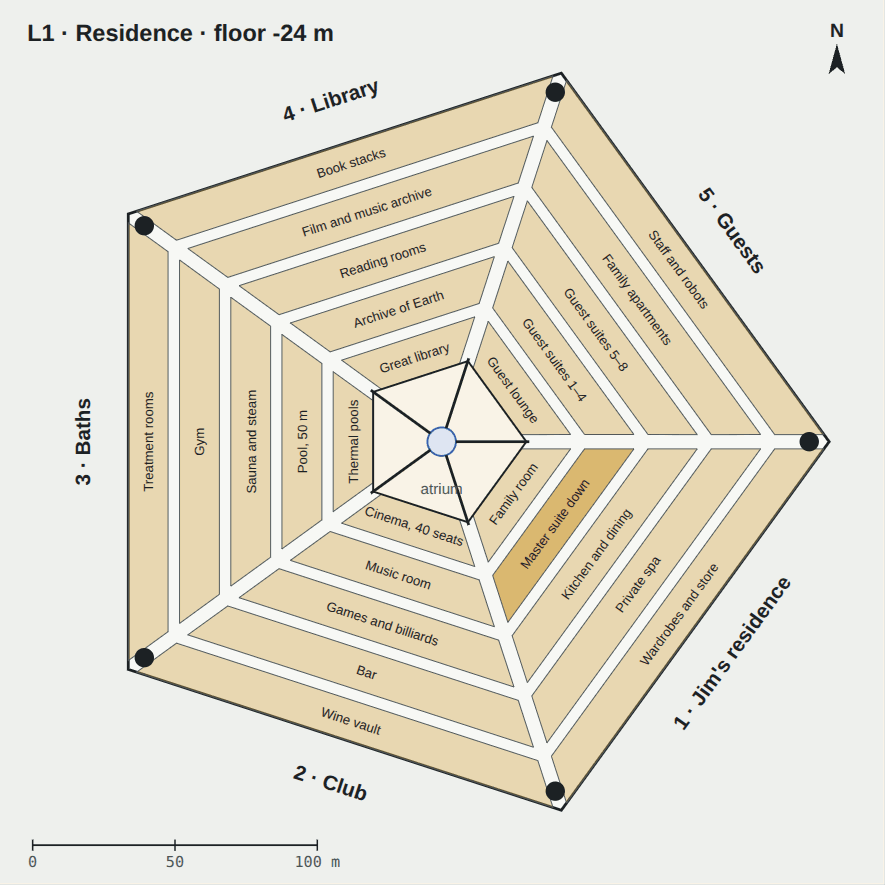
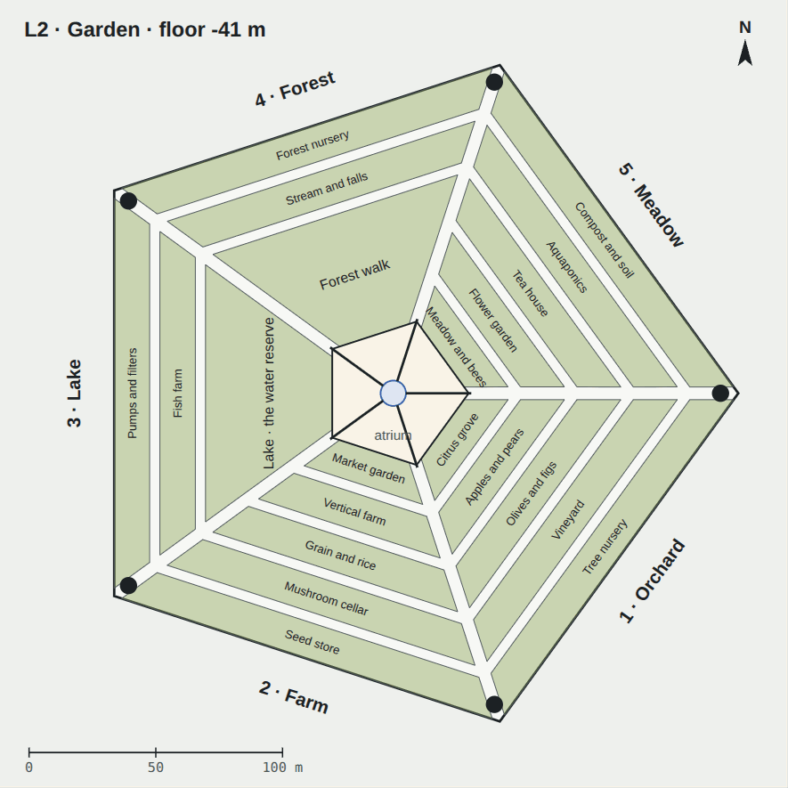
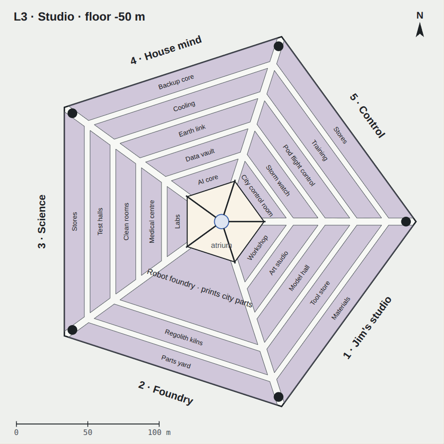
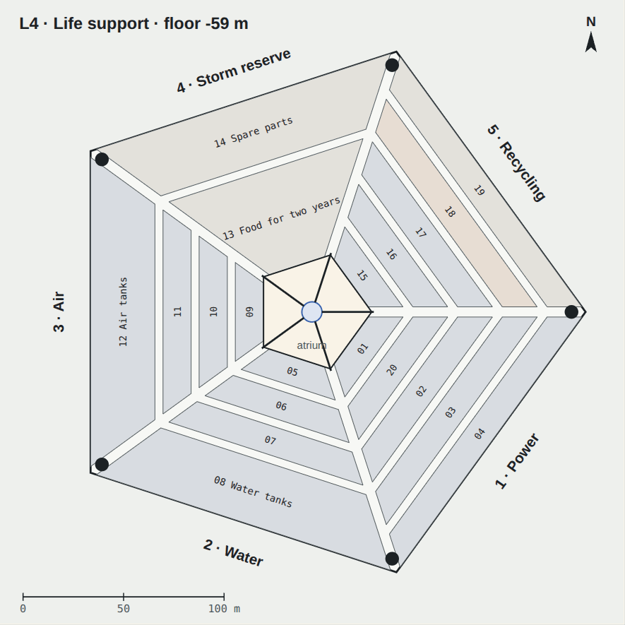
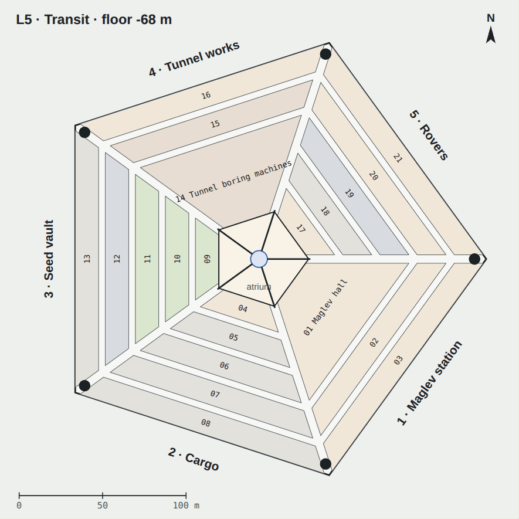
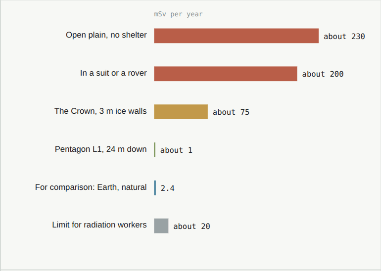
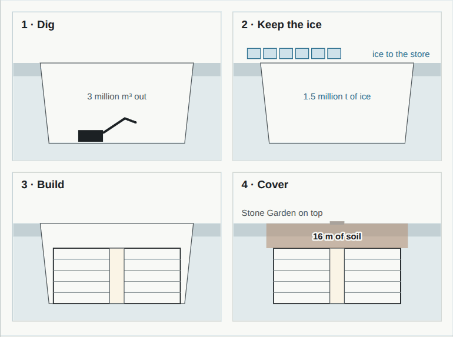

# 03 · The Pentagon

[← 02 The Crown](02-crown.md) · [Design](README.md) · **03 The Pentagon** · [04 Interiors →](04-interiors.md)

**[Open the full chapter on the live site ↗](https://ttmathcs.github.io/mars-campus/palace/design/pentagon.html)**

Arcadia below ground. One solid five-sided block, 160 m on each side and five levels deep, lies under the Stone
Garden with 16 m of soil on top. It is for the nights and the work: where Jim sleeps, where the gardens and
the workshops are, and where the air, water and power come from. **Requirements:** PG-1 to PG-3, LV-3, CR-4.

*Section east to west through the centre, looking north, to scale. To the right the cut runs along the east avenue to
the corner core under the Arrival spire. The atrium drops 68 m from the Sun Well to the sun court on L5.*

| | |
| --- | --- |
| **160 m** | Each of the five sides; the corners lie exactly under the Crown's five spires |
| **−16 to −68 m** | Five levels, from the roof of L1 to the floor of L5 |
| **209,700 m²** | Floor area, 41,940 m² a level: 11 times the Crown |
| **16 m** | Soil on top: it stops the radiation and holds the air pressure down |
| **2 min** | The longest walk to a portal; there are no lifts |

## The plan

Every level has the same plan. Round the atrium in the middle run five pentagonal **rings**, A inside to E outside,
each 14 m deep, with 4 m streets between them. Five 5 m **avenues** run out to the five **corner cores**, each under a
spire, with a portal to that spire, a portal to every level, a stair, and the shafts for air, water and power. In the
atrium stands the **portal column**, reached by five bridges on every level. Sector 1 lies to the south-east, straight
below the master suite up, and the sectors are numbered clockwise.

L1's rooms, with the codes of the [floor plans](../plans/README.md), ring by ring from the atrium out:

| Sector | Rings A to E |
| --- | --- |
| 1 · Jim's residence | A L1-01 Music room, L1-02 Family room, L1-03 Dining room and bar, L1-04 Study (upstairs) · B L1-05 Laundry and linen, L1-06 Bath, L1-07 Moss garden, L1-08 Bedroom, L1-09 Dressing room, L1-10 Kitchen · C L1-11 Pantry and cold store, L1-12 Robot bay, L1-13 Household stores · D L1-14 Memory rooms · E L1-15 Wardrobe and stores, L1-16 Residence plant room |
| 2 · The club | A L1-17 Cinema · B L1-18 Games room · C L1-19 Ballroom · D L1-20 Wine cellar · E L1-21 Club stores |
| 3 · Baths and sport | A L1-22 Thermal baths · B L1-23 Lap pool, 50 m · C L1-24 Sports hall · D L1-25 Sauna and steam · E L1-26 Treatment rooms |
| 4 · Library and archive | A L1-27 Great library · B L1-28 Archive of Earth · C L1-29 Film and music archive · D L1-30 Book stacks · E L1-31 Conservation workshop |
| 5 · Guests | A L1-32 Guest lounge · B L1-33 to L1-36 Guest suites 1 to 4 · C L1-37 to L1-40 Guest suites 5 to 8 · D L1-41, L1-42 Family apartments · E L1-43 Staff and robots |

## The five levels

| L1 Residence, −24 m · L1-01 to L1-43 | L2 Garden, −41 m · L2-01 to L2-21 |
| --- | --- |
|  |  |
| Jim's home below ground, for the nights and the evenings: his residence, the club, the baths, the library and the guests. Everyone sleeps here, under 16 m of soil | 16 m tall under a sky of lamps: orchards, a farm, a lake that is also the water reserve, a forest with a stream, and a meadow with bees |
| **L3 Studio, −50 m · L3-01 to L3-23** | **L4 Life support, −59 m · L4-01 to L4-19** |
|  |  |
| Jim's studio and workshops, the robot foundry that prints parts for the city, laboratories and the medical centre, the house mind and the control rooms | The city feed, batteries, fuel cells and heat pumps, water from ice, the air plant, the storm reserve of two years' food, and recycling |
| **L5 Transit, −68 m · L5-01 to L5-21** | |
|  | |
| The maglev station (phase 2), the cargo halls, the seed vault, the tunnel works, and the rover hall with the tunnel up to the plain. The sun court is at its centre | |

## Why underground

*Radiation in mSv a year, if you stayed in one place all year. Estimates from Curiosity's radiation measurements.*

- **Radiation:** about 230 mSv a year on the open plain; under 16 m of soil, less than people get on Earth.
- **Pressure:** soil on top balances the air inside pushing up: 101 kPa ÷ (1.7 t/m³ × 3.71 m/s²) ≈ 16 m. At the
  chosen 70 kPa, 11 m would balance, so the roof never has to hold the Pentagon down against its own air.
- **Temperature:** a few metres down the ground stays near −60 °C all year. The walls are insulated so the ice-rich
  ground stays frozen, like buildings on permafrost in Canada.
- **Storms and quakes** don't reach it.

## The atrium and the sun court

A five-sided shaft 35 m across and 68 m deep. Light from the Sun Well's sky lens falls down its middle; its walls are
terraces of hanging gardens, with water running down from the lake on L2. At the bottom, the **sun court** is a garden
of 2,100 m² lit with the colour and warmth of a clear Mars noon. The lens shows the sky that is outside, and keeps it
bright through a dust storm.

*Future technology: portals.* Step through the one in a corner core and you are in the spire above, or on another
level. **Real fallback:** a stair in every corner core from L5 to L1, robot carriers on spiral ramps for goods, and a
sealed stair to a hatch in the garden. Each sector can be sealed by pressure doors, and every point has two ways out.

## How it is built

*Four stages: dig, keep the ice, build, cover. The soil that comes out becomes the walls and the cover; the ice
becomes the water store and the rocket fuel.*

Robots dig an open pit about 70 m deep, about 3.1 million m³, in frozen ground whose walls stand steep on their own.
Below 14 m most of it is ice, about 1.5 million tonnes: water, air and rocket fuel for decades. The walls, floors and
roof are sintered-regolith panels made from the dug soil; then 16 m of soil goes back on top. Over it go a paved pentagon
4 m wider than the block, so the ground shows where Arcadia lies, the Stone Garden inside it, the Orb's dock round
the Sun Well, a glass pavilion over each corner stair, and the Crown's pads. L4 and L5 are finished first; the gardens take the longest to grow.
