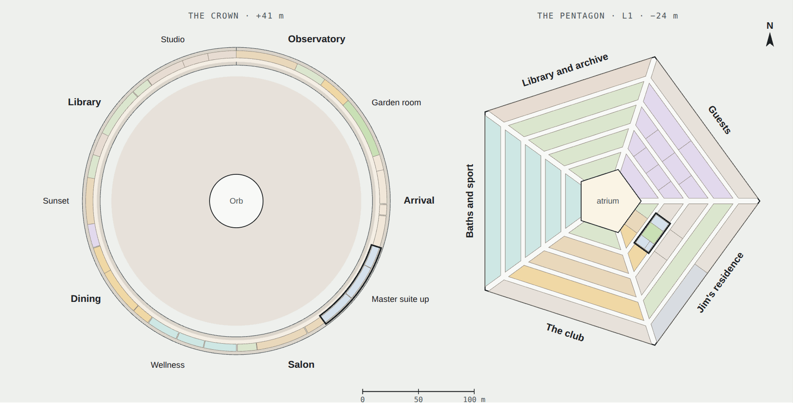
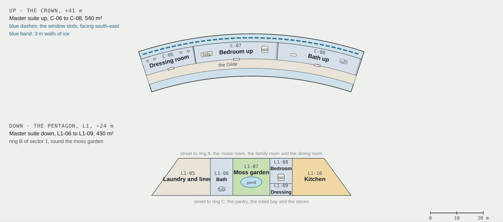
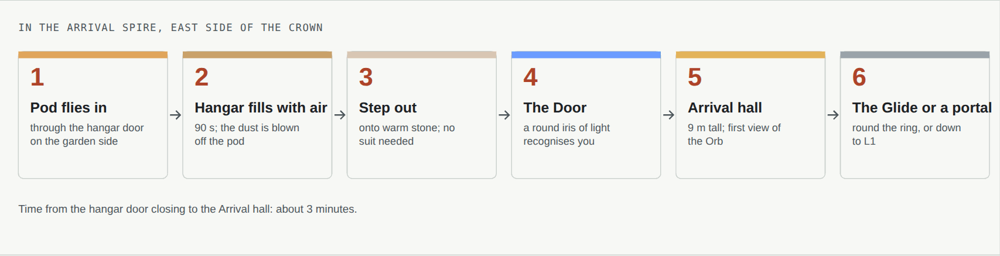
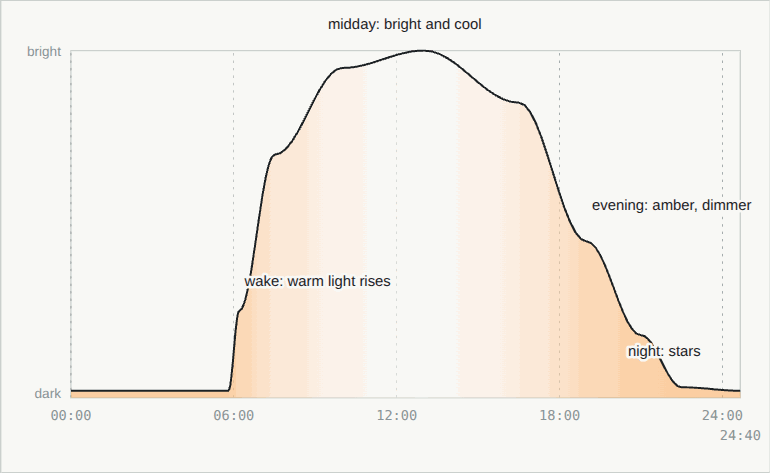

# 04 · Interiors

[← 03 The Pentagon](03-pentagon.md) · [Design](README.md) · **04 Interiors** · [05 Power →](05-power.md)

**[Open the full chapter on the live site ↗](https://ttmathcs.github.io/mars-campus/palace/design/interiors.html)**

*Jim's family room on L1, path-traced from the 3D model. Every room, picture first: **[The rooms, in pictures](../rooms.md)**.*

The rooms of Arcadia, what they look like and what they are made of. The Crown is for daylight, views, music and
guests; the Pentagon for sleep, water, gardens and work. The aim everywhere: calm rooms of real materials that feel
like Earth, in a house that could only be on Mars. **Requirements:** LV-1 to LV-7, TR-5, TR-6.

*Left, the Crown's main floor at +41 m; right, the Pentagon's residence level L1, 24 m down, at the same scale and
turned the same way. The two master suites (outlined) are one above the other, in the south-east.*

## Design language

A small palette of **real materials**, most made on Mars: stone and ceramic from the ground, glass from its sand,
metals from its rocks, wood from the trees on L2. Surfaces are matt and warm; colour comes from the materials, never
from paint. In the Crown, light comes through the window slots, a blade of gold at sunrise and sunset. In the
Pentagon every room has a **sky ceiling**, an artificial skylight that follows the time of day. No room shows its
machines.

| Material | Where |
| --- | --- |
| Polished basalt | Hall floors, the dining table, the pool deck |
| Regolith plaster | Curved walls, warm white with a fine sand texture |
| Olive and walnut | Benches, shelves and doors, grown on L2 |
| Linen | Curtains, sofas and bedding, from flax grown on L2 |
| Bronze | Slot reveals, handrails, the library's ladders |
| Titanium | Fittings, kitchen and bathroom metal |
| Mars glass | Screens, shower walls, the atrium balustrades |
| Moss and ferns | Living walls in the baths, the suites and the Glide |

## The Crown's rooms

*The great salon, 45 m along the ring under the Salon spire. [More rooms in pictures](../rooms.md#the-crown).*

| Part | Codes | What it is like |
| --- | --- | --- |
| Arrival (spire, E) | C-01 to C-05 | The pod hangar, the suit room, the Door and the Arrival hall, 9 m tall, of basalt and plaster, with the first view back over the garden to the Orb. Upstairs, dock control watches the pods come in |
| Master suite up (dip, SE) | C-06 to C-08 | Jim's day rooms for resting: the bedroom faces the sunrise through the south-east slots, with the dressing room at one end and a bath with a soaking tub by the slots at the other |
| Salon (spire, SSE) | C-09 to C-12 | The great salon, 45 m along the ring, with wool rugs and low sofas; the hearth room of cold, lit mist at one end and the recital room with the concert grand at the other. Upstairs, the Sky lounge |
| Wellness (dip, SSW) | C-13 to C-15 | A 25 m sky pool along the ring, where low gravity makes every wave rise high and fall slowly; a spa with a cedar sauna and a round hot pool; a gym with the view |
| Dining (spire, SW) | C-16 to C-19 | A dining hall for 22 at one basalt table, the chef's kitchen, and a wine room of Mars glass stocked from the cellar below. Upstairs, the Sky bar |
| Sunset (dip, W) | C-20 to C-22 | The sun sets straight down the length of the sunset lounge. At one end the guests' day room; at the other a gallery of Jim's paintings and photographs of Mars |
| Library (spire, NW) | C-23 to C-26 | Jim's study in the north light, two floors of walnut shelves round a spiral stair, and a map room with a 3 m globe of Mars. Upstairs, a reading gallery under the roof |
| Studio (dip, NNW) | C-27 to C-29 | An art studio in the steady north light, a photo and print room, and a craft room for pottery and models; heavy work goes down to the workshops on L3 |
| Observatory (spire, NNE) | C-30 to C-32 | A star lounge with reclining seats under the northern sky, and the telescope room. Upstairs, the telescope dome with a 1 m telescope |
| Garden room (dip, NE) | C-33 to C-34 | A breakfast room in the morning light through the east slots, and a sky garden of fruit trees, flowers and herbs |

## The Orb's rooms

The Wormhole Gate, a ball 18 m across, floats in a round space of glass 24 m across. On each of three floors five
rooms sit between two lanes: the outer lane along the windows, the inner lane along the glass onto the Gate. In any
room the universe can be switched on, in 3D, in the room itself
([chapter 02](02-crown.md#the-orb-the-universe-in-vr-and-the-wormhole-gate)).

| Floor | Rooms | What it is like |
| --- | --- | --- |
| +64 m · 870 m² | Portal rooms, O-02 to O-06 | Five portal rooms, one from each spire, with seats to wait in, round the foyer under the Gate (O-01). Polished basalt and bronze frames; from the inner lane you look up at the Gate through the glass |
| +72 m · 1,070 m² | Universe lounges, O-07 to O-11, and the Gate | Five lounges, one for each part of the universe: Earth, Mars, solar system, galaxy, deep universe. Deep sofas face the Gate; at a switch the universe fills the room in 3D, with Earth and Mars and their weather in the corner of your view. The bridge (O-12) leaves the inner lane into the Gate |
| +80 m · 870 m² | Rest rooms, O-13 to O-17 | Jim's rest room and four more: a day bed, a window to the sky across the outer lane, and a glass wall onto the Gate that turns frosted. The windows are radiation glass; at night Jim sleeps below ground |

## Two master suites

*The two master suites, plans at the same scale, from the floor plans. Up: three rooms along the outer wall of the
ring, the window slots facing the sunrise. Down: the bath, the bedroom and the dressing room round a moss garden open
to a lit roof, between the laundry and the kitchen.*

Jim asked for "one up and one down". They sit one above the other in the south-east. **Master suite up**, C-06 to
C-08, 540 m², in the Crown's dip between the Arrival and Salon spires: three rooms along the outer wall, the dressing
room, the bedroom and the bath; the bed faces the south-east slots, so on a clear morning the sun rises straight
across the room. It is Jim's day room for a nap after lunch or an hour of reading. **Master suite down**, L1-06 to
L1-09, 430 m², in ring B of sector 1 on L1, 65 m below: the bath, the bedroom and the dressing room round a moss
garden open to a lit roof 8 m up, under a sky ceiling that dims to stars at night. Under 16 m of soil it is the
quietest, safest room on Mars, and where Jim sleeps.

## Coming home

*The hangar is the house's airlock; nobody wears a suit to come home.*

The pod flies straight into the hangar from the garden side. The hangar fills with air in about 90 seconds while the
dust is blown off the pod. Beside it, the suit room keeps the suits in ports in the outer wall, so no dust comes in.
**The Door**, a round opening 5 m across closed by an iris of light, recognises Jim by face, eyes and the way he walks,
and opens only for him and his guests. Then the Arrival hall: 9 m tall, basalt floor, olive-wood bench, and the
first window slot looking back to the Orb.

## The Pentagon's rooms

*The family room on L1, by the hearth. [More rooms in pictures](../rooms.md#the-pentagon-l1-jims-residence).*

| Level | Area | Codes | What it is like |
| --- | --- | --- | --- |
| L1 | Jim's residence | L1-01 to L1-16 | On ring A, behind glass onto the atrium gardens: the music room with his piano, the family room by the long fire, the dining room with its bar, and the study upstairs. On ring B: the bedroom, bath and dressing room round a moss garden, and the kitchen. Further out: the pantry, the robot bay, the memory rooms and the stores |
| L1 | The club | L1-17 to L1-21 | A 40-seat cinema with a screen 12 m wide, a games room for billiards, cards and low-gravity table tennis, a ballroom for the parties when visitors come, and the wine cellar |
| L1 | Baths and sport | L1-22 to L1-26 | Thermal baths at three temperatures, a 50 m lap pool, a sports hall with a climbing wall and a running track, saunas and steam rooms, and treatment rooms |
| L1 | Library and archive | L1-27 to L1-31 | The great library, two storeys of books read at long tables by the atrium glass; the Archive of Earth; the film and music archive; robotic book stacks; a conservation workshop |
| L1 | Guests | L1-32 to L1-43 | A guest lounge two storeys tall, eight guest suites and two family apartments, and rooms for staff and robots. Guests sleep below ground, as Jim does |
| L2 | The garden level | L2-01 to L2-21 | 16 m tall under a sky of lamps: orchards and a vineyard, a farm, a lake that is the house's water reserve, a forest with a stream and falls, and a meadow with bees and a tea house |
| L3 | Jim's studio | L3-01 to L3-05 | Jim's workshop, a sculpture and casting hall, and a model hall where the city is planned at 1:500 before the robots build it |

## Light through the sol

*Brightness of the sky ceilings from midnight to midnight; the line's colour is the colour of the light.*

The house keeps Mars time, a sol of 24 h 40 min, and the sky ceilings follow the pattern the body expects: warm light
at waking, bright cool light at midday, warm and dim in the evening, then darkness and stars. In a dust storm the
house keeps the same bright sols indoors.

## Living with Mars indoors

| Mars | What you notice | How the rooms deal with it |
| --- | --- | --- |
| Gravity 38% of Earth's | You bounce when you walk fast; water falls slowly | Taller, deeper stairs with handrails; heavy furniture; showers with a curtain of air |
| Air at 70 kPa, 27% oxygen | It breathes like Calgary; water boils at 90 °C | Pressure cookers; no open flames; materials that don't burn |
| Perchlorate dust | Nothing, if the design works | Suits stay outside; the pod is cleaned in the hangar; filtered air |
| Distance from Earth | Calls lag 3 to 22 minutes each way | Messages instead of calls; a local archive of films, music and books |
