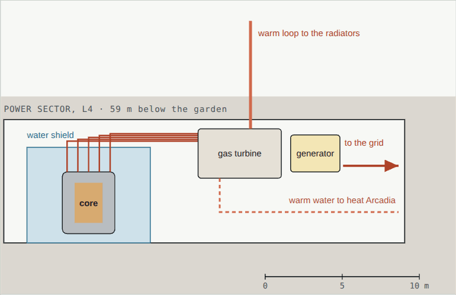
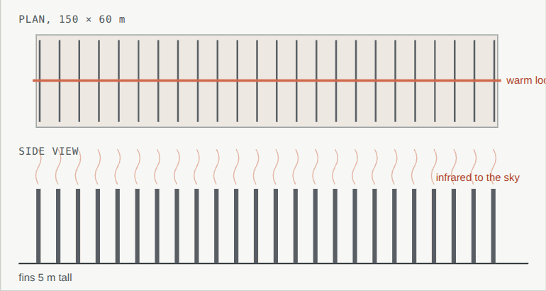

# 05 · Power

[← 04 Interiors](04-interiors.md) · [Design](README.md) · **05 Power** · [06 Transportation →](06-transport.md)

**[Open the full chapter on the live site ↗](https://ttmathcs.github.io/mars-campus/palace/design/power.html)**

On Mars, power is life: it makes the air, melts the water, lights the farms and fuels the ships home. Sunlight is weak,
a global dust storm can hide it for weeks, and Jim wants no panels spread over the ground (1 Oct 2026), so Arcadia and
the spaceport run on nuclear power that never stops. **Requirements:** SY-1, GN-12.

*The power system in phase 1, average megawatts, the same on a clear sol and in a storm. Band widths are to scale.
Electricity is orange, heat is red; the 30 km cable joins Arcadia and the spaceport into one grid.*

| | |
| --- | --- |
| **8 MW** | Average demand in phase 1: Arcadia, the spaceport and the fuel plant |
| **20 MWe** | Four fission microreactors of 5 MWe, two at Arcadia and two at the port, running day and night, in storms too |
| **0** | Panels on the ground: nothing to clean, nothing for a storm to bury |
| **30 km** | Buried DC cable linking Arcadia and the spaceport |
| **9 days** | Full power from fuel cells alone, burning stored rocket fuel |

## Where it comes from

- **Fission microreactors:** four units of 5 MWe, each the size of a shipping container, cooled by heat pipes with no
  pumps to fail. Two sit on the Pentagon's L4, 59 m down; two in a buried vault at the spaceport. Each runs about
  8 years between refuellings. Real: NASA's KRUSTY test (2018) ran a small heat-pipe reactor at full power, and NASA's
  Fission Surface Power project is developing reactors for the Moon.
- **Batteries** of 20 MWh at each end cover a reactor trip or the evening peak, and **fuel cells** can burn the methane
  and oxygen stored for the ships: 1,000 t keeps 8 MW going for about 9 days.
- The **fuel plant** is the one load that can wait: it takes whatever the rest of the grid is not using, so the
  reactors run steadily, and it slows down while a reactor is refuelled. *The anti-gravity drives and portals are
  future technology; 0.5 MW is kept for them.*
- **No solar field.** Solar power works on Mars (Spirit, Opportunity and InSight ran on it), but a field big enough for
  this house would cover the plain in panels, and a global dust storm can hide the sun for weeks; one ended Opportunity
  in 2018.

| Source | Where | Capacity | Average, clear sol | In a global dust storm |
| --- | --- | --- | --- | --- |
| 2 fission microreactors | Pentagon L4 | 2 × 5 MWe | 4.9 MW of 9 | 4.9 MW of 9 |
| 2 fission microreactors | Spaceport vault | 2 × 5 MWe | 3.1 MW of 9 | 3.1 MW of 9 |
| Batteries | House and port | 2 × 20 MWh | evening peaks | reactor trips |
| Fuel cells on stored methane and oxygen | Spaceport | 8 MW | standby | if a reactor is down |

*A reactor vault on L4: the core in a steel vessel inside a water-filled shield; heat pipes carry its heat to a gas
turbine, and the waste heat goes up to the radiators.*

## Through a sol

*Supply and demand through a sol. Arcadia and the port follow the day; the fuel plant takes what is left, so the
reactors run steadily. A global dust storm hides the sun for weeks and changes nothing.*

## The grid

*The trench beside the road: the cables and the fibre lie in sand under a warning layer, 1.5 m down.*

A buried direct-current cable runs 30 km beside the rover road at ±20 kV, able to carry 15 MW either way with about
1.5% lost at full load. With it Arcadia and the spaceport act as one grid: the reactors at either end can carry the
other's loads, so one can be refuelled or repaired while the lights stay on. An optical fibre in the same trench backs
up the radio links.

## Heat

*The radiator field: 24 rows of fins 5 m tall, fed by a warm loop from L4.*

A reactor makes about twice as much heat as electricity. About 2 MW warms the Pentagon's floors, melts ice and keeps
the gardens warm; the rest, up to 20 MW, goes to a field of radiators 150 × 60 m, 400 m north, out of the views from
the Crown's main rooms and far enough away not to thaw the ground under the Pentagon. The port's two reactors have
their own smaller radiators.

## Growing with the city

| Phase | Demand | What is added |
| --- | --- | --- |
| 1 · Port and home | 8 MW | Four 5 MWe reactors, two at each end, batteries, the 30 km cable |
| 2 · First neighbours | 12 MW | The maglev, within the four reactors; about 0.25 MW for each new home |
| 3 · Arcadia City | 60–70 MW | A larger plant in L4's fusion-ready bay, fission until fusion is ready |
| 4 · Connections | — | Links to other Mars cities share power |
