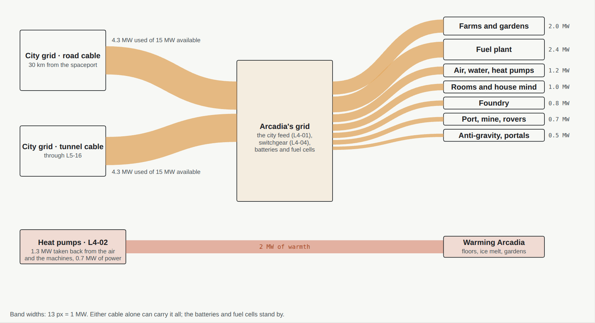
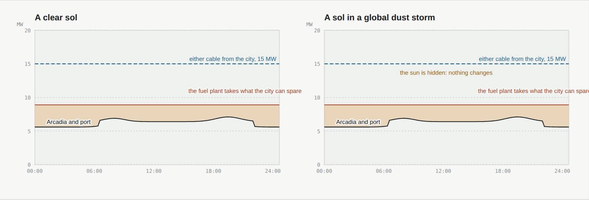
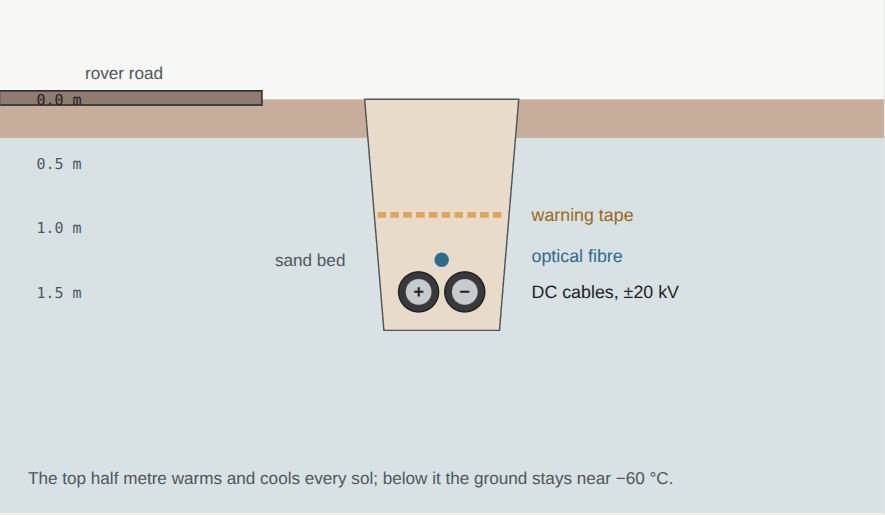

# 05 · Power

[← 04 Interiors](04-interiors.md) · [Design](README.md) · **05 Power** · [06 Transportation →](06-transport.md)

**[Open the full chapter on the live site ↗](https://ttmathcs.github.io/mars-campus/palace/design/power.html)**

On Mars, power is life: it makes the air, melts the water, lights the farms and fuels the ships home. Sunlight is weak,
a global dust storm can hide it for weeks, and Jim wants no panels spread over the ground (1 Oct 2026), so Arcadia
takes its power from the city's grid, as any home in a city does, and keeps enough of its own to ride through an
outage. It has no power plant: no reactor to refuel or guard, no radiators, no panels on the ground (Jim, 6 Oct 2026:
"no nuclear reactor is needed since it is provided by city"). **Requirements:** SY-1, GN-12.

*The power system in phase 1, average megawatts, the same on a clear sol and in a storm. Band widths are to scale.
Electricity is orange, heat is red. The city's power comes in on two cables, either of which can carry it all.*

| | |
| --- | --- |
| **8.6 MW** | Average demand in phase 1: Arcadia, the spaceport and the fuel plant |
| **2 cables** | From the city's grid by two routes, each able to carry it all: 15 MW |
| **0** | Reactors and panels: the city makes the power; nothing to refuel, nothing for a storm to bury |
| **20 MWh** | Batteries at Arcadia, and as much at the port, for the evening peak and the first hours of an outage |
| **9 days** | Full power from fuel cells alone, burning stored rocket fuel, if the city's grid were ever down |

## Where it comes from

- **The city's grid:** the city makes the power and brings it in; Arcadia buys it, as every home in the city does. It
  has no power plant of its own: no reactor to refuel, guard or one day take apart, no field of radiators to shed its
  heat. The power comes in on two buried cables by different routes (the grid, below), at the city feed on L4 (L4-01).
- **Its own, for an outage:** batteries of 20 MWh at Arcadia (L4-03) and 20 MWh at the port carry the evening peak and
  the first hours of any fault; **fuel cells** (L4-20, and at the port) can burn the methane and oxygen kept for the
  ships: 1,000 t keeps 8 MW going for about 9 days.
- The **fuel plant** is the one load that can wait: it runs hardest when the city has power to spare, at night and when
  the farms' lamps are off, and slows down when the city asks. *The anti-gravity drives and portals are future
  technology; 0.5 MW is kept for them.*
- **No solar field.** Solar power works on Mars (Spirit, Opportunity and InSight ran on it), but a field big enough for
  this home would cover the plain in panels, and a global dust storm can hide the sun for weeks; one ended Opportunity
  in 2018.

| Source | Where | Capacity | Average, clear sol | In a global dust storm |
| --- | --- | --- | --- | --- |
| The city's grid · road cable | 30 km by the rover road, from the spaceport | 15 MW | 4.3 MW | 4.3 MW |
| The city's grid · tunnel cable | Through the city's first tunnel, L5-16 | 15 MW | 4.3 MW | 4.3 MW |
| Batteries | Arcadia (L4-03) and port | 2 × 20 MWh | evening peaks | the first hours of an outage |
| Fuel cells on stored methane and oxygen | Arcadia (L4-20) and port | 8 MW | standby | if the city's grid is down |

*Real technology: buried direct-current cables already join countries on Earth (NordLink carries 1,400 MW over 623 km
between Norway and Germany, 2021); battery plants of hundreds of megawatt-hours steady grids today, and solid-oxide
fuel cells run on methane.*

## Through a sol

*Supply and demand through a sol. Arcadia and the port follow the day; the fuel plant takes what the city can spare. A
global dust storm hides the sun for weeks and changes nothing here.*

## The grid

*The trench beside the road: the cables and the fibre lie in sand under a warning layer, 1.5 m down.*

The city's power comes in on two buried direct-current cables by different routes, so a cut in one leaves the other:
one runs 30 km beside the rover road from the spaceport, where the city's grid reaches, and the other comes through
the first of the city's tunnels (L5-16). Each, at ±20 kV, can carry 15 MW, the house and the port together with room
to spare, with about 1.5% lost at full load. An optical fibre runs in each trench and backs up the radio links. Inside
Arcadia power is distributed as direct current; the switchgear is on L4 (L4-04), beside the batteries.

## Heat

With no reactor there is no spare heat, so Arcadia makes its own warmth. Heat pumps on L4 (L4-02) take the heat back
out of the air leaving the rooms and out of the machines beside them (the air and water plants, the house mind's
computers) and put it into warm water for the floors, the ice melt and the gardens: about 2 MW of warmth in the coldest
weeks for about 0.7 MW of electricity. A tank of hot water (L4-03) covers the evening peak; the thick insulation of the
Pentagon and the frozen ground round it keep most of the warmth in (chapter 08). No radiators.

## Growing with the city

| Phase | Demand | What is added |
| --- | --- | --- |
| 1 · Port and home | 8.6 MW | The city's power on two cables, batteries and fuel cells at both ends |
| 2 · First neighbours | 12 MW | The maglev, within the two cables; about 0.25 MW for each new home |
| 3 · Arcadia City | 60–70 MW | The city's grid grows with it; its tunnels carry the cables to every home |
| 4 · Connections | — | Links to other Mars cities share power |
