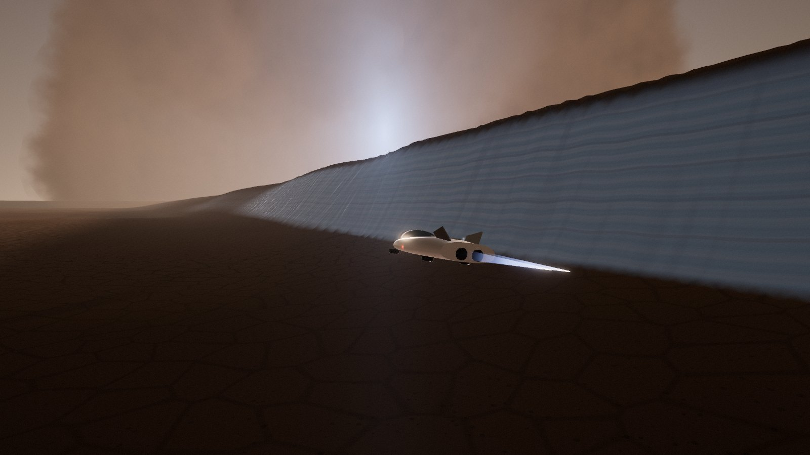
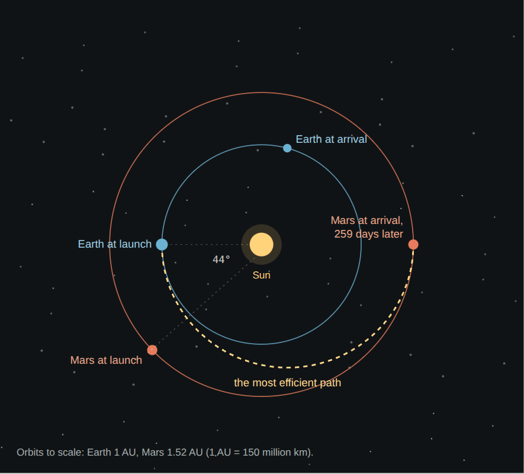
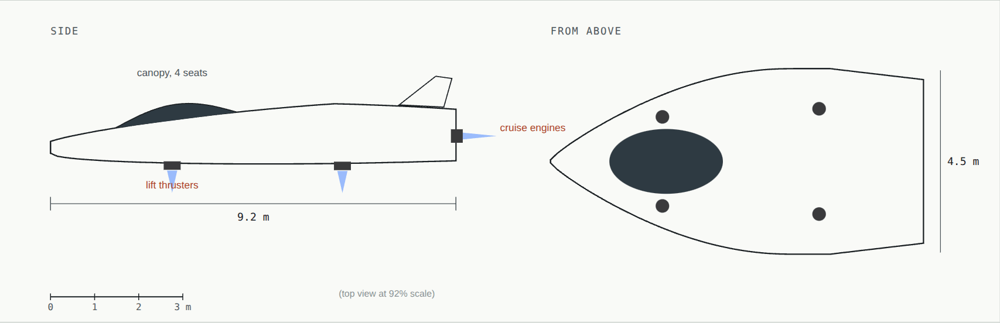
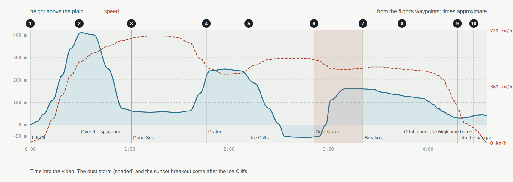
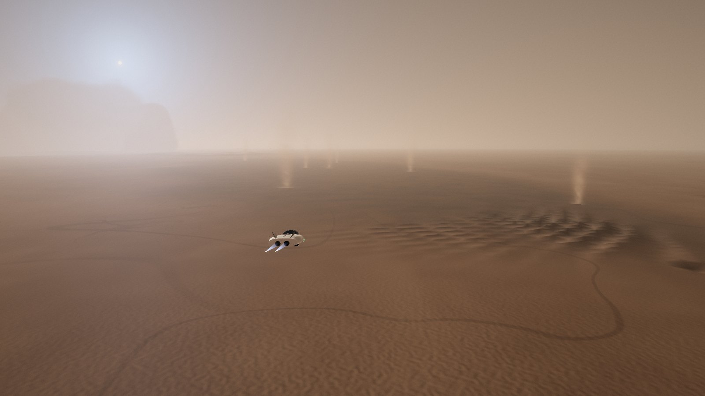
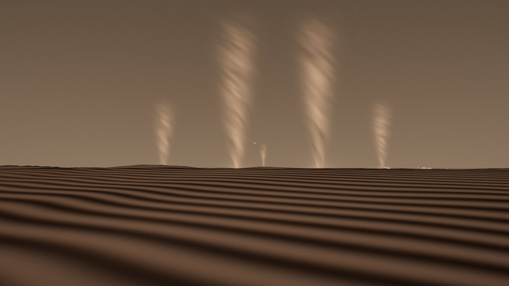
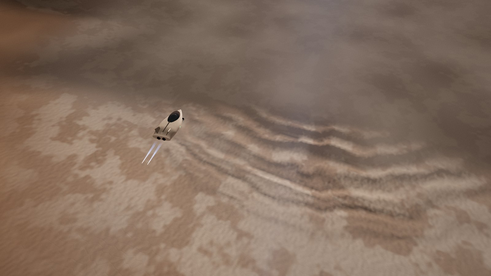
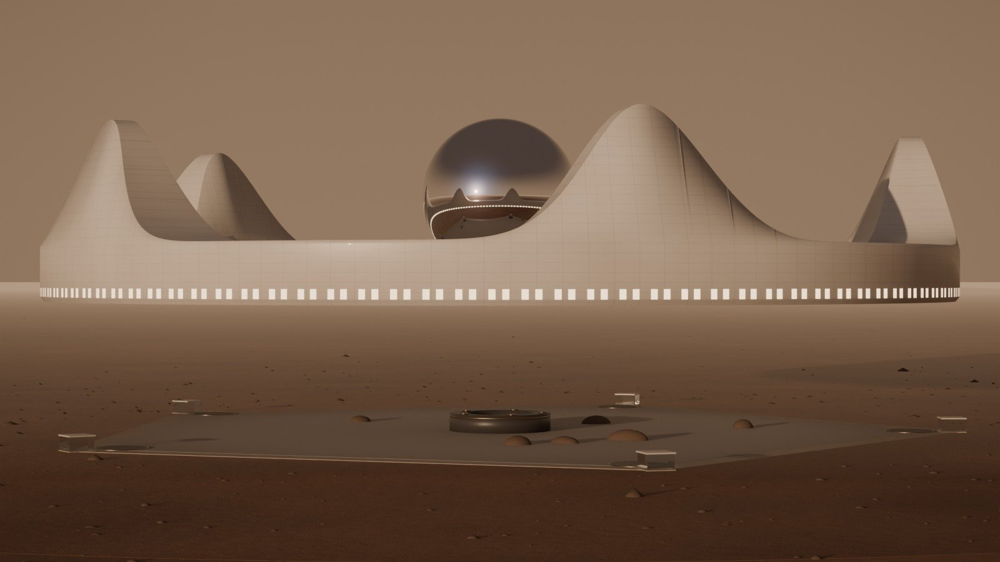
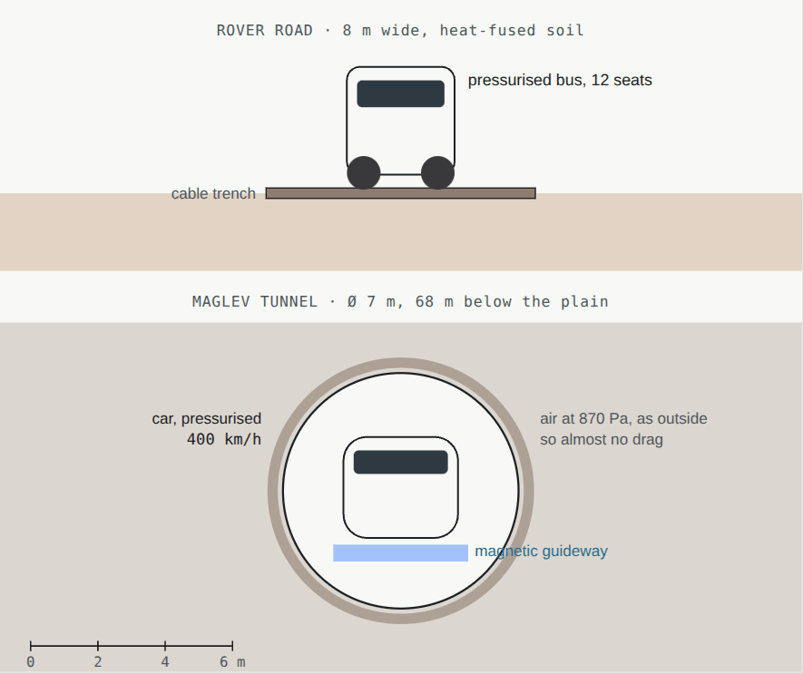

# 06 · Transportation

[← 05 Power](05-power.md) · [Design](README.md) · **06 Transportation** · [07 Arcadia Spaceport →](07-spaceport.md)

**[Open the full chapter on the live site ↗](https://ttmathcs.github.io/mars-campus/palace/design/transport.html)**

Since 2 October 2026 the Wormhole Gate does the travelling: press send in the Orb and it takes Jim, or a guest, to Earth, the spaceport or anywhere, in a moment. So the pod and the ships are for journeys taken to see the views: the pod's scenic flight over the Dune Sea, a crater and the Ice Cliffs, through a dust storm into the blue sunset, and voyages from the spaceport to orbit, Phobos and Deimos. Rovers and, later, a maglev train move goods along the ground; inside Arcadia, portals take Jim anywhere in one step. *Real fallback: if the Gate stays a dream, the ships and the pod carry people and cargo, as designed below.* **Requirements:** SY-2, TR-2 to TR-4, TR-7, CR-4.

| | |
| --- | --- |
| **A moment** | By the Wormhole Gate, to Earth or anywhere: the way to travel |
| **26 months** | Between launch windows for the ships; the trip takes about 6 months |
| **4 min 40 s** | The pod's scenic flight: 37 km at up to 680 km/h |
| **45 min** | By pressurised bus on the rover road, when pods can't fly |
| **6 min** | By maglev, 68 m underground, from phase 2 |
| **1 step** | By portal, anywhere in Arcadia |

## From Earth

*Launch when Mars is 44° ahead of Earth; the most efficient path, half an ellipse, arrives 259 days later.*

Earth and Mars line up for an efficient trip once every 26 months. Ships leave Earth in that window, coast for about
six months, land on one of the spaceport's pads, refuel with methane and oxygen made on Mars, and fly back in the next
window. Jim leaves in the window of **November–December 2026** and lands in **mid-2027** (decided 1 Oct 2026).

## The pod

*Four lift thrusters under the body for take-off and landing; two cruise engines in the tail.*

The air at the site is less than 1% of Earth's, so rotors can barely lift anything; the pod takes off and lands on
four thrusters burning methane and oxygen, like a small ship. At speed its flat-bottomed lifting body carries about a
quarter of its weight. It has 4 seats, is 9.2 m long, weighs about 6 t fuelled, tops 680 km/h and burns about 1.5 t of
propellant on the scenic flight. It flies itself, can land with one thruster out and carries 12 hours of air; in a
big storm the pods stay home and the bus takes over.

## The scenic flight

*Height and speed through the flight, from the demo's flight path. The numbers are the ten shots of the video.*

The route is a designed flight, not the shortest path (that would be 30 km in under 3 minutes). It crosses the Dune
Sea, climbs over the rim of a 3.2 km crater, follows the Ice Cliffs, dives through a dust storm, breaks out into the
blue sunset with Phobos crossing the sun, circles the Crown, passes under the ring 30 m above the garden and flies
into the hangar. In the demo you can switch between the director's, cockpit and chase cameras, pause, jump between
shots and skip to the arrival. Phase 1 of the 3D build plays it.

| # | Shot | Time |
| --- | --- | --- |
| 1 | Lift-off at the spaceport | 0:00 |
| 2 | Over the spaceport, turning west into the low sun | 0:30 |
| 3 | The Dune Sea, 55 m over black dunes and dust devils | 1:02 |
| 4 | The crater, over its rim | 1:48 |
| 5 | The Ice Cliffs, beside a 100 m scarp of layered ice | 2:14 |
| 6 | The dust storm: dark red sky, sparks on the canopy, the cockpit on radar | 2:54 |
| 7 | Breakout into the blue sunset, Phobos crossing the sun | 3:24 |
| 8 | One circle round the Crown, then under the ring | 3:48 |
| 9 | Into the hangar in the east spire | 4:22 |
| 10 | Welcome home: the Door recognises you | 4:32 |

| | | |
| --- | --- | --- |
|  |  |  |
| 1 Lift-off | 2 Heading west | 3 The Dune Sea |
|  |  |  |
| 4 Over the crater | 5 The Ice Cliffs | 7 The Crown ahead, after the storm |

## On the ground: the road and the maglev

*Road and tunnel, to scale: the bus on the road; the maglev car in its 7 m tunnel, 68 m down.*

- **The rover road:** 30 km of rolled, heat-fused soil, 8 m wide. Pressurised buses carry 12 people in shirt sleeves at
  40 km/h, 45 minutes end to end; electric cargo rovers carry containers and ice.
- **The maglev (phase 2):** a straight tunnel 30 km long, 68 m down, from L5 to a station under the terminal. Mars air
  is so thin that the train meets almost no resistance even though the tunnel is not pumped out: 400 km/h, about
  6 minutes.

## In Arcadia: portals

*Future technology.* Portals in the Crown's five spires, the Orb, the Pentagon's corner cores and the atrium's portal
column link every level in one step. Jim's words: "No elevator. From crown to underground is by wormhole or any
transmission device." **Real fallback:** stairs in the corner cores, robot carriers on ramps, the Glide round the
Crown, and the pods and escape capsules between the Crown and the ground.

| How | Between | Time | Carries | When |
| --- | --- | --- | --- | --- |
| Wormhole Gate | the Orb and anywhere | a moment | people: the way to travel | future technology |
| Ship | Arcadia Spaceport and orbit, the moons, Earth | days to 6 months | voyages to see space; the real fallback for people and cargo | every 26 months to Earth |
| Pod | the spaceport, the Crown's hangar and the sights | 3 to 5 min | 4 people, for the view | phase 1 |
| Bus | the spaceport and the rover hall on L5 | 45 min | 12 people | phase 1 |
| Maglev | L5 and the station under the terminal | 6 min | people and containers | phase 2 |
| Glide | round the Crown, 734 m | up to 4 min | people | phase 1 |
| Portal | spires, Orb, every level; later every home | 1 step | people, goods | future technology |
