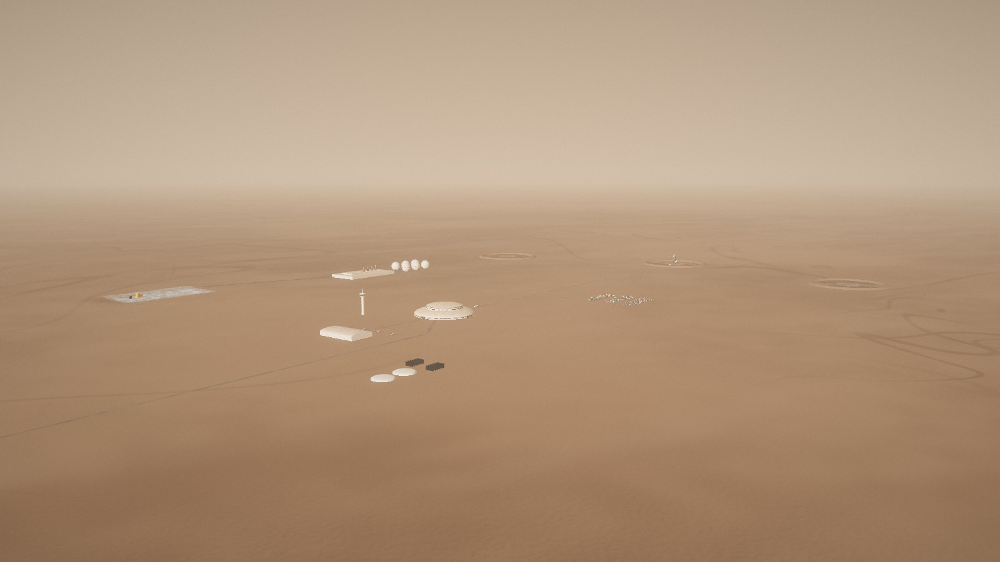
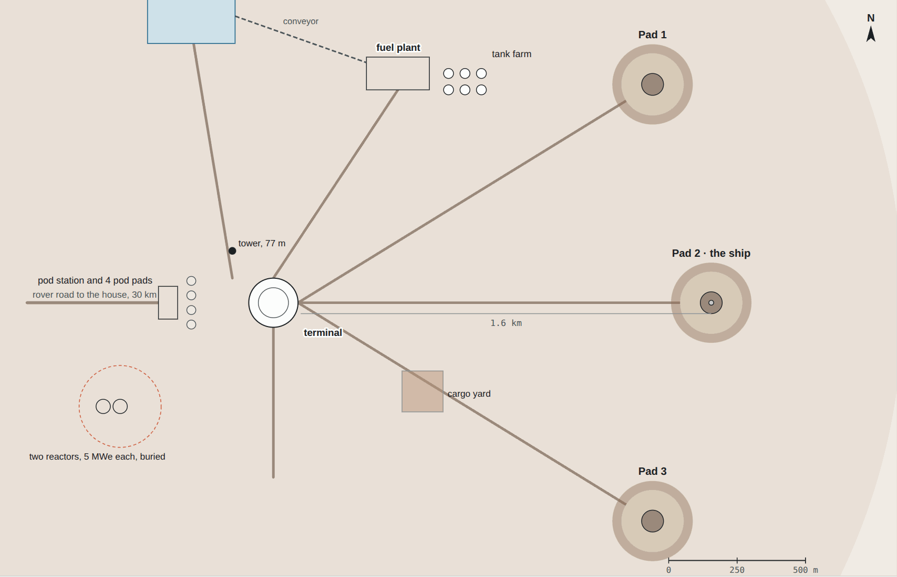
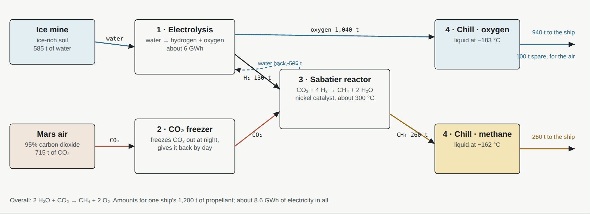
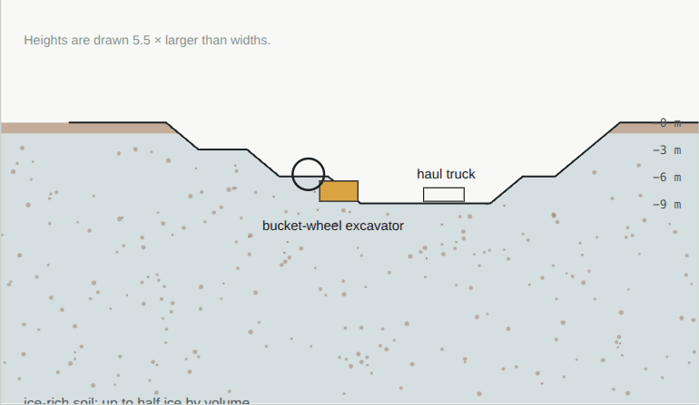
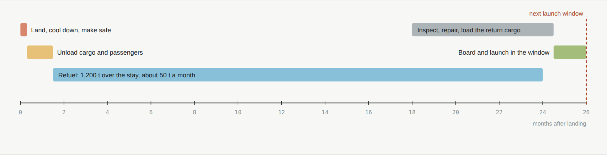
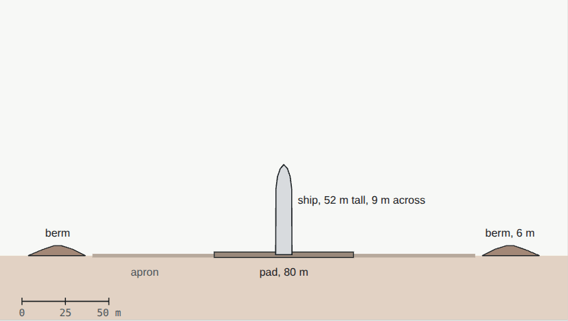
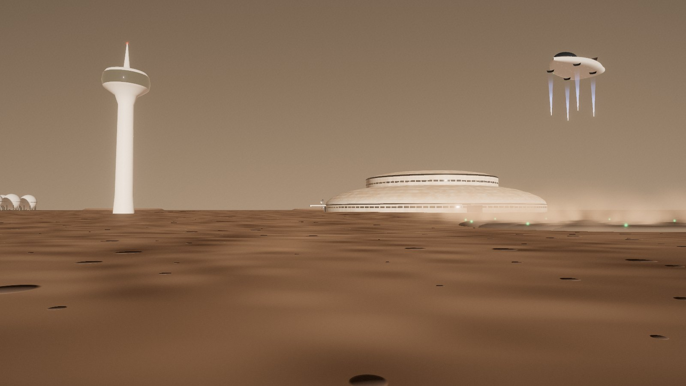

# 07 · Arcadia Spaceport

[← 06 Transportation](06-transport.md) · [Design](README.md) · **07 Arcadia Spaceport** · [08 Life support →](08-life.md)

**[Open the full chapter on the live site ↗](https://ttmathcs.github.io/mars-campus/palace/design/spaceport.html)**

Where the ships land and take off, 30 km east of Arcadia on landing site AP-1. Since the Wormhole Gate does the travelling (2 Oct 2026), its ships fly voyages to see space: to orbit, Phobos and Deimos, and further, and the pods take off from here on their scenic flights. It is a harbour and a refinery in one: three pads for ships, a terminal, a station for the pods, and a fuel plant that turns ground ice and the carbon dioxide in the air into rocket fuel. *Real fallback: if the Gate stays a dream, this is where the ships from Earth land.* **Requirements:** TR-1, TR-7, ST-1, ST-2.

*From the south-west: the two reactor domes in front, the terminal dome and control tower, the pod station, the fuel
plant with its six tanks, the ice mine on the left, and the three landing pads 1.6 km out.*

| | |
| --- | --- |
| **3** | Pads for ships from Earth, 1.6 km from the terminal behind earth berms |
| **1,200 t** | Of methane and oxygen to send one ship home, made here |
| **585 t** | Of water ice, and 715 t of the air's carbon dioxide, go into it |
| **Ø 180 m** | The terminal: arrivals, health centre, lounge |
| **4** | Pod pads at the pod station, on the side facing home |

## The plan

*North up, to scale. The pads are far out to the east because a landing ship throws sand and rocks.*

The pads are 80 m across, of heat-resistant sintered regolith, each inside a ring berm 6 m high. The terminal is a
low white dome 180 m across with a 77 m control tower. The pod station faces home, on the west side. Power comes from
the city's grid, which reaches the port here, with batteries and fuel cells standing by and no panels on the ground; the fuel plant, the tank farm and the ice
mine lie to the north. In phase 2 a
maglev station opens under the terminal.

## The fuel plant

*From ice and air to methane and oxygen, for one ship. The water made in the third step goes back to the first.*

1. **Water:** ice from the mine is melted, filtered and split into hydrogen and oxygen.
2. **Carbon dioxide:** Mars air is 95% CO₂, frozen out on cold plates at night and released as pure gas by day.
3. **The Sabatier reactor:** hydrogen and CO₂ over a hot nickel catalyst become methane and water.
4. **Cold:** methane is chilled to −162 °C and oxygen to −183 °C and pumped to six spherical tanks. The spare oxygen goes
   to Arcadia's air.

Real today: NASA's MOXIE on the Perseverance rover made oxygen from Mars air 16 times (2021–2023), and Sabatier
reactors recycle air on the International Space Station. One ship's 1,200 t takes about 8.6 GWh, about 5 months at
2.4 MW.

## The ice mine

*Three benches, each 3 m high, in soil that is half ice.*

An open pit 320 × 200 m, 1 km north of the terminal. A bucket-wheel excavator works the face; electric trucks and a
500 m conveyor carry the ice-rich soil to the plant. The Pentagon's dig filled the tanks for the first years; AP-9,
58 km further east, is kept for when the city grows.

## A ship's stay

*A ship lands in one window and leaves in the next, 26 months later; most of that time it sits on its pad while the
plant fills it.*

*A pad in section with a ship to scale: the pad, the apron and the berm that catches thrown rocks.*

*Lift-off from the pod station, the start of the scenic flight, with the terminal and the tower.*
