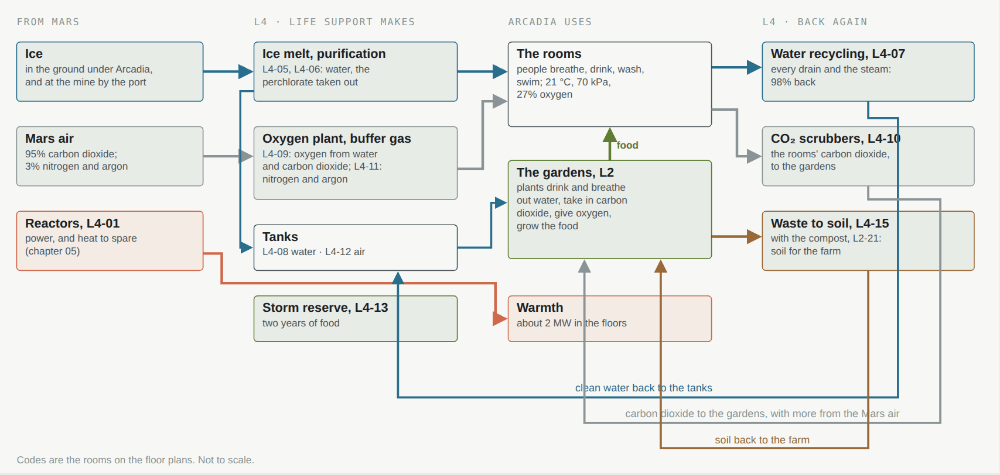
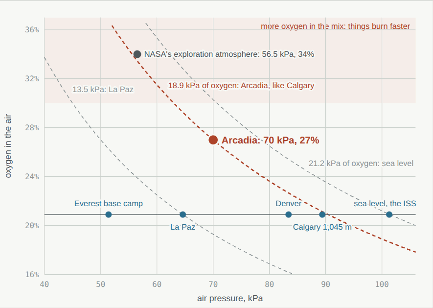
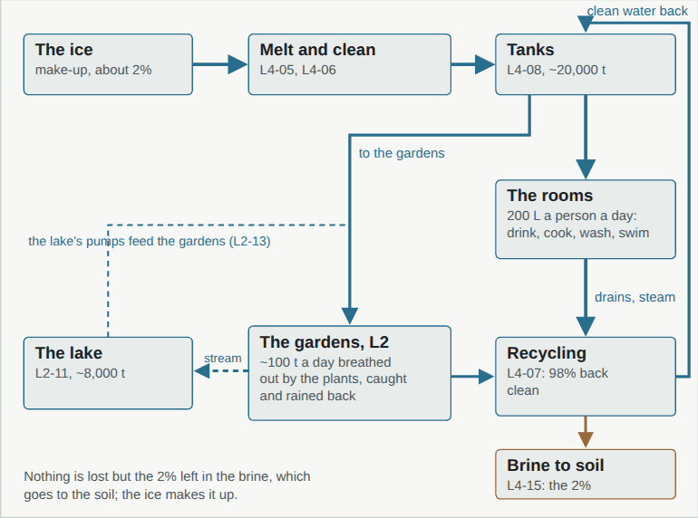
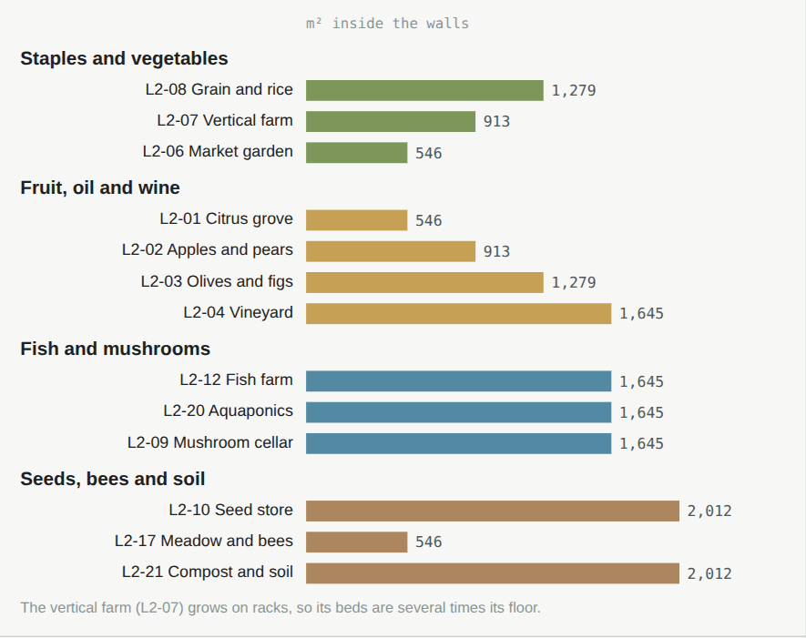
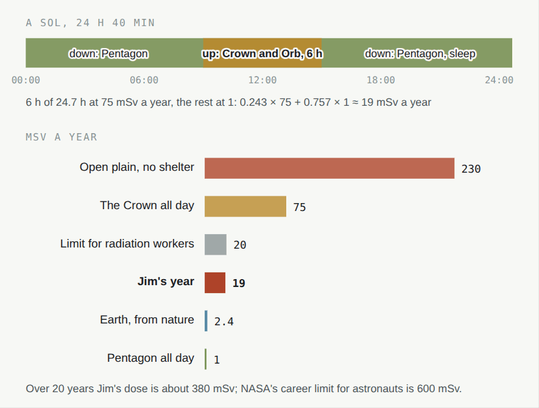

# 08 · Life support

[← 07 Arcadia Spaceport](07-spaceport.md) · [Design](README.md) · **08 Life support** · [09 Communications and space →](09-space.md)

**[Open the full chapter on the live site ↗](https://ttmathcs.github.io/mars-campus/palace/design/life.html)**

Outside, the air is a hundredth as thick as Earth's and almost all carbon dioxide, the ground is −60 °C, the soil holds
perchlorate salts and the sky lets through cosmic rays. Inside Arcadia none of that reaches Jim. L4, 59 m down, makes
the air and the water from Mars itself and takes them back again; the garden level grows the food; heat pumps keep
it warm; the soil and ice overhead keep the radiation out. **Requirements:** SY-3, SY-4, LV-3.

*The loops of life support. Blue: water. Grey: air. Green: food. Brown: waste. Red: heat. The codes are the rooms on
the [floor plans](../plans/README.md).*

| | |
| --- | --- |
| **70 kPa · 27%** | The air: 70% of sea-level pressure, 27% oxygen, which breathes like Calgary |
| **98%** | Of the water used again; the ice in the ground makes up the rest |
| **2 years** | Of food in the storm reserve on L4, besides the farm on L2 |
| **19 mSv** | A year for Jim: by day down in the Pentagon, by night up in the Crown |
| **0** | Open flames, and suits that come indoors |

## The air

*Curves join mixes with the same oxygen pressure: Arcadia's air gives the body what Calgary's does.*

- **70 kPa with 27% oxygen** gives 18.9 kPa of oxygen, a little more than Calgary at 1,045 m (sea level: 21.2).
  Decided on 1 Oct 2026 with our best judgment, as Jim asked. Water boils at 90 °C.
- **Why not Earth's pressure:** every wall and door holds the air in, so lower pressure is a lighter, safer building
  and less gas to make and lose. **Why not lower:** NASA's exploration atmosphere (56.5 kPa, 34%) needs so much
  oxygen in the mix that things burn fast.
- **Suits at 56.5 kPa**, as NASA's newest suit design can work, are above the 51 kPa of nitrogen and argon in
  Arcadia's air, so nobody has to breathe pure oxygen before going out.
- **How much:** about 2.3 million m³, 2,100 t of air: 560 t of oxygen, 1,560 t of nitrogen and argon. The oxygen comes
  from water split by electricity (L4-09) and the fuel plant's spare 100 t a ship; the nitrogen and argon are 3% of
  the Mars air, so the robots freeze the carbon dioxide out of about 52,000 t of it (L4-11) before Jim arrives.
- **Breathing out:** a person uses 0.84 kg of oxygen a day and breathes out about 1 kg of carbon dioxide; the gardens
  under their lamps take in roughly a tonne a day (our estimate), so they are fed carbon dioxide from the Mars air.
- Real: MOXIE made oxygen from Mars air on Perseverance 16 times (2021–2023); the ISS makes its oxygen by electrolysis.

## Water

- **Plenty to start with:** 1.5 million t of ice from the Pentagon's dig, 90,000 t in the Crown's walls, the ice mine
  by the port. People use a few tonnes a year.
- **Clean:** melted on L4 (L4-05) and cleaned (L4-06): the soil's perchlorate, about 0.5%, is taken out by ion exchange
  and reverse osmosis, as from polluted wells on Earth, and bacteria break the rest into salt and oxygen.
- **Used again:** water recycling (L4-07) returns **98%**, as the ISS has since 2023. So Arcadia can use about
  200 L a person a day, as a Canadian home does, with only 2% made up from the ice.
- **The gardens** breathe out roughly 100 t of water a day (our estimate); coolers catch it and it falls at night as
  mist and over the falls into the lake.

| Store | Where | Water |
| --- | --- | --- |
| The lake | L2-11, 3,259 m², 2.5 m deep on average | about 8,000 t |
| Water tanks | L4-08 | about 20,000 t |
| The Crown's walls | 2.2 m of ice in sealed cells | about 90,000 t |
| The ice store | from the dig | up to 1.5 million t |

## Food

- **The farm on L2**, under 2 MW of lamps (chapter 05): grain, rice and beans, the vertical farm, the market garden,
  orchards, olives and vines, fish and aquaponics, mushrooms on the garden's waste, bees in the meadow.
- **About a hundred people's food:** roughly 35 kcal per m² a day from staple crops under the farm's light (our
  estimate from NASA's crop trials), on about 7,000 m² of beds counting the vertical farm's racks: 250,000 kcal a day.
  Jim's household needs a small part; the rest is for guests and the first neighbours.
- **The storm reserve:** two years of food (L4-13), the time to the next ship; the seed store (L2-10) and the seed vault
  on L5 can start the farm again. Waste goes back as soil (L2-21, L4-15).

## Warmth

About **2 MW** of warmth from heat pumps on L4 (L4-02), taken back from the air leaving the rooms and from the
machines, warms Arcadia through the floors, for about 0.7 MW of the city's power (chapter 05). The Pentagon's walls, roof and floor
are insulated so the ice-rich ground stays frozen, as under buildings on permafrost.

| Where the heat goes, a worked estimate | Heat |
| --- | --- |
| The Pentagon: 130,000 m² of walls, roof and floor, 0.1 W/m²K, 81 °C between in and out | 1.05 MW |
| The Crown and the Orb: about 52,000 m² of skin, 0.2 m of aerogel (0.075 W/m²K), 85 °C | 0.33 MW |
| Melting ice, warming the air from the tanks, the pools | about 0.3 MW |
| Margin for the coldest nights | about 0.3 MW |
| **Arcadia** | **about 2 MW** |

## Radiation

- On the open plain about **230 mSv a year** (Curiosity's detector); behind the Crown's ice walls about 75; under the
  Pentagon's 16 m of soil about 1 (chapter 03).
- **By day down, by night up** (Jim, 6 Oct 2026: "day has too much radiation so day should be in the ground while
  night in the sky"): the day below, away from the Sun's ultraviolet and storm particles; about 6 hours of each sol
  from sunset in the Crown and the Orb, for dinners, music and the stars; sleep below. That gives Jim about
  **19 mSv a year**, within the limit for radiation workers; over 20 years about 380 mSv, under NASA's 600 mSv career
  limit for astronauts.
- **Solar storms:** the storm watch (L3-20) sees a flare at once; the particles come minutes to hours later; everyone
  goes below by portal, at most two minutes away.
- *Future technology:* radiation glass in the Orb's rest rooms. Real fallback: 1.5 m of acrylic and water.

## Dust and perchlorates

Suits stay outside in suit ports (the suit room C-01, the rover hall on L5), the pod is brushed and blown clean in the
hangar before it fills with air, every air handler has fine filters, and the perchlorate is taken out of the water on
L4. Dust storms do no harm: no panels to bury, the city's power on buried cables, lamps that run on.

## Fire

At 27% oxygen many things burn faster than in Earth's air, so: no open flames (hearths of lit mist, induction
cooking); materials that pass NASA's flammability test at 27%; sensors in every room watched by the house mind;
water-mist sprinklers; pressure doors that close each sector; and the stores no one lives in (the book stacks L1-30, the
data vault L3-15, the spare parts L4-14) kept at 15% oxygen, where a fire cannot start, as in some archives on Earth.

## Health

The medical centre (L3-10, 913 m²) has a doctor's surgery, a scanner, an operating room with a robot surgeon and a
two-year pharmacy, with the clean rooms (L3-11) to make medicines; doctors on Earth answer by message in 6 to 44
minutes there and back, and there is no evacuation between the 26-month launch windows. Exercise is built into every
day against bone and muscle loss in 38% gravity: the gym and the sky pool in the Crown, the sports hall and the 50 m
pool below. The sky ceilings follow the 24 h 40 min sol, and the gardens, the views, letters from home and the Orb keep
the mind well. *Future technology:* the Wormhole Gate could take Jim home in an instant; the real plan is the medical
centre and the stores.
