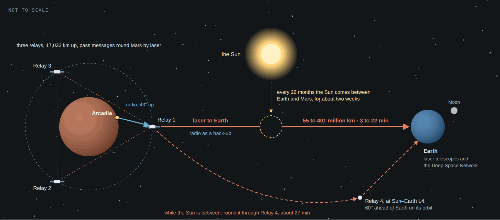
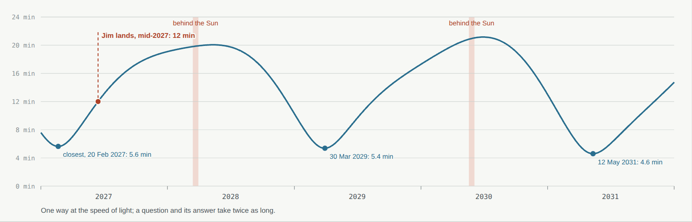
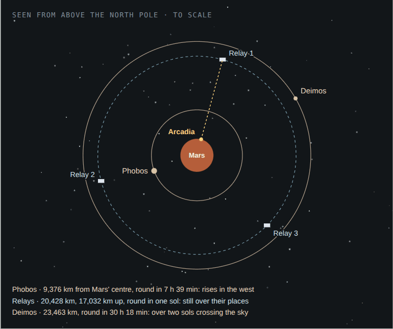
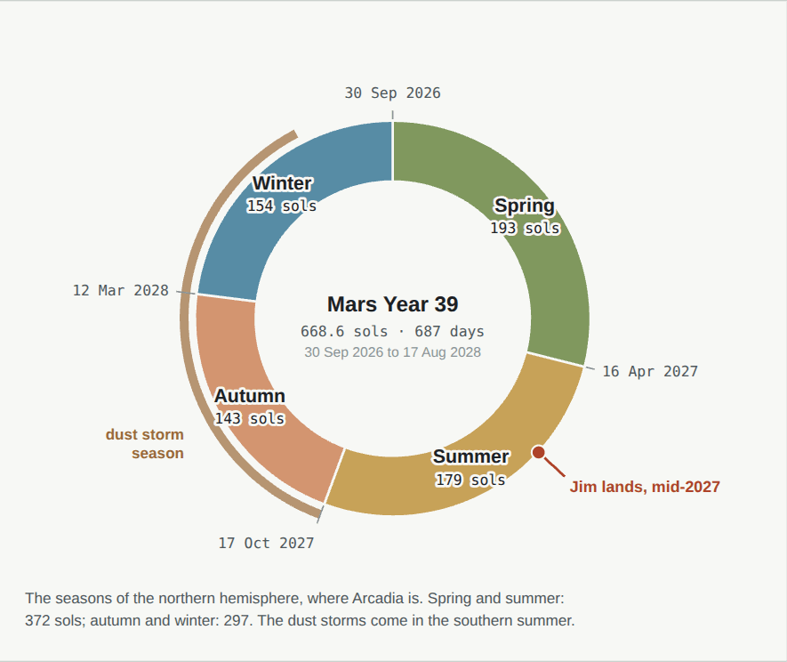

# 09 · Communications and space

[← 08 Life support](08-life.md) · [Design](README.md) · **09 Communications and space** · [10 Building it →](10-phases.md)

**[Open the full chapter on the live site ↗](https://ttmathcs.github.io/mars-campus/palace/design/space.html)**

Earth is 55 to 401 million km away, and a signal at the speed of light takes 3 to 22 minutes to cross. Arcadia talks
to it through three relay satellites that hang over Mars and send everything on by laser, with a fourth far out beside
Earth's orbit for the weeks when the Sun is in the way. Overhead, two small moons cross the sky, Earth shines as a blue
morning or evening star, and the clocks keep Mars time. **Requirements:** SY-5.

*Arcadia talks by radio to the relay over it; the relays pass messages round Mars and on to Earth by laser, with radio
to NASA's Deep Space Network as a back-up. Every 26 months, when the Sun comes between, Relay 4 carries the link round
it. Not to scale.*

| | |
| --- | --- |
| **3–22 min** | One way, at the speed of light; a question and its answer take 6 to 44 |
| **17,032 km** | Up, the relays' orbit: they turn with Mars and hang still over their places |
| **4** | Relays: three round Mars, one beside Earth's orbit to see round the Sun |
| **2 moons** | Phobos, rising in the west twice a sol; Deimos, a bright star |
| **24 h 40 min** | A sol, Mars' day; a Mars year is 668.6 sols |

## The delay

*Worked out from the planets' orbits (NASA JPL's approximate orbital elements). Shaded: the weeks when Mars is within
2° of the Sun as seen from Earth.*

- **No phone calls.** Nobody can talk live across even 3 minutes, so the link is for **messages**: letters, video
  letters, files, the news. Jim records a video letter in the evening; his family sees it before breakfast and
  answers; he has the answer the next day.
- **Behind the Sun.** Every 26 months, for two weeks or more, Mars is within 2° of the Sun as seen from Earth and the
  Sun's radio noise drowns a direct signal. Missions on Mars today go quiet then; Arcadia goes round through Relay 4.

| Earth and Mars, 2027 to 2031 | |
| --- | --- |
| Closest, 20 Feb 2027 | 101 million km · 5.6 min |
| Behind the Sun, 21 Mar 2028 | 357 million km · 20 min |
| Closest, 30 Mar 2029 | 97 million km · 5.4 min |
| Behind the Sun, 25 May 2030 | 377 million km · 21 min |
| Closest, 12 May 2031 | 83 million km · 4.6 min |
| Nearest ever possible | about 55 million km · 3 min |

## The links

- **Three relays over Mars**, 17,032 km above the equator, where a satellite goes round once a sol and hangs still
  over one place (the areostationary orbit), 120° apart. Relay 1 hangs over the spaceport, at 202.1° E, **43° up** in
  Arcadia's southern sky; Arcadia talks to it by **radio**, which goes through dust storms. Together the three see all of Mars
  but the poles, and pass messages to each other by laser.
- **Lasers to Earth.** NASA's DSOC on the Psyche probe sent 267 megabits a second from 31 million km (2023) and 25
  from 226 million km (2024). With telescopes 1 m across instead of DSOC's 22 cm, the relays carry about
  **0.2 to over 1 gigabit a second** (our estimate). Radio to the Deep Space Network is the back-up.
- **Round the Sun.** Relay 4 sits at the Sun–Earth L4 point, 60° ahead of Earth on Earth's orbit. Through conjunction
  it sees Mars 37° from the Sun and Earth 60° from it, so the link goes round; messages take about 27 minutes.
- **On the ground:** flat antennas set into the white roofs of the five corner pavilions, any one enough, so one can be
  mended while the others work; a second set on the spaceport's 77 m tower, joined by the optical fibre in the cable
  trench (chapter 05). Below, the **Earth link (L3-16)** runs them, beside the house mind (L3-14), its back-up (L3-18),
  the data vault (L3-15) and the city control room (L3-19).

## Living with the delay

Letters and video letters from the study (C-23, L1-04) and the memory rooms (L1-14); the news in the Earth lounge in
the Orb (O-07); concerts and talks streamed to the cinema (L1-17); the world's books, films and music kept at home in
the Archive of Earth (L1-28) and the film and music archive (L1-29), with a sealed copy on L5 (L5-11). Help that can't
wait comes from Arcadia itself: the house mind, the medical centre and the robots (chapter 08). *Future technology:* the
Wormhole Gate sends people and things, but no messages faster than light.

## The sky

- **Phobos**, 27 km long, goes round in 7 h 39 min, faster than Mars turns: it rises in the **west**, crosses the
  southern sky in about four hours, about twice a sol, and looks a third as wide as the Moon from Earth.
- **Deimos**, 15 km long, goes round in 30 h 18 min: it rises in the east and takes more than two sols to cross the sky,
  a bright star.
- **Earth** is never far from the Sun: a blue evening star for months, then a morning star. When Jim lands in 2027 it
  is the morning star, and through the Observatory's telescope (C-30 to C-32) the Moon shows beside it.

## Mars time

- **The sol** is 24 h 39 min 35 s: Arcadia's clocks count 24 hours, each 2.7% longer than Earth's, keeping local mean
  solar time for 201.44° E the way NASA's Mars24 clock does, so the sky ceilings, meals and sleep follow the sun.
- **A Mars clock in every room** shows Mars time and the sol beside the time in Jim's home town on Earth.
- **The year** is 668.6 sols. Mars Year 39 began on 30 September 2026. At Arcadia, 39.8° N, spring and summer last
  372 sols, autumn and winter 297; the dust storm season, in the southern spring and summer, runs from
  17 Oct 2027 to 21 Jun 2028.
  Jim lands in the northern summer, in mid-2027.
