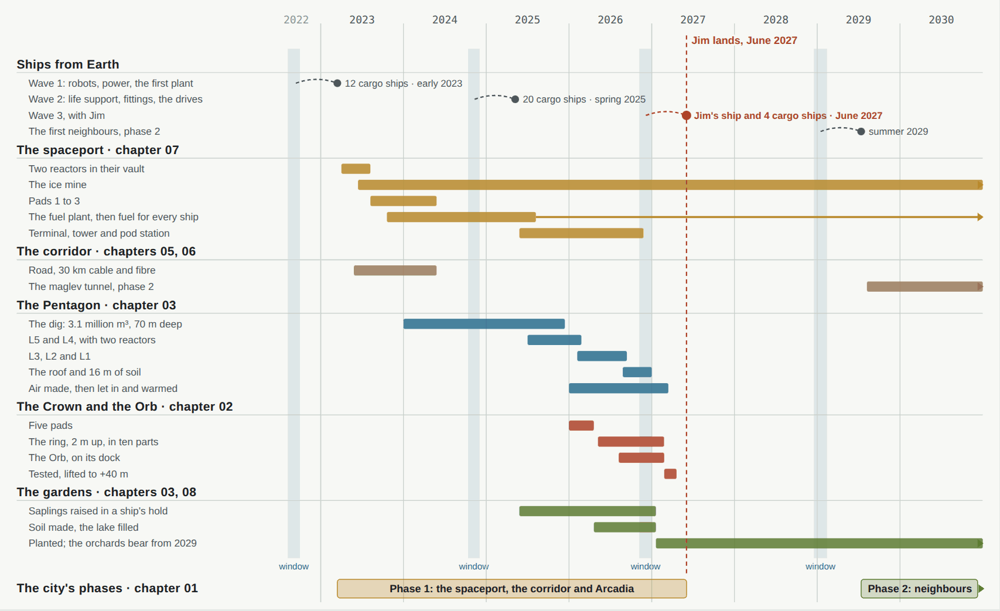
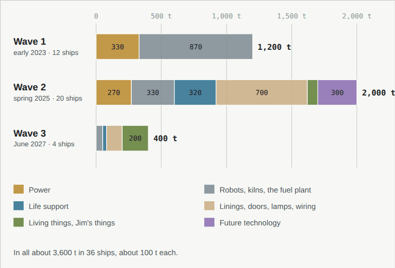
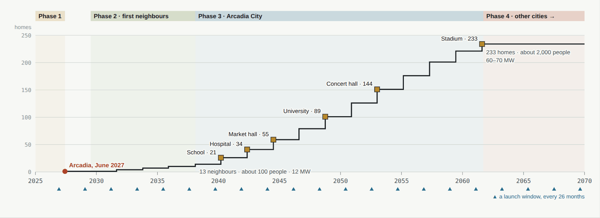

# 10 · Building it

[← 09 Communications and space](09-space.md) · [Design](README.md) · **10 Building it**

**[Open the full chapter on the live site ↗](https://ttmathcs.github.io/mars-campus/palace/design/phases.html)**

Robots first. They land in early 2023, two launch windows before Jim, and work for four years: power and fuel at the
spaceport, the road and the cable, the Pentagon dug 70 m into the ice and built from its own soil, the Crown assembled
and lifted to its height. When Jim lands in June 2027, Arcadia is warm and full of air, and its gardens are planted.
Then the city grows round it, one seed of the sunflower at a time. **Requirements:** SY-6.

*Shaded: the launch windows from Earth, every 26 months; the ships land about six months later. Arrows: work that goes
on.*

| | |
| --- | --- |
| **4 years** | Of robot work before Jim lands; the first ships land in early 2023 |
| **36 ships** | Of cargo from Earth, about 3,600 t; Mars gives the rest, over 200 times as much |
| **3.1 million m³** | Dug for the Pentagon in two years; 1.5 million t of it is ice |
| **June 2027** | Jim lands: Arcadia is finished, its gardens newly planted |
| **233 homes** | Arcadia City, about 2,000 people, by the early 2060s |

## The order of work

1. **Land and switch on, 2023.** 12 cargo ships land on the open plain of AP-1; robots bury the spaceport's two
   reactors; from mid-2023 everything runs on their 10 MW.
2. **Water and fuel, 2023 to 2025.** The ice mine, the fuel plant line by line, the three pads.
3. **The corridor, 2023 to 2024.** The rover road and the trench with the 30 km DC cable and the fibre.
4. **The dig, 2024 to 2025.** 3.1 million m³ from a pit 70 m deep, about 4,300 m³ a sol; 1.5 million t of ice kept;
   kilns at the pit's edge fire the first panels.
5. **The Pentagon from the bottom up, 2025 to 2026.** L5 and L4 with Arcadia's reactors (L4-01) and the air and water
   plants, then L3 (the kilns move to L3-07), L2 and L1; the roof and 16 m of soil late in 2026.
6. **Air and warmth, 2026 to 2027.** 560 t of oxygen and 1,560 t of nitrogen and argon made on L4, let in early 2027.
7. **The Crown, 2026 to 2027.** Five pads; the ring assembled 2 m up in ten 36° parts; tested and lifted to +40 m in
   April 2027; the Orb rises from its dock; the Stone Garden is laid underneath.
8. **The gardens, 2025 to 2027.** Saplings raised in a ship's hold, planted early in 2027; the lake filled.
9. **Jim lands, June 2027,** on pad 1 with the third wave, by ship this once: the Orb, with the Gate in it, is still
   being built when he leaves Earth.

## Robots first

Earth is minutes away by radio (chapter 09), so the robots work on their own: the house mind (L3-14) gives them the
day's work and people on Earth check it once a day. About 90 (our estimate): 8 diggers and ice cutters, 24 haul
rovers, 4 graders and rollers, 16 builders, 6 kiln and printer lines, 30 service robots, and from 2029 two tunnel
boring machines (L5-14). They live in the rover hall and garage (L5-17, L5-18) and the robot bay (L1-12); the robot
foundry (L3-06) prints their parts.

## From Earth, and from Mars

- About **3,600 t in 36 cargo ships** of about 100 t (our estimate): the reactors, the robots and kilns, the fuel
  plant's and life support's machines, wiring, lamps and electronics, seeds and saplings, Jim's things, and the drives
  and portals of future technology.
- The cargo ships of the first two waves **stay** on the plain east of the pads: stores, the first greenhouse, and
  later steel for the foundry. From 2027 ships use the pads and fly home.
- **Mars gives the rest:** about 600,000 t of the Pentagon's panels, 129,000 t of the Crown's shell and ice, about
  28,000 t of water, 2,100 t of air, the gardens' soil: over 200 t for every tonne shipped.

## After Jim: the city grows

| Phase | When | What |
| --- | --- | --- |
| 1 · Port and home | 2023–2027 | The spaceport, the corridor, Arcadia |
| 2 · First neighbours | 2029–2038 | 13 homes within 1 km, about 100 people; the maglev opens in 2033; 12 MW |
| 3 · Arcadia City | 2038–early 2060s | 233 homes out to 3.8 km, about 2,000 people; the school about 2040, hospital 2042, market hall 2044, university 2049, concert hall 2053, stadium early 2060s; 60–70 MW in L4-02 |
| 4 · Other cities | from the 2060s | Rail and tunnels to cities near by, portals to those far away |

## If it runs late

The Crown lifts two months before Jim lands and every wave brings spares; if a whole wave is lost, Jim's launch moves
to the January 2029 window. Dust storms slow the outdoor work but don't stop it. The foundry prints most parts. If the
future technology isn't ready, the Crown stands on its pads, stairs and robot carriers do the portals' work and the
ships do the Gate's.
