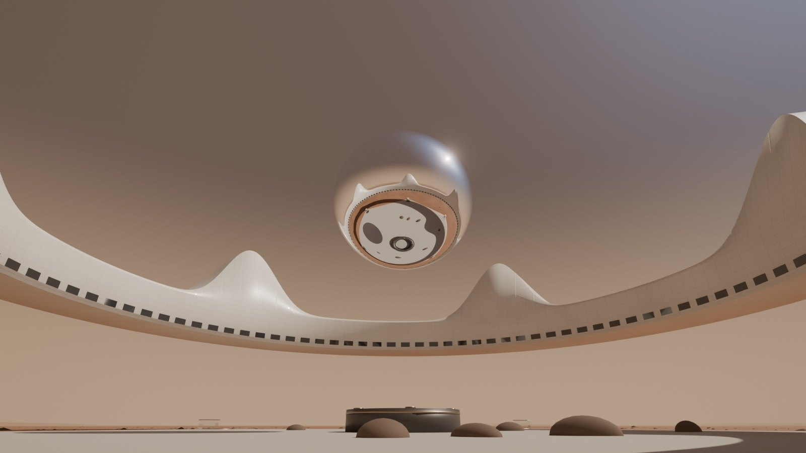
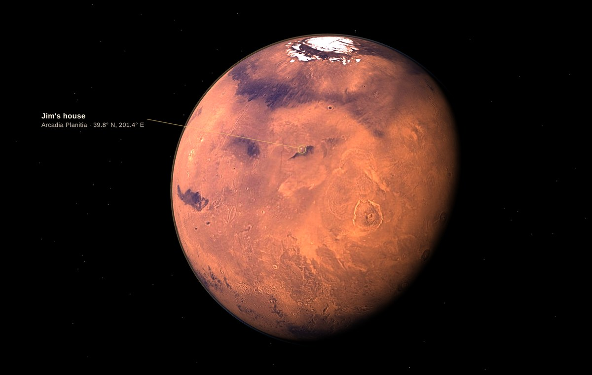

# Pictures

[Demo 2 home](../README.md) · [Requirements](../REQUIREMENTS.md) · [Decisions](decisions.md) · [Design](design/README.md) · [Floor plans](plans.md) · **Pictures**

Every picture of demo 2. They are rendered from the new 3D build (`palace/src/`), the same scene the flight video
plays, so they show the design as it will look in the demo. They are simulations, not photographs. On 1 Oct 2026 the
weak ones were redone so they look real; the cockpit view did not, so it was taken out. The diagrams are
on the [design pages](design/README.md) and the plan sheets on [Floor plans](plans.md).

| | | |
| --- | --- | --- |
|  |  |  |
|  |  |  |
|  |  |  |
|  |  |  |

## The Crown

### Coming home at sunset

The Crown from the pod on its last approach, with the dust storm it has just flown through behind it. The Orb mirrors
the sky; the five spires hold the anti-gravity drives. *Used on the homepage and in [chapter 02](design/02-crown.md).*

### The Crown by day

From the south-east at mid-morning. The Crown's shadow, with its five spires, falls across the plain; under the ring
the Stone Garden is gravel and seven stones round the Sun Well. *[Chapter 02](design/02-crown.md#how-it-works-day-to-day).*

### Nothing holds it up

From the plain at sunset: the ring floats 40 m over the Stone Garden, the Orb in its middle and the sky showing
underneath. The garden is raked gravel and seven basalt stones; nothing else stands on the ground. *On the design
book's cover and in [chapter 02](design/02-crown.md).*

### The house from the air

The Crown alone on the plain of Arcadia Planitia, with the rings of light under its spires where the anti-gravity
fields touch the ground. *[Chapter 01](design/01-site-and-city.md#the-site-plan).*

### Inside the Orb, the universe switched on

A lounge on the Orb's +72 floor with the universe switched on: future-tech VR shown directly in the space of the room.
A spiral galaxy floats above the polished stone floor, which reflects it; on the left, through the glass, the Wormhole
Gate shows the place it opens onto, a far nebula. Rendered from its own scene (`palace/tools/orb_scene.html`).
*In [chapter 02](design/02-crown.md#the-orb-the-universe-in-vr-and-the-wormhole-gate).*

## The spaceport

### Arcadia Spaceport

From the south-west: the two reactor domes in front, the terminal dome and the control tower, the pod station, the
fuel plant with its six tanks, the ice mine on the left, and the three landing pads 1.6 km out. No panels on the ground. *[Chapter 07](design/07-spaceport.md).*

## The flight home

The flight video has ten shots and lasts 4 min 40 s ([chapter 06](design/06-transport.md#the-flight-home)). These
are frames from it.

### 1 Lift-off

The pod rises from the pod station on four blue methane flames, with the terminal and the tower behind.
*[Chapter 07](design/07-spaceport.md).*

### 2 Heading west

Heading west into the low sun after lift-off, with dust devils marching across the plain. *[Chapter 06](design/06-transport.md#the-flight-home).*

### 3 The Dune Sea

Down to 55 m over the black basalt sand of the Dune Sea, between the dust devils. *[Chapter 06](design/06-transport.md#the-flight-home).*

### 4 Over the crater

The climb over the rim of a crater 3.2 km across, with frost in its shadows. *[Chapter 06](design/06-transport.md#the-flight-home).*

### 5 The Ice Cliffs

45 m above the foot of a 100 m scarp of layered ice, blue in the shade, a minute before the dust storm.
*[Chapter 06](design/06-transport.md).*

## The Mars Atlas

### Mars from orbit

Mars from orbit over the northern plains: the north polar cap at the top, Arcadia Planitia with a marker at Jim's
house, and Olympus Mons to the lower right. Rendered with the real colour map of Mars
(`palace/tools/mars_scene.html`). *The Atlas card on the design book's cover.*

The Atlas on the live site zooms from the solar system to the house over NASA imagery
([open it](https://ttmathcs.github.io/mars-campus/palace/design/atlas/)). These views were saved without the NASA
tiles, so they show the coarser base map.

| Whole Mars | Arcadia Planitia |
| --- | --- |
|  |  |

## How the pictures are made

- **Renders:** `python3 palace/tools/book_renders.py [names]` loads the 3D test build and saves 1600 × 900 pictures
  to `palace/design/img/`. Each view is a fixed camera or a time in the flight video; see the list in the script.
  Build the test page first with `sh palace/build.sh debug`.
- **Two pictures from their own scenes:** `python3 palace/tools/scene_render.py orb` (inside the Orb) and
  `scene_render.py mars` (Mars from orbit) load `palace/tools/orb_scene.html` and `mars_scene.html` headless.
- **Diagrams, plan sheets and Atlas views:** `python3 palace/tools/docs_export.py` exports them from the live pages
  into `palace/docs/img/`.
- **Maps:** the base map of Mars is the Solar System Scope colour map (CC BY 4.0, from NASA imagery). On the live
  pages the NASA/JPL/USGS Viking colour mosaic loads on top of it.
- Small pictures named `th-*` in `palace/design/img/` are the chapter cards on the design book's cover.
