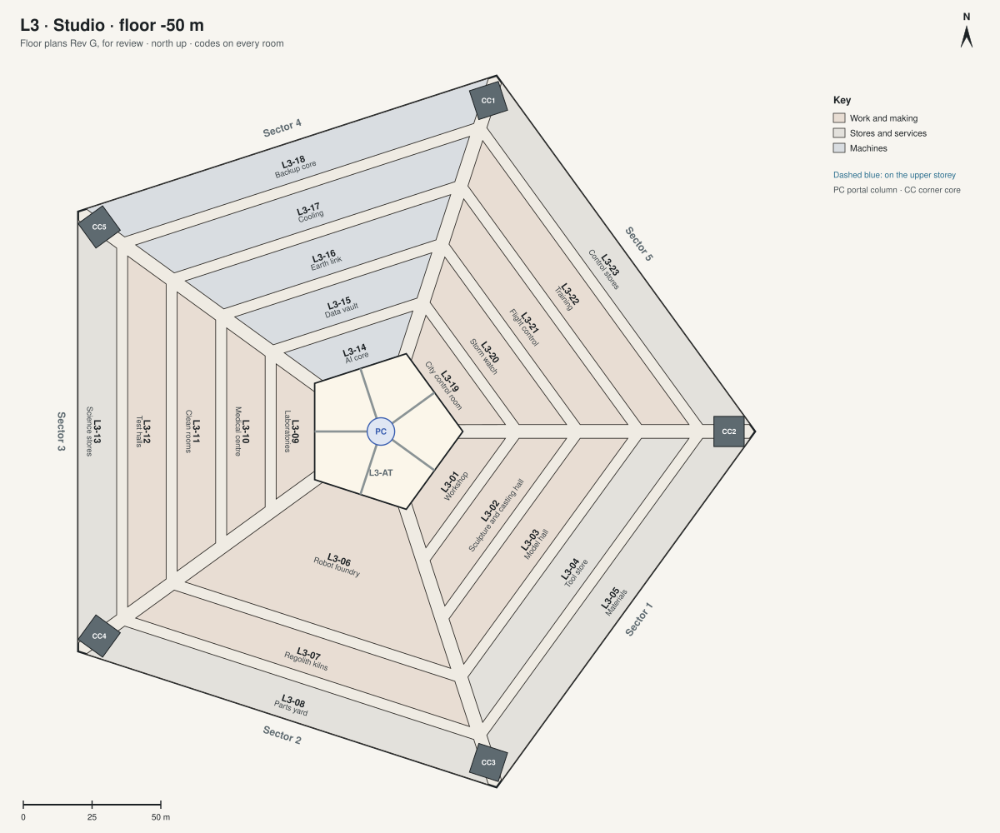

# Floor plans Rev G · L3 · Studio

[All sheets](README.md) · **[Open on the live site ↗](https://ttmathcs.github.io/mars-campus/palace/plans/rev-g/l3.html)**

| Code | Room | What it is for | Two of a kind |
| --- | --- | --- | --- |
| **L3-01** | Workshop | Jim's workshop for wood and metal. |  |
| **L3-02** | Sculpture and casting hall | Big and heavy work: sculpture, casting, kilns. | C-27 |
| **L3-03** | Model hall | Room for big models: railways, rockets, the city. |  |
| **L3-04** | Tool store | Tools and machines. |  |
| **L3-05** | Materials | Timber, metals and materials. |  |
| **L3-06** | Robot foundry | Prints the parts for the house and the city. |  |
| **L3-07** | Regolith kilns | Fires Mars soil into panels and bricks. |  |
| **L3-08** | Parts yard | Finished parts waiting for use. |  |
| **L3-09** | Laboratories | Science: soil, ice, air, plants. |  |
| **L3-10** | Medical centre | A doctor's surgery, a scanner and an operating room, with no evacuation possible. |  |
| **L3-11** | Clean rooms | Electronics and medicines made clean. |  |
| **L3-12** | Test halls | Testing machines before use. |  |
| **L3-13** | Science stores |  |  |
| **L3-14** | AI core | The house mind: the computers that run the house. |  |
| **L3-15** | Data vault | The house's data, kept safe. |  |
| **L3-16** | Earth link | The link to the relays and to Earth. |  |
| **L3-17** | Cooling | Cooling for the computers. |  |
| **L3-18** | Backup core | A second house mind, in case the first fails. |  |
| **L3-19** | City control room | Runs the house, the city and the spaceport. |  |
| **L3-20** | Storm watch | Weather and dust storms, radiation alerts. |  |
| **L3-21** | Flight control | All flights and rovers: the pods, the ships, the rover trips. | C-05 |
| **L3-22** | Training | Training for robots and people: suits, rovers, emergencies. |  |
| **L3-23** | Control stores |  |  |
