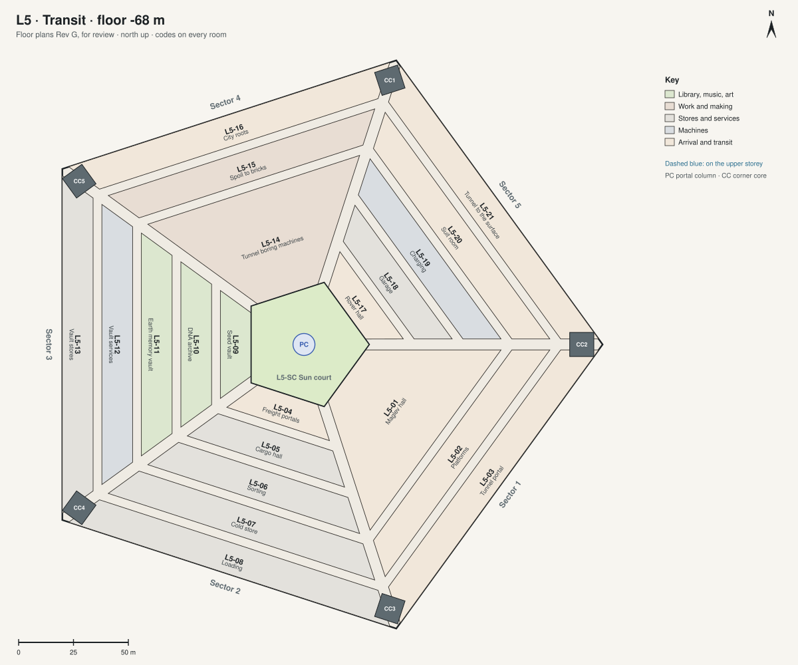

# Floor plans Rev G · L5 · Transit

[All sheets](README.md) · **[Open on the live site ↗](https://ttmathcs.github.io/mars-campus/palace/plans/rev-g/l5.html)**

| Code | Room | What it is for | Two of a kind |
| --- | --- | --- | --- |
| **L5-01** | Maglev hall | The station for the maglev to the spaceport (phase 2). |  |
| **L5-02** | Platforms |  |  |
| **L5-03** | Tunnel portal |  |  |
| **L5-04** | Freight portals |  |  |
| **L5-05** | Cargo hall |  |  |
| **L5-06** | Sorting |  |  |
| **L5-07** | Cold store |  |  |
| **L5-08** | Loading |  |  |
| **L5-09** | Seed vault | Seeds of Earth's plants, kept for centuries. | L2-10 |
| **L5-10** | DNA archive |  |  |
| **L5-11** | Earth memory vault | The sealed copy of the Archive of Earth. | L1-28 |
| **L5-12** | Vault services |  |  |
| **L5-13** | Vault stores |  |  |
| **L5-14** | Tunnel boring machines | They dig the city's tunnels. |  |
| **L5-15** | Spoil to bricks |  |  |
| **L5-16** | City roots | The start of the tunnels to the city. |  |
| **L5-17** | Rover hall |  |  |
| **L5-18** | Garage |  |  |
| **L5-19** | Charging |  |  |
| **L5-20** | Suit room | Suits for going out by rover through the tunnel. | C-01 |
| **L5-21** | Tunnel to the surface |  |  |
