# Floor plans Rev B

[Demo 2 home](../README.md) · [Requirements](../REQUIREMENTS.md) · [Decisions](decisions.md) · [Design](design/README.md) · [Rooms](rooms.md) · **Floor plans** · [Pictures](gallery.md)

> **Newer, for Jim's review: [floor plans Rev G](plans/README.md)**, every room designed and given a code
> (2 Oct 2026). Rev B below stays as approved.

The review set Jim **approved on 30 Sep 2026** ("Approve. Go."). These are the drawings from the live page
[ttmathcs.github.io/mars-campus/palace/plans/](https://ttmathcs.github.io/mars-campus/palace/plans/), exported so they
can be seen here. Areas are gross floor areas, rounded.

> **Changed since Rev B.** The [design book](design/README.md) is newer where they differ:
> - **Site:** the real landing zone AP-1, at 39.8° N (Rev B said about 44° N). Decided 1 Oct 2026.
> - **The Orb:** Rev E puts the Wormhole Gate, a ball 18 m across, in its middle, with rooms on three rings round it,
>   and the universe in VR in the rooms ([chapter 02](design/02-crown.md#the-orb-the-universe-in-vr-and-the-wormhole-gate)). The Crown becomes 19,100 m²
>   and the Pentagon 11 times its size. Shown for Jim's review; the sheets below still show the Rev B Orb.
> - **Nothing on the ground (B.1, 1 Oct 2026):** at Jim's request the garden mirrors and the spaceport's solar field
>   are off the sheets (GN-12). The Stone Garden is raked gravel and seven stones; the Sun Well is a sky lens; two
>   reactors at the port and two under the house supply the power.
> - **A built ground (Rev E, 1 Oct 2026):** a paved pentagon over the Pentagon, the Orb's dock round the Sun Well, a
>   glass pavilion at each corner and glass over the avenues (GN-13, OR-9). Shown in
>   [chapter 01](design/01-site-and-city.md#the-site-plan); the sheets below do not show it yet.

| Sheet | Drawing |
| --- | --- |
| [A-001](#a-001-the-crown-birds-eye-view-from-the-south) | The Crown, bird's-eye view |
| [A-002](#a-002-size-check) | Size check: the Crown, the Pentagon and the TTMath campus to one scale |
| [A-101](#a-101-site-and-flight-corridor) | Site and flight corridor |
| [A-102](#a-102-how-the-city-grows) | How the city grows |
| [A-201](#a-201-the-crown-main-floor) | The Crown, main floor |
| [A-301](#a-301-the-pentagon-levels-1-to-5) | The Pentagon, levels 1 to 5 |
| [A-401](#a-401-section-east-to-west) | Section east to west |
| [A-501](#a-501-arcadia-spaceport) | Arcadia Spaceport |
| [A-601](#a-601-the-pods-scenic-flight) | The pod's scenic flight |

## A-001 The Crown, bird's-eye view from the south

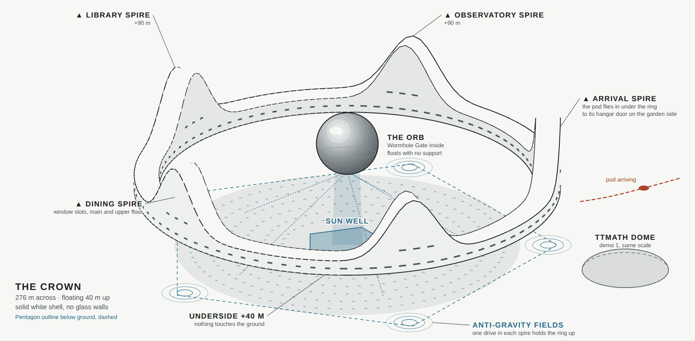

Nothing touches the ground: anti-gravity drives in the five spires hold the ring 40 m above the plain, and the rings
on the ground show where their fields reach. The spires rise to 90 m, the dips to 50 m. The Orb floats over the Sun
Well from 52 to 92 m. Dashed lines are the window slots. The small dome at the front right is the TTMath campus dome
from demo 1, to the same scale.

*B.1, 1 Oct 2026: the garden mirrors and the light they sent down the Sun Well were taken off this sheet; the Stone
Garden is raked gravel and seven stones, and the Sun Well is a sky lens.*

## A-002 Size check

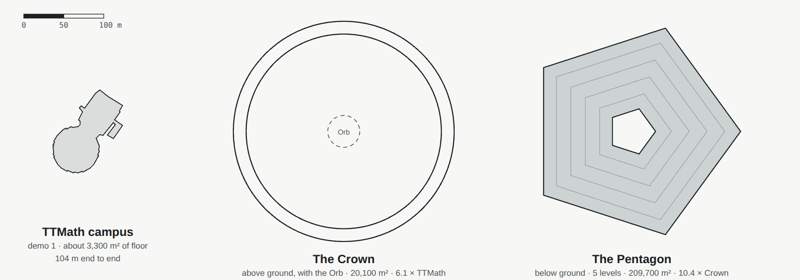

All three to the same scale: the Crown (276 m across), the Pentagon (160 m sides) and the TTMath campus of demo 1.

## A-101 Site and flight corridor

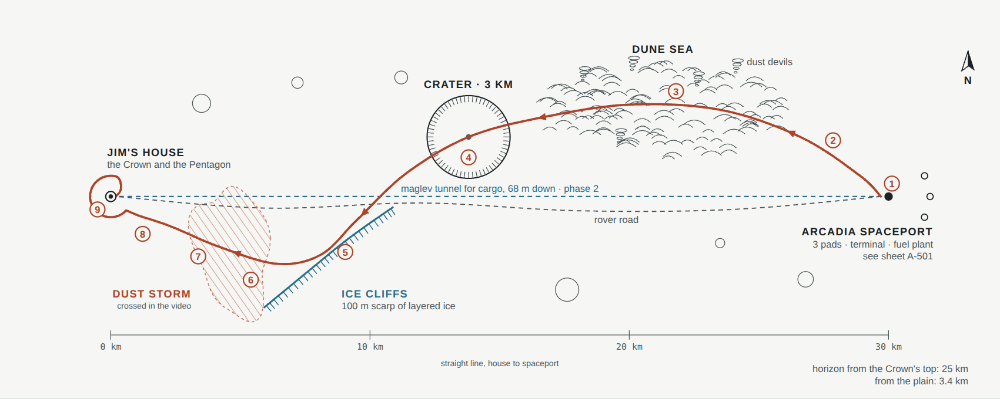

The house and the spaceport sit on the flat, ice-rich floor of Arcadia Planitia; the ice gives water, air and rocket
fuel. The pod's 37 km scenic route crosses the Dune Sea, a 3 km crater, the Ice Cliffs and a dust storm, then circles
the Crown; the numbers are the shots of the flight video (A-601). The rover road is the backup; in phase 2 a maglev
tunnel runs 30 km straight between the two, 68 m down. From the top of a spire the horizon is 25 km away, so the ships
at the spaceport can be seen.

## A-102 How the city grows

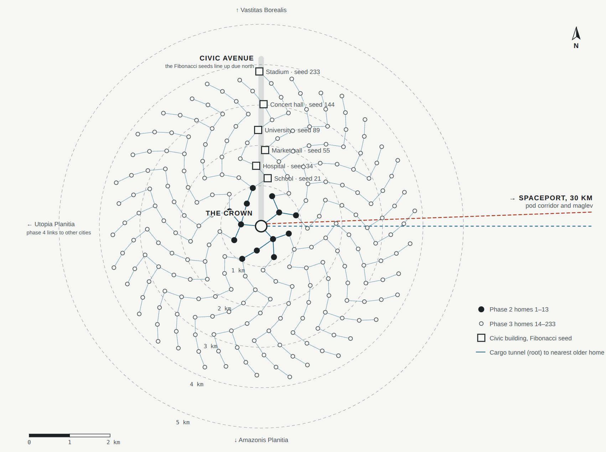

Every new home takes the next seed of a sunflower spiral, turned 137.5° (the golden angle) from the one before, about
450 m apart. Civic buildings take the Fibonacci seeds (21 school, 34 hospital, 55 market hall, 89 university, 144
concert hall, 233 stadium), which line up due north of the Crown. Phase 1: the port and the house. Phase 2: 13 homes
and the maglev. Phase 3: Arcadia City, 233 homes, 3.8 km out. Phase 4: links to other cities.

## A-201 The Crown, main floor

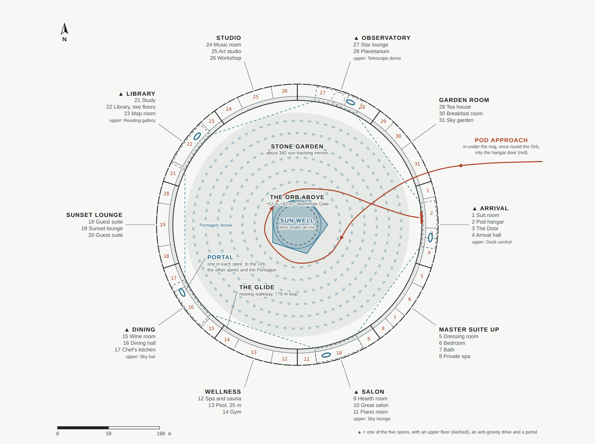

Ten parts round a 16 m ring at +41 m: five spires, each with an upper floor, an anti-gravity drive and a portal, and
five dips. The Glide walkway runs 779 m round the inside edge. Window slots 1.2 m tall, set 3 m deep, with storm
shutters. There are no legs and no lifts.

## A-301 The Pentagon, levels 1 to 5

| L1 Residence | L2 Garden |
| --- | --- |
| 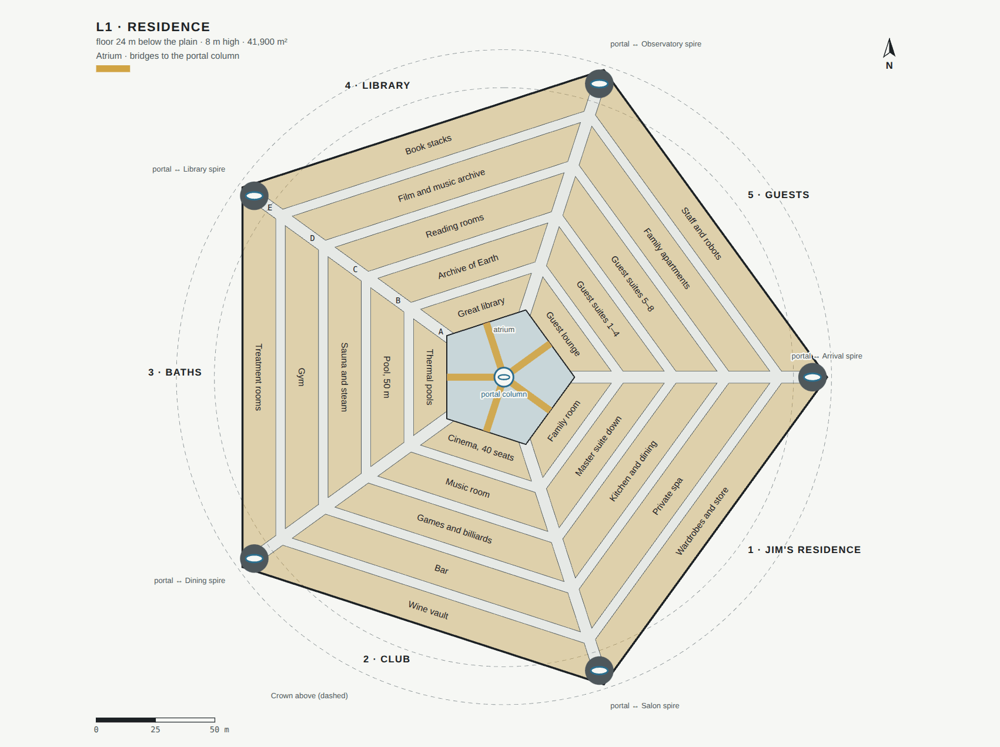 | 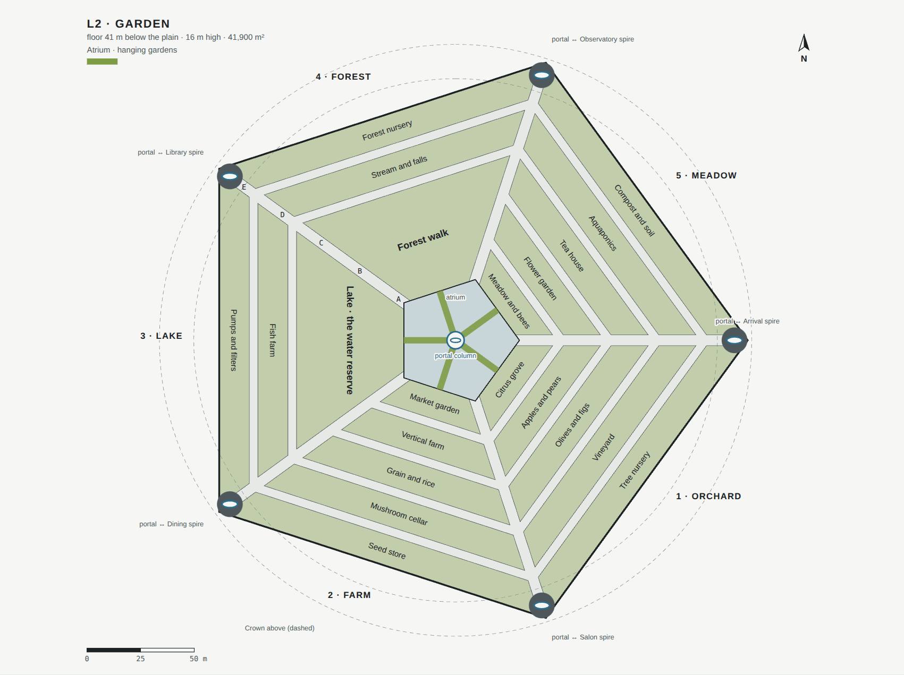 |
| **L3 Studio** | **L4 Life support** |
| 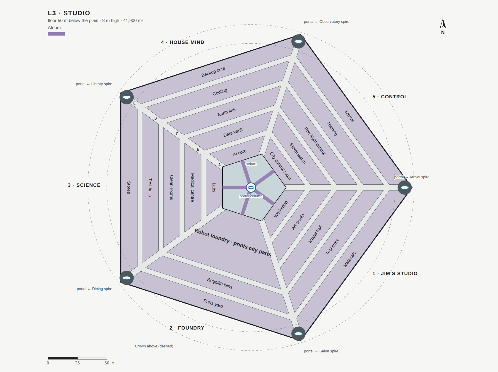 | 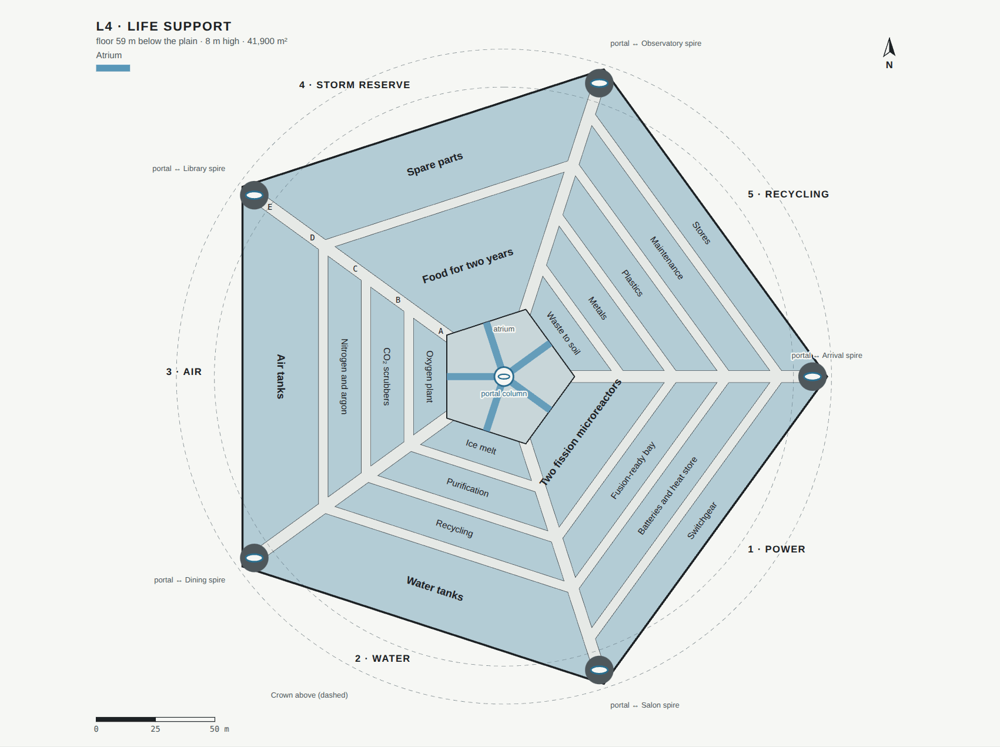 |
| **L5 Transit** | |
| 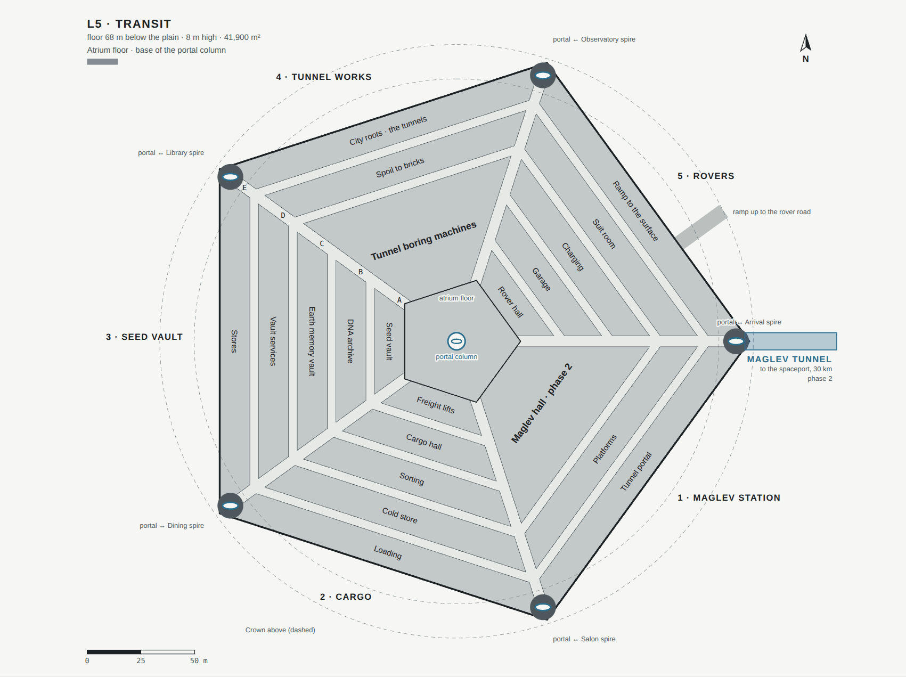 | |

One solid block under 16 m of soil, which weighs as much as the air inside pushes up and stops cosmic radiation.
Five rings (A inside to E outside) with 4 m streets, and five 5 m avenues out to the corner cores, each with a portal
to a spire and a stair. The portal column in the atrium has a portal on every level. No room is more than two minutes
from a portal. The master suite down is on L1, sector 1.

## A-401 Section east to west

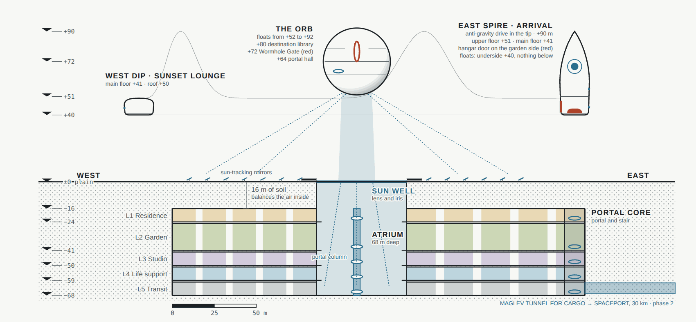

Through the east spire (Arrival, with the pod hangar), the Orb and the west dip (the Sunset lounge). The Crown floats
at +40 m; the Orb hovers from +52 to +92 m. The Sun Well is the one big piece of glass in the house, a thick lens under
a solid iris; the atrium drops 68 m to the floor of L5.

## A-501 Arcadia Spaceport

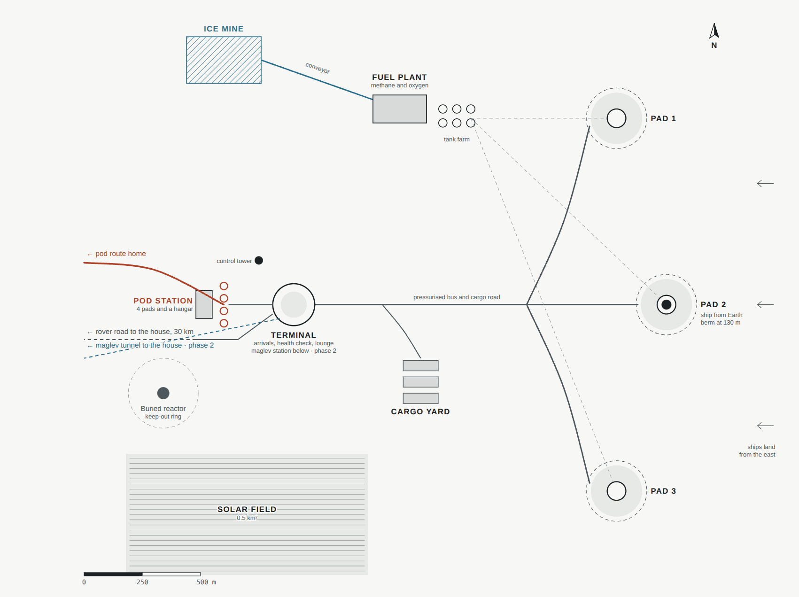

Three landing pads 1.6 km from the terminal, each behind a berm because landing rockets throw rocks. The fuel plant
turns ground ice and the air's CO₂ into methane and oxygen. Passengers ride a bus from the pad to the terminal and walk
through to the pod station facing home.

*B.1, 1 Oct 2026: the solar field was taken off this sheet. The port runs on two buried reactors, with no panels on the
ground.*

## A-601 The pod's scenic flight

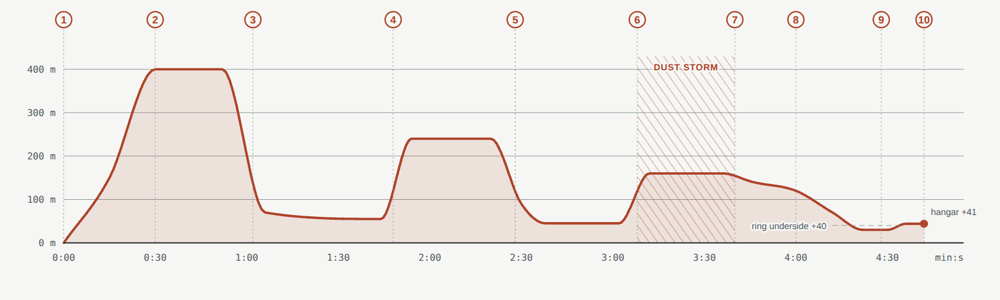

Height above the plain against time: 37 km, about 4 min 40 s from lift-off to the hangar, highest point 400 m, lowest
pass 30 m under the ring. It plays in real time, with cockpit, chase and director cameras, and can be skipped. See the
[pictures from the flight](gallery.md#the-scenic-flight).
