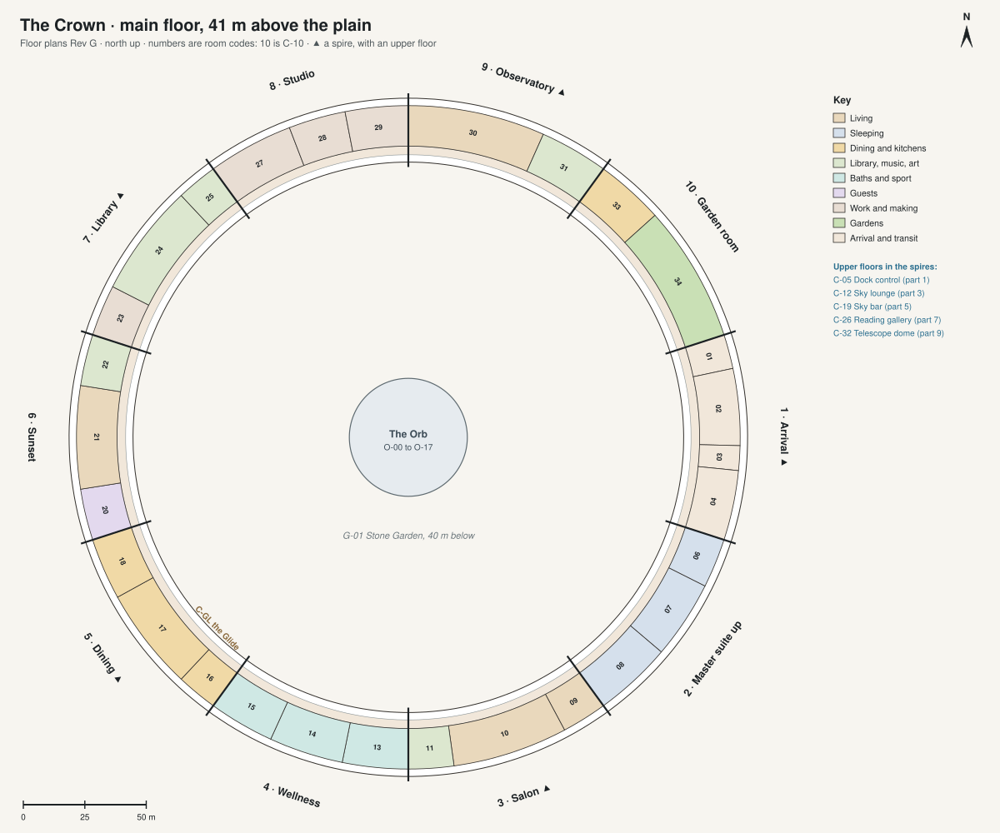

# Floor plans · The Crown

[All sheets](README.md) · **[Open on the live site ↗](https://ttmathcs.github.io/mars-campus/palace/plans/crown.html)**

| Code | Room | What it is for | Two of a kind |
| --- | --- | --- | --- |
| **C-01** | Suit room | Suits and the airlock with a dust room, for going out onto the hull or the plain. | L5-20 |
| **C-02** | Pod hangar | The pods dock here, through a door in the outer wall. |  |
| **C-03** | The Door | The front door of Arcadia, from the hangar. |  |
| **C-04** | Arrival hall | Where everyone arrives: 20 m tall under its spire, the great maple in its round banquette, the portal to the Orb, the spires and the Pentagon. |  |
| **C-05** | Dock control | Upstairs in the Arrival spire: watches the pods dock. | L3-21 |
| **C-06** | Dressing room | Clothes for the day, next to the bedroom up. |  |
| **C-07** | Bedroom up | Jim's day room to rest in: a nap after lunch, reading; the bed faces the south-east slots, where the sun rises. | L1-08 |
| **C-08** | Bath up | A bath with a soaking tub by the slots. |  |
| **C-09** | Hearth room | A fireside corner of the salon, a hearth of lit mist. |  |
| **C-10** | Great salon | Jim's living room by day: linen sofas, olive trees, the sun through the slots, the view. | L1-02 |
| **C-11** | Recital room | The concert grand, played for guests: the salon's chairs turn to face it. | L1-01 |
| **C-12** | Sky lounge | Upstairs in the Salon spire: the highest view over the plain by day. |  |
| **C-13** | Spa | A cedar sauna with a glass front and a round hot pool, with the view. | L1-25 |
| **C-14** | Sky pool, 25 m | Swimming in daylight along the ring, where low gravity makes every wave rise high and fall slowly. | L1-23 |
| **C-15** | Gym | Machines and weights with the view, for the daily exercise. | L1-24 |
| **C-16** | Wine room | Wine brought up from the cellar (L1-20) for the dinners, and served from here. |  |
| **C-17** | Dining hall | Dinners with guests: one basalt table for 22, the afternoon sun low through the slots. | L1-03 |
| **C-18** | Chef's kitchen | Cooks for the dining hall. | L1-10 |
| **C-19** | Sky bar | Upstairs in the Dining spire: drinks at sunset with the view west. | L1-03 |
| **C-20** | Guests' day room | Where visitors spend their days up here: desks, sofas, a kitchenette, a corner for children. |  |
| **C-21** | Sunset lounge | Low sofas facing the west slots: at sunset the sun shines straight in, in a blue sky. |  |
| **C-22** | Gallery | Jim's paintings from the studio and his photographs of Mars. |  |
| **C-23** | Study | Jim's day desk in the north light: writing, his memoirs, video letters. | L1-04 |
| **C-24** | Library | Reading in daylight: two floors of walnut shelves with a working collection, a gallery and a spiral stair. | L1-27 |
| **C-25** | Map room | A globe of Mars 3 m across and chests of maps: planning trips and flights. |  |
| **C-26** | Reading gallery | Upstairs in the Library spire, a reading room under the roof. |  |
| **C-27** | Art studio | Painting and drawing in the steady north light. | L3-02 |
| **C-28** | Photo and print room | Printing Jim's photographs of Mars and his art. |  |
| **C-29** | Craft room | Pottery, models and small repairs (heavy work is in L3's workshops). |  |
| **C-30** | Star lounge | Night: reclining chairs under the slots and the real stars. |  |
| **C-31** | Telescope room | The controls of the telescope upstairs, and screens for what it sees. |  |
| **C-32** | Telescope dome | Upstairs in the Observatory spire: the telescope. |  |
| **C-33** | Breakfast room | Breakfast with the sunrise through the east slots. |  |
| **C-34** | Sky garden | Herbs, flowers and small trees under the slots: a conservatory in the ring. |  |
