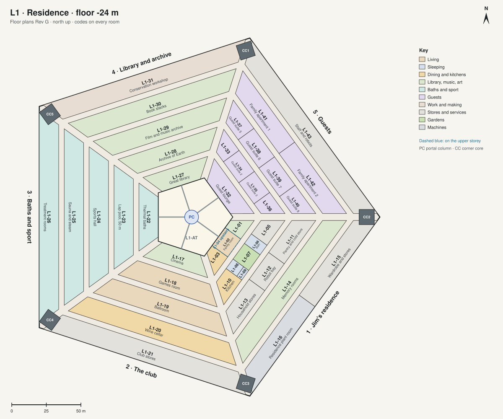

# Floor plans · L1 · Residence

[All sheets](README.md) · **[Open on the live site ↗](https://ttmathcs.github.io/mars-campus/palace/plans/l1.html)**

| Code | Room | What it is for | Two of a kind |
| --- | --- | --- | --- |
| **L1-01** | Music room | Jim's piano, played every day, and his records on a long console with a turntable. | C-11 |
| **L1-02** | Family room | Jim's evening living room: the long fire of lit mist, a sofa, books, the screen. | C-10 |
| **L1-03** | Dining room and bar | Everyday meals, a table for eight; the bar at the back of the room. | C-17 |
| **L1-04** | Study | Jim's evening desk, on the upper storey over the family room: letters and video letters home, his accounts, Arcadia's console. | C-23 |
| **L1-05** | Laundry and linen | Washing, ironing and the linen for the suite, next to the bath. |  |
| **L1-06** | Bath | The master bath: a stone tub, a shower, two basins, a glass wall onto the moss garden. |  |
| **L1-07** | Moss garden | A garden open to the lit roof, 8 m tall, between the bedroom and the bath: moss, a pond, stones, a maple. |  |
| **L1-08** | Bedroom | Jim's bedroom for the nights, under 16 m of soil: the bed faces a glass wall onto the moss garden. | C-07 |
| **L1-09** | Dressing room | Clothes, shoes, the suits for going outside, behind the bedroom. |  |
| **L1-10** | Kitchen | The everyday kitchen, across the street from the dining room. Robots cook; Jim can too. | C-18 |
| **L1-11** | Pantry and cold store | Food from the garden level, kept for the kitchen. |  |
| **L1-12** | Robot bay | Where the robots that cook, clean and carry charge and are serviced. |  |
| **L1-13** | Household stores | China, glass, furniture and decorations not in use. |  |
| **L1-14** | Memory rooms | Jim's keepsakes from Earth: family photographs, letters and the things he brought from home, in a suite of quiet rooms. |  |
| **L1-15** | Wardrobe and stores | Clothes and things not in daily use. |  |
| **L1-16** | Residence plant room | The air, heat and water for the residence, with its own back-up. |  |
| **L1-17** | Cinema | Forty seats in front of a screen 12 m wide: films. | O-07 |
| **L1-18** | Games room | Billiards, cards and table tennis, which plays strangely in low gravity. |  |
| **L1-19** | Ballroom | Dances and celebrations when visitors arrive, every 26 months. |  |
| **L1-20** | Wine cellar | Arcadia's one cellar, cool and steady below ground, with a tasting table. |  |
| **L1-21** | Club stores | Chairs, tables, instruments and decorations for the club. |  |
| **L1-22** | Thermal baths | Long soaks: a warm pool at 36 °C, a round hot pool at 40 °C and a cold plunge at 14 °C, loungers along the glass. | C-13 |
| **L1-23** | Lap pool, 50 m | Training: lengths and water exercise, safe below ground. | C-14 |
| **L1-24** | Sports hall | A climbing wall, ball games and a running track, all lively in low gravity. | C-15 |
| **L1-25** | Sauna and steam | Saunas and steam rooms for the evening, next to the baths. | C-13 |
| **L1-26** | Treatment rooms | Massage and physiotherapy for bones and muscles in low gravity, with changing rooms for the baths. |  |
| **L1-27** | Great library | Arcadia's main collection, two storeys of books, read at long tables by the atrium glass. | C-24 |
| **L1-28** | Archive of Earth | Earth's history and culture, and family records, to read and to look at. |  |
| **L1-29** | Film and music archive | Films and recordings, with booths to watch and listen. |  |
| **L1-30** | Book stacks | Robotic stacks that bring any book to the library or to any room. |  |
| **L1-31** | Conservation workshop | Repairing, scanning and printing books; the library's stores. |  |
| **L1-32** | Guest lounge | The guests' living and dining room on the atrium glass, two storeys tall. |  |
| **L1-33** | Guest suite 1 | A bedroom, a bath and a sitting room. |  |
| **L1-34** | Guest suite 2 | A bedroom, a bath and a sitting room. |  |
| **L1-35** | Guest suite 3 | A bedroom, a bath and a sitting room. |  |
| **L1-36** | Guest suite 4 | A bedroom, a bath and a sitting room. |  |
| **L1-37** | Guest suite 5 | A bedroom, a bath and a sitting room. |  |
| **L1-38** | Guest suite 6 | A bedroom, a bath and a sitting room. |  |
| **L1-39** | Guest suite 7 | A bedroom, a bath and a sitting room. |  |
| **L1-40** | Guest suite 8 | A bedroom, a bath and a sitting room. |  |
| **L1-41** | Family apartment 1 | For a family visiting with children: bedrooms, a kitchen, a living room. |  |
| **L1-42** | Family apartment 2 | For a family visiting with children: bedrooms, a kitchen, a living room. |  |
| **L1-43** | Staff and robots | Rooms for staff, if any come; robot bays and stores for the guest wing. |  |
