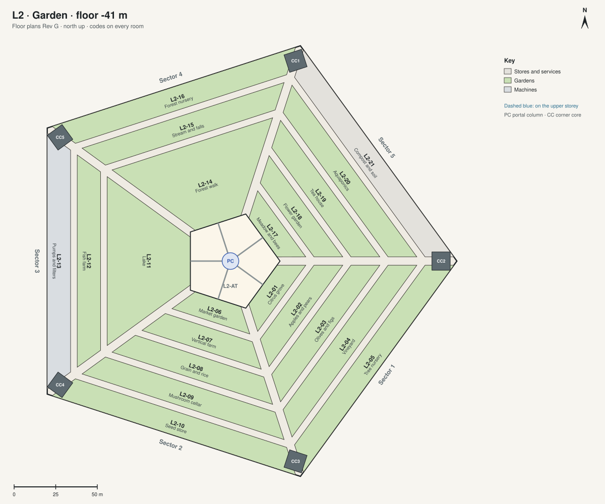

# Floor plans · L2 · Garden

[All sheets](README.md) · **[Open on the live site ↗](https://ttmathcs.github.io/mars-campus/palace/plans/l2.html)**

| Code | Room | What it is for | Two of a kind |
| --- | --- | --- | --- |
| **L2-01** | Citrus grove | Oranges, lemons and limes under the sky of lamps. |  |
| **L2-02** | Apples and pears | An orchard of apples and pears. |  |
| **L2-03** | Olives and figs | Olives for oil, and figs. |  |
| **L2-04** | Vineyard | Vines for grapes and wine. |  |
| **L2-05** | Tree nursery | Young trees for the orchards and the city. |  |
| **L2-06** | Market garden | Vegetables and herbs, picked fresh. |  |
| **L2-07** | Vertical farm | Racks of greens under LEDs, the highest yields. |  |
| **L2-08** | Grain and rice | Wheat, rice and beans. |  |
| **L2-09** | Mushroom cellar | Mushrooms grown on the garden's waste. |  |
| **L2-10** | Seed store | The farm's working seeds. | L5-09 |
| **L2-11** | Lake | A lake that is also Arcadia's water reserve. |  |
| **L2-12** | Fish farm | Fish for the table, fed from the gardens. |  |
| **L2-13** | Pumps and filters | The lake's pumps and filters. |  |
| **L2-14** | Forest walk | A forest with paths, under trees 12 m tall. |  |
| **L2-15** | Stream and falls | A stream that falls into the lake. |  |
| **L2-16** | Forest nursery | Young trees and plants for the forest. |  |
| **L2-17** | Meadow and bees | A meadow of wild flowers, with hives. |  |
| **L2-18** | Flower garden | Flowers for the rooms. |  |
| **L2-19** | Tea house | A tea house in the meadow: tea, quiet, contemplation. |  |
| **L2-20** | Aquaponics | Fish and plants in one loop of water. |  |
| **L2-21** | Compost and soil | Making soil from Arcadia's waste. |  |
