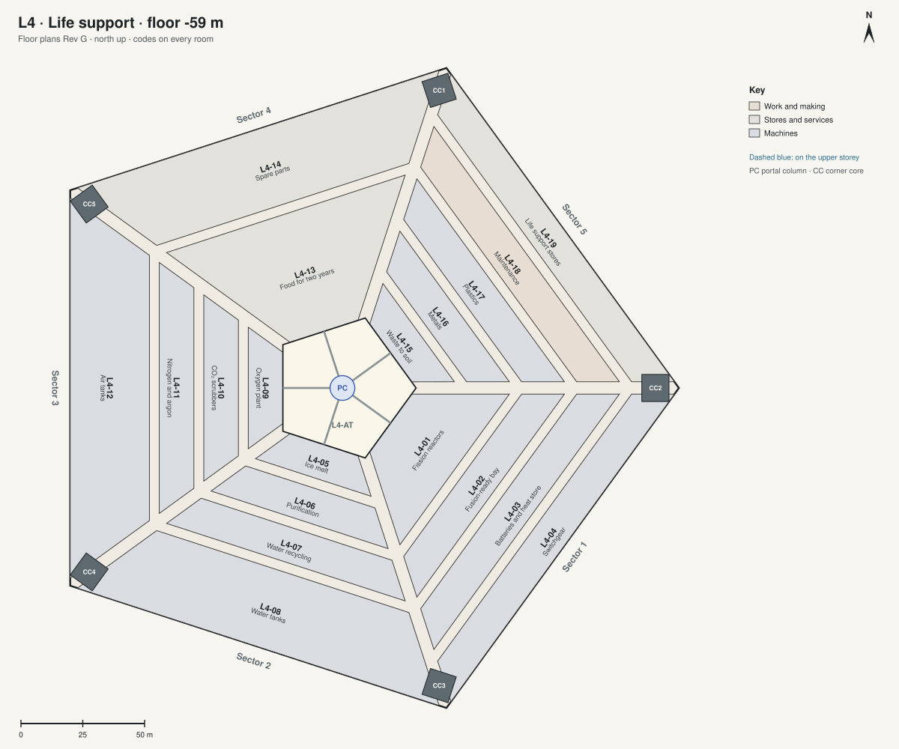

# Floor plans · L4 · Life support

[All sheets](README.md) · **[Open on the live site ↗](https://ttmathcs.github.io/mars-campus/palace/plans/l4.html)**

| Code | Room | What it is for | Two of a kind |
| --- | --- | --- | --- |
| **L4-01** | Fission reactors | Two 5 MWe microreactors. |  |
| **L4-02** | Fusion-ready bay | Kept for a fusion plant when one exists. |  |
| **L4-03** | Batteries and heat store |  |  |
| **L4-04** | Switchgear |  |  |
| **L4-05** | Ice melt | Melting the ice from the mine. |  |
| **L4-06** | Purification | Removing the perchlorate salts. |  |
| **L4-07** | Water recycling | 98% of the water used again. |  |
| **L4-08** | Water tanks |  |  |
| **L4-09** | Oxygen plant | Oxygen from carbon dioxide and water. |  |
| **L4-10** | CO₂ scrubbers |  |  |
| **L4-11** | Nitrogen and argon | The buffer gases, from the Mars air. |  |
| **L4-12** | Air tanks |  |  |
| **L4-13** | Food for two years | The storm reserve. |  |
| **L4-14** | Spare parts |  |  |
| **L4-15** | Waste to soil |  |  |
| **L4-16** | Metals |  |  |
| **L4-17** | Plastics |  |  |
| **L4-18** | Maintenance |  |  |
| **L4-19** | Life support stores |  |  |
