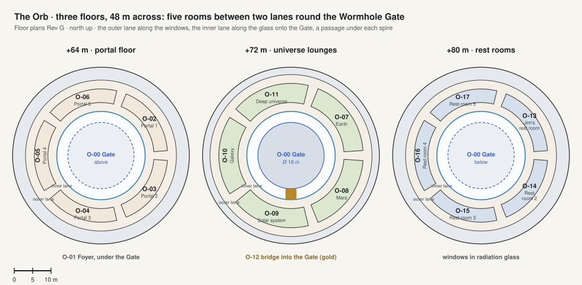

# Floor plans · The Orb

[All sheets](README.md) · **[Open on the live site ↗](https://ttmathcs.github.io/mars-campus/palace/plans/orb.html)**

| Code | Room | What it is for | Two of a kind |
| --- | --- | --- | --- |
| **O-00** | Wormhole Gate | A ball 18 m across in the middle of the Orb: it sends Jim to any place and time. |  |
| **O-01** | Foyer | Under the Gate, round which the portals open. |  |
| **O-02** | Portal 1 | The portal from the Arrival spire, in a room between the lanes, with seats to wait in. |  |
| **O-03** | Portal 2 | The portal from the Salon spire, in a room between the lanes, with seats to wait in. |  |
| **O-04** | Portal 3 | The portal from the Dining spire, in a room between the lanes, with seats to wait in. |  |
| **O-05** | Portal 4 | The portal from the Library spire, in a room between the lanes, with seats to wait in. |  |
| **O-06** | Portal 5 | The portal from the Observatory spire, in a room between the lanes, with seats to wait in. |  |
| **O-07** | Earth lounge | The universe zoomed to Earth: home, its weather, its news. | L1-17 |
| **O-08** | Mars lounge | Mars, Arcadia and the city. |  |
| **O-09** | Solar system lounge | The planets and their moons. |  |
| **O-10** | Galaxy lounge | The Milky Way: choosing far places for the Gate. |  |
| **O-11** | Deep universe lounge | The web of galaxies and time. |  |
| **O-12** | Bridge into the Gate | 3 m wide, from the inner lane into the Gate. |  |
| **O-13** | Jim's rest room | A day bed, a window to the sky behind radiation glass, a glass wall onto the Gate that turns frosted. |  |
| **O-14** | Rest room 2 | A day bed, a window to the sky behind radiation glass, a glass wall onto the Gate that turns frosted. |  |
| **O-15** | Rest room 3 | A day bed, a window to the sky behind radiation glass, a glass wall onto the Gate that turns frosted. |  |
| **O-16** | Rest room 4 | A day bed, a window to the sky behind radiation glass, a glass wall onto the Gate that turns frosted. |  |
| **O-17** | Rest room 5 | A day bed, a window to the sky behind radiation glass, a glass wall onto the Gate that turns frosted. |  |
