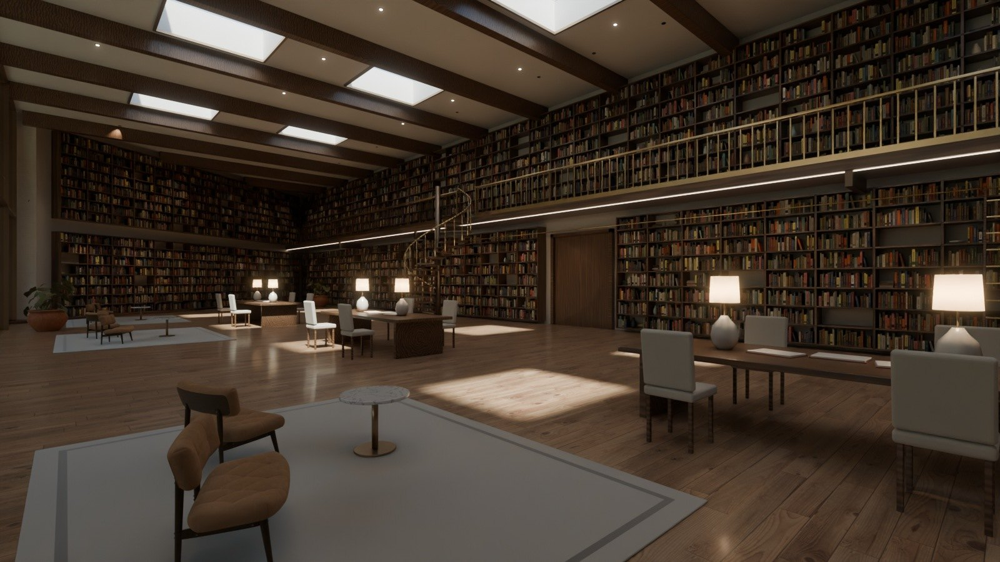
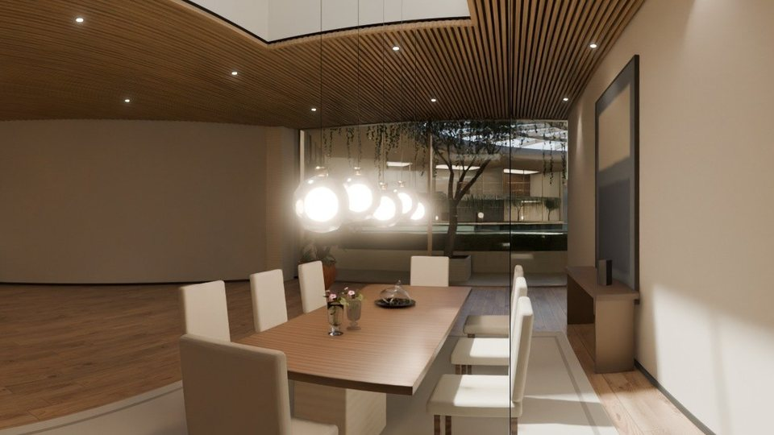
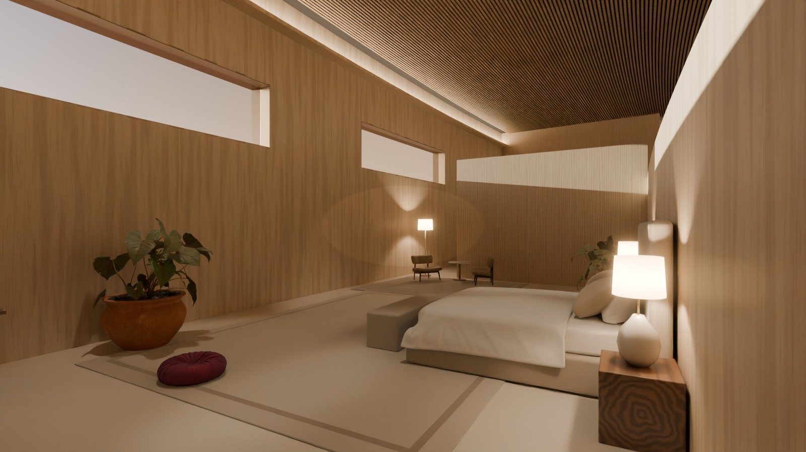
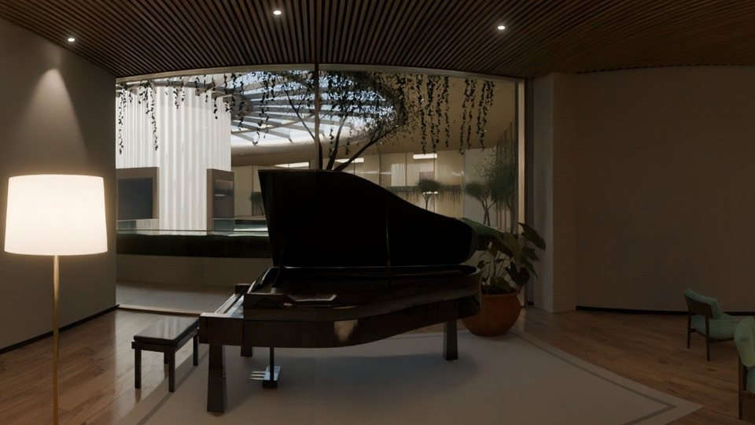
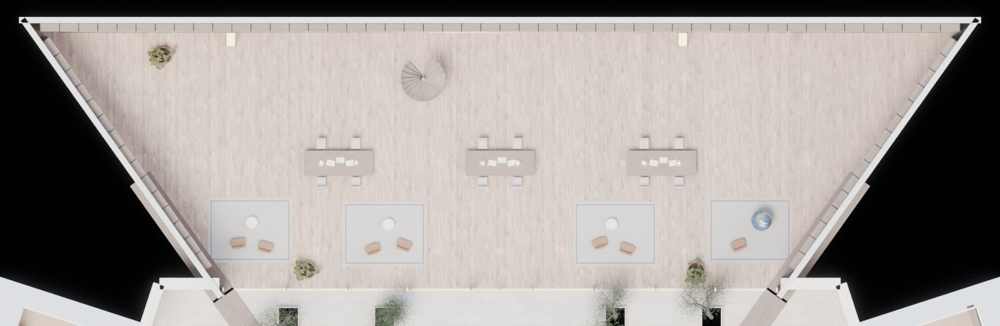
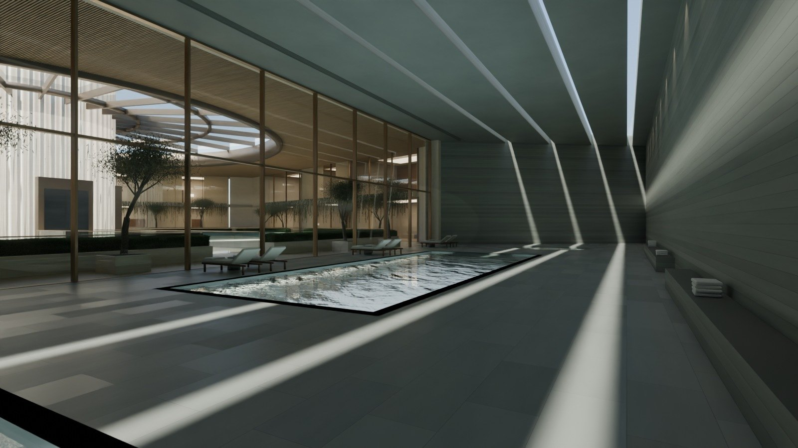
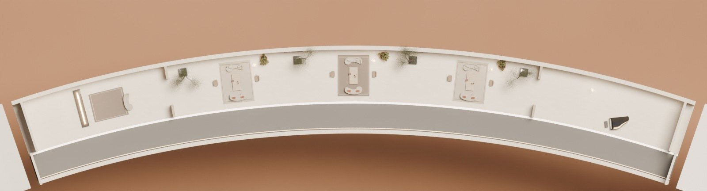
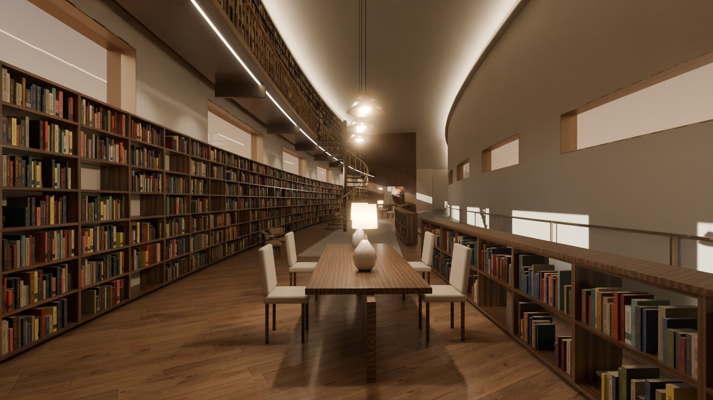
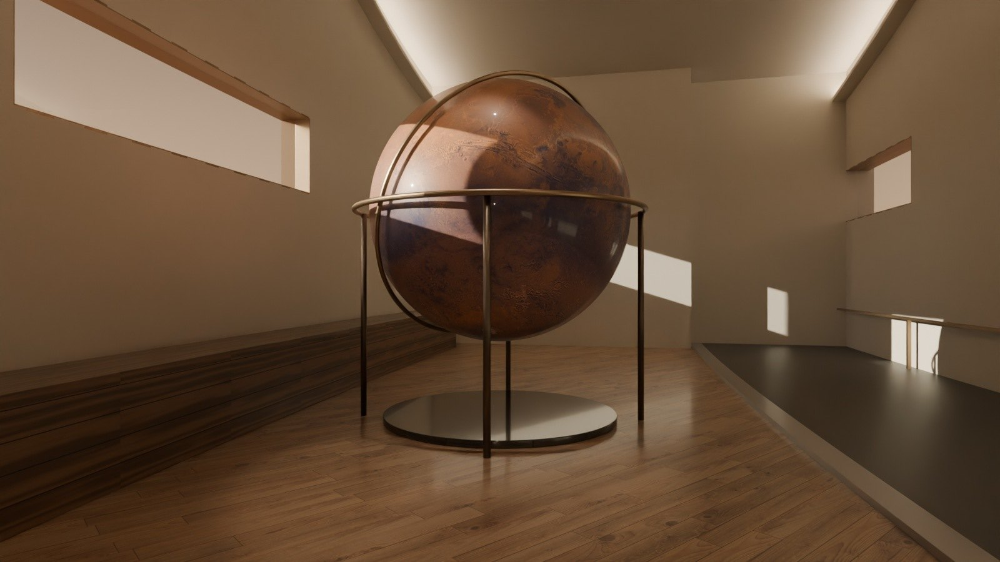

# The rooms, in pictures

[Demo 2 home](../README.md) · [Requirements](../REQUIREMENTS.md) · [Decisions](decisions.md) · [Design](design/README.md) · **Rooms** · [Floor plans](plans.md) · [Pictures](gallery.md)

Jim's house, room by room, picture first. Each picture is path-traced in Blender Cycles from the same model as the 3D
demo: real bounced light, real glass, and furniture scanned from real things. Nothing is painted by hand. Under each
picture: what the room is, what it is made of, and a link to walk round it in 360° in the
**[photo tour](https://ttmathcs.github.io/mars-campus/palace/tour/)**. The design behind the rooms is in
[chapter 04, Interiors](design/04-interiors.md); where they are is on the [floor plans](plans.md).

| | | |
| --- | --- | --- |
|  |  |  |
| **[The family room](#the-family-room)**, L1 | **[By the fire](#the-family-room)**, L1 | **[The great salon](#the-great-salon)**, the Crown |
|  |  |  |
| **[The great library](#the-great-library)**, L1 | **[The dining room](#the-dining-room-and-the-bar)**, L1 | **[The master suite up](#the-master-suite-up)**, the Crown |

**Rendering now**, and added here as each one finishes: the cinema (L1, across the atrium);
the master suite down, with its moss garden and bath; the Crown's library and map room, its pool, Arrival hall, dining
hall and sunset lounge.

## The Pentagon, L1: Jim's residence

The residence is the front of ring A on L1, 24 m below ground, behind 28.8 m of glass onto the atrium's gardens.

### The family room

- **The room:** 28.8 m of glass onto the atrium, 13.9 m deep, a ceiling at 3.8 m; Jim's study is the storey above.
  The music room and the dining room open off it through cased openings.
- **Made of:** oak boards and an oak-slat ceiling on black felt, a travertine chimney breast, walnut shelves lit from
  within, bronze mullions.
- **In it:** a curved velvet sofa and two chairs round a travertine table, a silk pouf, a chess table by the glass;
  all scans of real furniture. The hearth is lit mist, not fire: no open flames in air with 27% oxygen.
- **Walk round it:** [by the fire](https://ttmathcs.github.io/mars-campus/palace/tour/#fire) ·
  [at the glass](https://ttmathcs.github.io/mars-campus/palace/tour/#glass)

### The music room

- **The room:** at the left end of the glass, beside the family room, 13.9 m deep.
- **In it:** a grand piano by the glass, so Jim plays looking out at the atrium; a walnut console 7.2 m long full of
  records, with a turntable and two tall speakers; armchairs to listen from.
- **Walk round it:** [by the piano](https://ttmathcs.github.io/mars-campus/palace/tour/#piano)

### The dining room and the bar

- **The room:** at the right end of the glass, beside the family room.
- **In it:** a walnut table for eight under five glass globes, a sideboard under a painting, shelves of books; at the
  back, the bar: bottles on lit bronze shelves, a walnut counter with a marble top, leather stools.
- **Walk round it:** [at the table](https://ttmathcs.github.io/mars-campus/palace/tour/#table)

## The Pentagon, L1: round the atrium

### The great library

- **The room:** ring A of sector 4, across the atrium from Jim's residence; two storeys high.
- **Made of:** oak boards, walnut shelves and gallery, brass rails, oak beams with skylights between them.
- **In it:** books on every wall, a gallery reached by a spiral stair, long reading tables under lamps, leather chairs.
- **Walk round it:** [in the library](https://ttmathcs.github.io/mars-campus/palace/tour/#library)

### The thermal baths

- **The room:** ring A of sector 3, across the atrium from Jim's residence.
- **Made of:** grey-green quartzite floors and walls, an oak-slat ceiling with slots of light from a sky ceiling.
- **In it:** the warm pool, loungers by the glass, stone benches with towels; the 50 m pool and the sauna are further
  back in the same sector.
- **Walk round it:** its 360° view is rendering.

## The Crown

The Crown's rooms run round the ring, 41 m above the plain, between the garden-side wall with the Glide along it and
the outer wall; slots through both walls frame the Orb on one side and the plain on the other.

### The great salon

- **The room:** 45 m along the curve of the ring, 10 m wide, under the Salon spire.
- **Made of:** regolith plaster, a floor of linen-coloured stone, an oak-slat ceiling lit from its coves, bronze reveals
  round the slots.
- **In it:** low linen sofas on wool rugs round olive-wood tables, olive trees in planters; a hearth of lit mist at one
  end and the concert grand at the other.
- **Walk round it:** [the great salon](https://ttmathcs.github.io/mars-campus/palace/tour/#crown_salon)

### The master suite up

- **The room:** part 2 of the ring, south-east, straight above the master suite down; Jim's morning rooms.
- **Made of:** pale oak walls and screens, a floor of linen-coloured stone, an oak-slat ceiling.
- **In it:** the bed facing the south-east slots, so the sun rises straight across the room; a sitting corner by the
  slots, a writing desk, dressers, plants.
- **Walk round it:** [the bedroom up](https://ttmathcs.github.io/mars-campus/palace/tour/#crown_bedroom)

### The Library and the map room

- **The room:** part 7 of the ring, north-west, under the Library spire: 45 m along the ring and 9.5 m high.
- **Made of:** oak boards, walnut shelves and gallery, brass rails and pendants, a basalt plinth for the globe.
- **In it:** two floors of books along the outer wall with the slots between them; reading tables and leather chairs;
  in the map room, a globe of Mars 3 m across, made from the same colour map as the Atlas, and chests of map drawers.
- **Walk round it:** [the Library](https://ttmathcs.github.io/mars-campus/palace/tour/#crown_library); the map room's 360° view is rendering.

## Still to come

The Crown's 25 m pool, the
studio, the observatory and the garden room; the Orb's rooms, once Jim decides between Rev F's two sizes; the guest
suites, the kitchen and the private spa on L1; the garden level (L2) and Jim's studio (L3).
