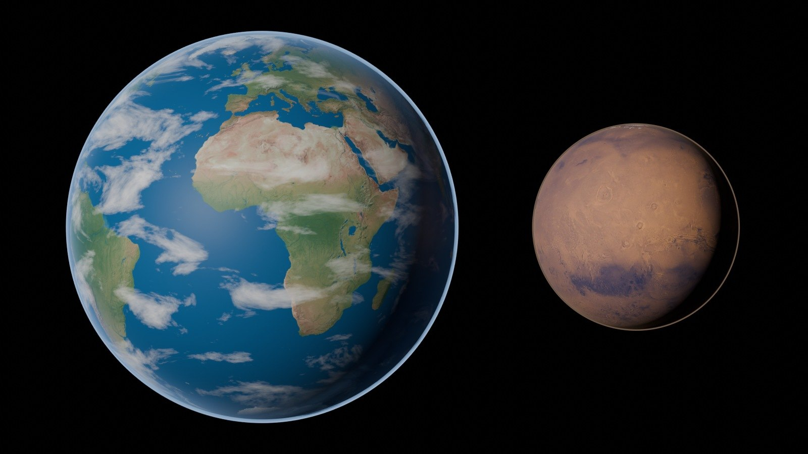

# The science

[Mars – your new home](../README.md) · **The science** · live at https://ttmathcs.github.io/mars-campus/science/

The real part of the site, beside the city's two imagined places, the TTMath campus and Arcadia: Mars as spacecraft have measured it, and the research on how
people could build and live there. **One subject a page**, each with its sources at the end; the few numbers that are
our own estimates say so. Jim asked for it on 2 Oct 2026, first on the homepage, then as separate pages split into
nested subpages ("please keep this as global rule").

## Mars facts: [`mars-facts/`](mars-facts/) · [live](https://ttmathcs.github.io/mars-campus/science/mars-facts/)

| Page | What is on it |
| --- | --- |
| [The surface](https://ttmathcs.github.io/mars-campus/science/mars-facts/surface.html) | The two halves, a labelled map, Olympus Mons and Valles Marineris, Hellas, the poles, the wet past (Curiosity, Perseverance), the soil, the sky, Arcadia Planitia |
| [Inside Mars](https://ttmathcs.github.io/mars-campus/science/mars-facts/inside.html) | InSight's marsquakes; crust, mantle, the molten layer and the liquid core (a section to scale); the lost magnetic field; signs of life inside |
| [Weather](https://ttmathcs.github.io/mars-campus/science/mars-facts/weather.html) | The air, the Viking weather station, cold, wind, dust devils, dust storms, clouds, frost and snow, seasons |
| [Mars in space](https://ttmathcs.github.io/mars-campus/science/mars-facts/space.html) | The orbit, the sol, the wandering tilt, Earth and Mars every 26 months, Phobos and Deimos, the sky from Mars |
| [Resources](https://ttmathcs.github.io/mars-campus/science/mars-facts/resources.html) | Water ice, the air's carbon dioxide, nitrogen and argon, basalt, iron, sulfur and salts, sunlight, low gravity |
| [Hazards](https://ttmathcs.github.io/mars-campus/science/mars-facts/hazards.html) | Thin air, cold, radiation, ultraviolet, toxic dust, dust storms, marsquakes, meteorites |
| [The numbers](https://ttmathcs.github.io/mars-campus/science/mars-facts/numbers.html) | Mars and Earth side by side in one table |
| [Exploration](https://ttmathcs.github.io/mars-campus/science/mars-facts/exploration.html) | The missions, from Mariner 4 (1965) to Perseverance and Ingenuity |

## Building on Mars: [`building-on-mars/`](building-on-mars/) · [live](https://ttmathcs.github.io/mars-campus/science/building-on-mars/)

| Page | What is on it |
| --- | --- |
| [Every factor](https://ttmathcs.github.io/mars-campus/science/building-on-mars/factors.html) | Seventeen conditions, each with what Mars does and the answer |
| [Getting there](https://ttmathcs.github.io/mars-campus/science/building-on-mars/getting-there.html) | Launch windows, landing heavy loads, what to bring and what to make, robots first |
| [Construction](https://ttmathcs.github.io/mars-campus/science/building-on-mars/construction.html) | Sintering, sulfur concrete, pressed bricks, 3D printing; the air pressure as the main load; frozen ground; dust |
| [Water](https://ttmathcs.github.io/mars-campus/science/building-on-mars/water.html) · [Air](https://ttmathcs.github.io/mars-campus/science/building-on-mars/air.html) · [Food](https://ttmathcs.github.io/mars-campus/science/building-on-mars/food.html) · [Energy](https://ttmathcs.github.io/mars-campus/science/building-on-mars/energy.html) | Mining and recycling water; oxygen as MOXIE made it; crops under LEDs; why fission |
| [Shielding](https://ttmathcs.github.io/mars-campus/science/building-on-mars/shielding.html) · [Health](https://ttmathcs.github.io/mars-campus/science/building-on-mars/health.html) | Soil and water against radiation; low gravity, medicine, isolation |
| [Rocket fuel](https://ttmathcs.github.io/mars-campus/science/building-on-mars/fuel.html) · [Talking to Earth](https://ttmathcs.github.io/mars-campus/science/building-on-mars/communication.html) · [Protecting Mars](https://ttmathcs.github.io/mars-campus/science/building-on-mars/protection.html) | Methane and oxygen from ice and air; radio delays and lasers; planetary protection |

Each Building on Mars page ends with a box, *In Arcadia, Jim's home*, linking to the design plan.

## How the pages are made

- One HTML file per page. `science.css` styles every page; `science.js` adds the top bar, the list of the section's
  pages, the page turn and the footer. Each page sets `<body data-sec="mars-facts" data-page="weather">`.
- **To add a page:** write it next to its siblings (copy one as a start), then add it to its section's list in
  `science.js` and a card on the section's `index.html`; the menus and page turns follow. A subject that grows too
  long gets its own subpages rather than a longer page.
- Pictures come from the design plan (`palace/design/img/`, `palace/docs/img/book/`); renders from demo 2 are marked
  as such in their captions.
- Sources: published papers (with DOIs), NASA and other agency records. NASA's own websites are blocked from the build
  container, so numbers were taken from the published values, not re-checked live.
- The design plan's old science chapters (Mars, the planet; Living on Mars) were replaced by these pages on 2 Oct 2026
  and removed on 3 Oct.
